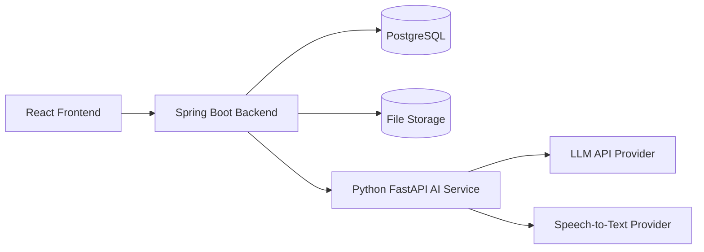
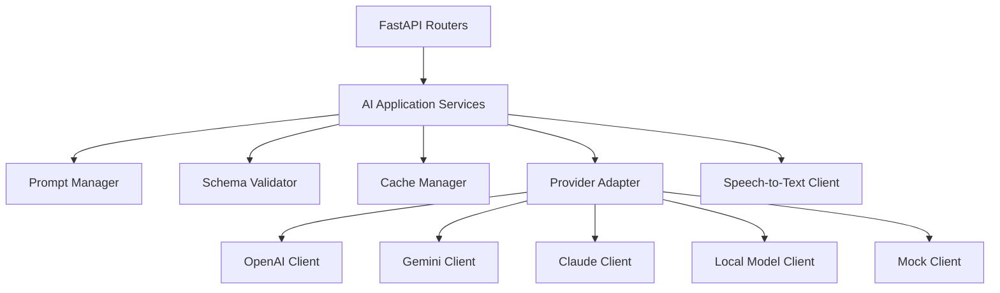
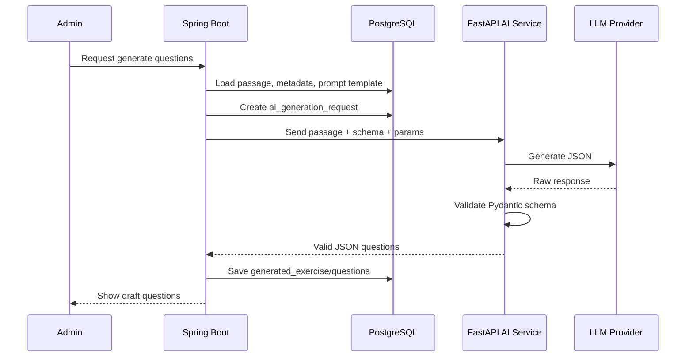
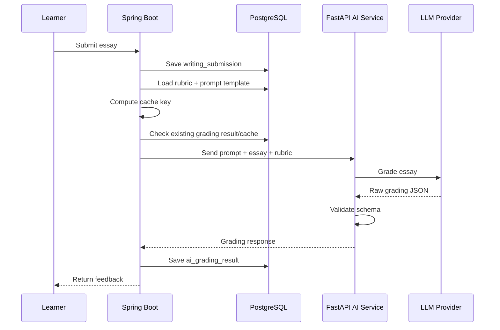
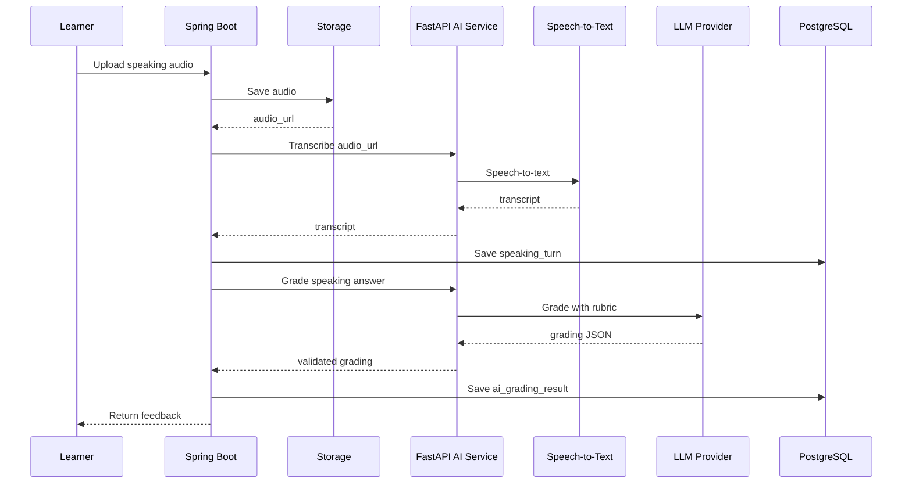

# Thiet ke AI Service - IELTS AI Learning Platform

## 1. Muc tieu

Tai lieu nay mo ta huong trien khai phan AI cho he thong hoc tieng Anh va luyen thi IELTS.

Muc tieu cua AI:

- Tao cau hoi, dap an va giai thich tu du lieu goc trong database.
- Cham Writing va Speaking theo IELTS rubric.
- Tao feedback chi tiet va goi y cai thien.
- Tao follow-up question cho Speaking.
- Tao vocabulary quiz va grammar exercise.
- Ho tro ca nhan hoa bai hoc tiep theo.

Nguyen tac quan trong:

- Frontend khong goi AI truc tiep.
- Spring Boot la backend chinh va so huu database.
- Python FastAPI la service rieng cho AI orchestration.
- AI API duoc goi co kiem soat, co cache, co schema validation.
- Reading/Listening/Vocabulary/Grammar khong goi AI moi khi learner lam bai; AI sinh truoc, luu DB, admin duyet, learner lam tu DB.
- Writing/Speaking can goi AI khi learner nop bai, nhung phai dung rubric, prompt version, schema validation va cache.

## 2. Kien truc tong quan



## 3. Vai tro tung thanh phan

## 3.1. React Frontend

Frontend chi lam viec voi Spring Boot API.

Frontend khong:

- Goi LLM API truc tiep.
- Giu API key.
- Tu xu ly prompt.
- Tu validate output AI.

## 3.2. Spring Boot Backend

Spring Boot la backend chinh.

Trach nhiem:

- Authentication/authorization.
- Quan ly user/profile/admin.
- Quan ly source data.
- Quan ly exercise/question/submission.
- Luu database.
- Goi FastAPI AI Service khi can.
- Validate response tu AI Service o muc nghiep vu.
- Luu cau hoi/feedback/ket qua cham diem vao database.
- Chay rule-based scoring cho Reading/Listening/Vocabulary/Grammar.

Spring Boot khong nen de FastAPI ghi truc tiep vao PostgreSQL trong MVP.

## 3.3. Python FastAPI AI Service

FastAPI la service xu ly AI.

Trach nhiem:

- Nhan request co cau truc tu Spring Boot.
- Build prompt tu prompt template.
- Goi AI provider.
- Validate output JSON bang Pydantic.
- Retry khi output sai schema.
- Chuan hoa response tra ve cho Spring Boot.
- Goi speech-to-text provider neu co audio.
- Khong so huu database chinh.

## 3.4. AI Provider

AI provider co the la:

- OpenAI.
- Gemini.
- Claude.
- Local LLM qua Ollama/vLLM neu co dieu kien.
- Mock provider khi dev/test.

Khuyen nghi MVP:

- Bat dau voi API provider.
- Thiet ke adapter de co the doi provider.
- Co Mock provider de demo/test khong ton chi phi.

## 4. Microservice hay monolith cho AI?

Khuyen nghi:

```text
Spring Boot modular monolith + Python FastAPI AI service rieng
```

Khong nen dung full microservice cho tat ca module trong do an vi tang do phuc tap:

- API gateway.
- Service discovery.
- Distributed tracing.
- Distributed transaction.
- Deployment phuc tap.

Nhung nen tach AI service vi:

- Python co he sinh thai AI/NLP/audio tot.
- De thay doi AI provider.
- De test/mock AI rieng.
- Giam phu thuoc AI vao backend nghiep vu.
- Phu hop voi kien truc thuc te.

## 5. Nen dung model, thu vien hay API?

## 5.1. Ket luan de xuat

Nen dung hybrid approach:

```text
LLM API cho tac vu ngon ngu kho
Rule-based code cho cham bai co dap an co dinh
Python libraries cho xu ly phu tro
Mock/local mode cho dev va demo
```

## 5.2. Bang lua chon theo tac vu

| Tac vu | Cach lam khuyen nghi |
| --- | --- |
| Tao cau hoi Reading | LLM API, sinh truoc va luu DB |
| Tao cau hoi Listening | LLM API tu transcript, sinh truoc va luu DB |
| Cham Reading | Rule-based so voi correct_answer trong DB |
| Cham Listening | Rule-based so voi correct_answer trong DB |
| Tao vocabulary quiz | LLM API hoac template rule-based, sinh truoc |
| Cham vocabulary quiz | Rule-based |
| Tao grammar exercise | LLM API hoac template rule-based, sinh truoc |
| Cham grammar exercise | Rule-based |
| Cham Writing | LLM API + rubric + JSON schema + cache |
| Cham Speaking | LLM API + transcript + rubric + JSON schema + cache |
| Speech-to-text | Whisper API/local Whisper |
| Pronunciation scoring | De sau, Azure Speech Assessment hoac provider tuong duong |
| Dashboard analytics | Code backend + SQL, AI chi dung de tao goi y neu can |

## 5.3. Vi sao khong tu train model trong MVP

Tu train/fine-tune model can:

- Dataset lon va chat luong.
- GPU.
- Quy trinh evaluation.
- MLOps.
- Thoi gian tuning.
- Kinh nghiem ML.

Trong do an nay, gia tri chinh nen la:

- Thiet ke he thong AI-enabled tot.
- Sinh cau hoi co truy vet tu source data.
- Cham Writing/Speaking theo rubric.
- Ca nhan hoa hoc tap.

Do do, API + prompt engineering + validation + cache la huong thuc te hon.

## 6. Kien truc noi bo FastAPI AI Service



## 6.1. Folder structure de xuat

```text
ai-service/
  app/
    main.py
    core/
      config.py
      logging.py
      errors.py
    api/
      routes/
        reading.py
        listening.py
        writing.py
        speaking.py
        vocabulary.py
        grammar.py
        recommendation.py
        speech.py
    schemas/
      common.py
      reading.py
      listening.py
      writing.py
      speaking.py
      vocabulary.py
      grammar.py
    services/
      prompt_service.py
      ai_generation_service.py
      grading_service.py
      speech_service.py
      cache_service.py
    providers/
      base.py
      openai_client.py
      gemini_client.py
      claude_client.py
      local_client.py
      mock_client.py
    prompts/
      reading_generate.md
      listening_generate.md
      writing_grade_task2.md
      speaking_grade.md
      grammar_generate.md
    tests/
```

## 6.2. Interface provider

```python
from abc import ABC, abstractmethod
from typing import Any

class LLMClient(ABC):
    @abstractmethod
    async def generate_json(
        self,
        system_prompt: str,
        user_prompt: str,
        response_schema: dict[str, Any],
        temperature: float = 0.2,
    ) -> dict[str, Any]:
        pass
```

Loi ich:

- Doi provider khong anh huong business logic.
- Test bang MockClient.
- Co the dung model re cho task don gian, model tot cho grading.

## 6.3. Config provider

```text
AI_PROVIDER=openai
AI_MODEL_DEFAULT=gpt-4o-mini
AI_MODEL_GRADING=gpt-4o
AI_TEMPERATURE_GENERATION=0.3
AI_TEMPERATURE_GRADING=0.1
AI_CACHE_ENABLED=true
AI_MOCK_MODE=false
```

## 7. API endpoints cua FastAPI AI Service

## 7.1. Reading

```text
POST /ai/reading/generate-questions
```

Input:

```json
{
  "source_material_id": "uuid",
  "passage": "...",
  "topic": "Environment",
  "level": "B2",
  "target_band": 6.5,
  "question_type": "true_false_not_given",
  "number_of_questions": 8
}
```

Output:

```json
{
  "questions": [
    {
      "question_text": "...",
      "question_type": "true_false_not_given",
      "options": null,
      "correct_answer": {"value": "True"},
      "explanation": "...",
      "evidence_text": "...",
      "evidence_location": "paragraph 2",
      "difficulty": "medium"
    }
  ]
}
```

## 7.2. Listening

```text
POST /ai/listening/generate-questions
```

Input:

```json
{
  "source_material_id": "uuid",
  "transcript": "...",
  "segments": [
    {
      "start_time": 12.5,
      "end_time": 18.0,
      "speaker": "A",
      "text": "..."
    }
  ],
  "topic": "Travel",
  "level": "B1",
  "question_type": "form_completion",
  "number_of_questions": 6
}
```

Output:

```json
{
  "questions": [
    {
      "question_text": "The booking is for ____ nights.",
      "correct_answer": {"value": "two"},
      "explanation": "...",
      "evidence_text": "...",
      "timestamp_start": 12.5,
      "timestamp_end": 18.0
    }
  ]
}
```

## 7.3. Writing grading

```text
POST /ai/writing/grade
```

Input:

```json
{
  "submission_id": "uuid",
  "task_type": "task_2",
  "prompt": "...",
  "essay": "...",
  "target_band": 6.5,
  "rubric": [
    {
      "criterion": "Task Response",
      "band_score": 6.0,
      "descriptor": "..."
    }
  ],
  "prompt_version": "writing-task2-v1"
}
```

Output:

```json
{
  "overall_band": 6.0,
  "criterion_scores": {
    "task_response": 6.0,
    "coherence_cohesion": 6.0,
    "lexical_resource": 6.5,
    "grammatical_range_accuracy": 5.5
  },
  "strengths": ["..."],
  "weaknesses": ["..."],
  "grammar_errors": [
    {
      "original": "...",
      "corrected": "...",
      "error_type": "...",
      "explanation": "..."
    }
  ],
  "vocabulary_suggestions": [
    {
      "original": "...",
      "suggestion": "...",
      "reason": "..."
    }
  ],
  "feedback_text": "...",
  "improved_answer_text": "..."
}
```

## 7.4. Speaking grading

```text
POST /ai/speaking/grade
```

Input:

```json
{
  "speaking_turn_id": "uuid",
  "part": "part_2",
  "question": "...",
  "answer_text": "...",
  "transcript": "...",
  "duration_seconds": 90,
  "target_band": 6.5,
  "rubric": [
    {
      "criterion": "Fluency and Coherence",
      "band_score": 6.0,
      "descriptor": "..."
    }
  ]
}
```

Output:

```json
{
  "overall_band": 5.5,
  "criterion_scores": {
    "fluency_coherence": 5.5,
    "lexical_resource": 6.0,
    "grammatical_range_accuracy": 5.0,
    "pronunciation": 5.5
  },
  "strengths": ["..."],
  "weaknesses": ["..."],
  "feedback_text": "...",
  "improved_answer_text": "...",
  "follow_up_question": "..."
}
```

## 7.5. Speech-to-text

```text
POST /ai/speech/transcribe
```

Input:

```json
{
  "audio_url": "https://...",
  "language": "en"
}
```

Output:

```json
{
  "transcript": "...",
  "duration_seconds": 83,
  "segments": [
    {
      "start_time": 0.0,
      "end_time": 4.2,
      "text": "..."
    }
  ]
}
```

## 8. Prompt engineering strategy

## 8.1. Nguyen tac prompt

Moi prompt nen co:

- Role ro rang.
- Task ro rang.
- Input data ro rang.
- Rubric/criteria neu la grading.
- Output JSON schema.
- Quy tac khong duoc tao thong tin ngoai source neu task yeu cau evidence.
- Yeu cau tra ve only valid JSON.

## 8.2. Reading prompt guideline

Muc tieu:

- Tao cau hoi dung theo passage.
- Cau hoi phu hop level.
- Dap an co evidence trong passage.
- Giai thich ngan gon.

Quy tac:

- Khong tao cau hoi neu dap an khong co trong passage.
- Moi cau hoi phai co evidence_text.
- Distractors trong multiple choice phai hop ly nhung sai.
- Khong lap lai y cua cau hoi truoc.

## 8.3. Listening prompt guideline

Muc tieu:

- Tao cau hoi tu transcript.
- Neu co segments, gan timestamp cho dap an.
- Tao cau hoi theo format IELTS Listening.

Quy tac:

- Dap an phai xuat hien trong transcript hoac suy ra truc tiep.
- Form completion khong nen co dap an qua dai.
- Dap an can chuan hoa case-insensitive khi cham.

## 8.4. Writing grading prompt guideline

Muc tieu:

- Cham theo IELTS Writing Band Descriptors.
- Tra diem tung tieu chi.
- Giai thich vi sao cho diem.
- Dua feedback co the hanh dong.

Quy tac:

- Cham tung criterion truoc.
- Khong cho overall cao hon nhieu so voi criterion thap nhat neu loi nghiem trong.
- Khong khen chung chung.
- Neu essay qua ngan, phai noi ro anh huong toi diem.
- Output la Estimated IELTS Band Score.

## 8.5. Speaking grading prompt guideline

Muc tieu:

- Cham theo Speaking rubric.
- Danh gia fluency/coherence, vocabulary, grammar, pronunciation.
- Dua feedback va follow-up question.

Quy tac:

- Neu chi co transcript, pronunciation chi la uoc luong han che.
- Neu co audio metrics, moi cham pronunciation tot hon.
- Follow-up question phai lien quan cau tra loi truoc.

## 9. JSON schema validation

FastAPI nen dung Pydantic model cho moi response.

Vi du schema cho Reading:

```python
from pydantic import BaseModel, Field

class GeneratedQuestion(BaseModel):
    question_text: str
    question_type: str
    options: list[dict] | None = None
    correct_answer: dict
    explanation: str
    evidence_text: str | None = None
    evidence_location: str | None = None
    timestamp_start: float | None = None
    timestamp_end: float | None = None
    difficulty: str | None = None

class ReadingGenerationResponse(BaseModel):
    questions: list[GeneratedQuestion] = Field(min_length=1)
```

Neu AI tra sai schema:

1. Retry voi prompt sua loi: "Convert this output to valid JSON matching schema".
2. Neu van sai, tra error ve Spring Boot.
3. Spring Boot luu `ai_generation_requests.status = failed`.

## 10. Kiem soat tinh nhat quan

## 10.1. Sinh noi dung co dap an co dinh

Ap dung cho:

- Reading.
- Listening.
- Vocabulary.
- Grammar.

Workflow:

```text
Admin/source data -> AI generate -> validate -> save DB -> admin review -> publish -> learner uses DB
```

Ket qua:

- Learner khong goi AI khi lam bai.
- Cau hoi, dap an, giai thich nhat quan.
- Chi phi thap hon.
- Admin co the sua cau hoi sai.

## 10.2. Writing/Speaking grading

Ap dung:

- Prompt version co dinh.
- Rubric version co dinh.
- Temperature thap.
- JSON schema co dinh.
- Cache bang hash.
- Luu model_name va prompt_version.

Cache key:

```text
hash(task_type + prompt + answer + rubric_version + prompt_version + model_name)
```

Neu cung input, lay grading result cu.

## 10.3. Model parameters

De tang nhat quan:

```text
temperature: 0.0 - 0.2 cho grading
temperature: 0.2 - 0.4 cho generation
top_p: thap/medium tuy provider
max_tokens: gioi han theo task
response_format: JSON neu provider ho tro
```

## 11. Kiem soat chi phi

## 11.1. Nguyen tac

- Khong goi AI khi khong can.
- Sinh truoc va cache.
- Dung model re cho task don gian.
- Dung model tot hon cho grading quan trong.
- Co quota noi bo.
- Dung Mock AI trong dev/test.

## 11.2. Phan loai task theo chi phi

| Task | Tan suat goi AI | Cach giam chi phi |
| --- | --- | --- |
| Generate Reading | Admin goi khi tao noi dung | Batch generate, luu DB |
| Generate Listening | Admin goi khi tao noi dung | Batch generate, luu DB |
| Vocabulary quiz | Admin goi hoac rule-based | Template/rule-based neu duoc |
| Grammar exercise | Admin goi hoac rule-based | Template/rule-based neu duoc |
| Writing grading | Learner submit | Cache, quota, model routing |
| Speaking grading | Learner submit | Cache, quota, text MVP |
| Recommendation | Khong can moi lan | Chay khi co du du lieu moi |

## 11.3. Model routing

Vi du:

```text
cheap_model:
  - vocabulary quiz
  - grammar exercise
  - simple recommendation

standard_model:
  - reading/listening question generation

strong_model:
  - writing grading
  - speaking grading
```

## 12. Rule-based scoring

Spring Boot nen cham cac bai co dap an co dinh.

## 12.1. Reading/Listening

So sanh `user_answers.answer` voi `generated_questions.correct_answer`.

Can chuan hoa:

- Lowercase.
- Trim spaces.
- Bo dau cau khong can thiet.
- Chap nhan aliases neu `correct_answer` co nhieu dap an.

Vi du correct answer:

```json
{
  "type": "text",
  "accepted_values": ["two nights", "2 nights", "two"]
}
```

## 12.2. Vocabulary/Grammar

Cham theo correct_answer trong DB.

Khong can goi AI.

## 13. Workflow chi tiet

## 13.1. Generate Reading questions



## 13.2. Grade Writing



## 13.3. Speaking with audio



## 14. Evaluation va quality control

## 14.1. Dataset test nho

Can tao tap test noi bo:

- 5 passages Reading.
- 5 transcripts Listening.
- 10 essays Writing mau.
- 10 speaking transcripts mau.
- Vocabulary/grammar sample.

## 14.2. Tieu chi danh gia

Reading/Listening generation:

- Cau hoi co dap an dung.
- Explanation hop ly.
- Evidence co trong source.
- Do kho phu hop level.
- Khong lap cau hoi.

Writing/Speaking grading:

- Diem tung criterion co ly do.
- Feedback lien quan bai lam.
- Loi grammar/vocabulary duoc chi ra dung.
- Overall band khong lech vo ly so voi criterion.

## 14.3. Human review

Admin review nen co:

- Accept.
- Edit.
- Reject.
- Regenerate.

Noi dung published phai co:

- Question text.
- Correct answer.
- Explanation.
- Evidence/timestamp neu la Reading/Listening.

## 15. Bao mat va privacy

## 15.1. API key

- Chi luu API key trong environment variables cua AI service.
- Khong tra key ve frontend.
- Khong commit key vao repository.

## 15.2. Du lieu nguoi dung

- Writing/Speaking submission co the chua du lieu ca nhan.
- Chi gui sang AI provider phan can thiet.
- Co the an danh user id khi goi AI.
- Khong dung submission nguoi dung de train model neu chua co dong y.

## 15.3. Logging

Nen log:

- request id.
- task type.
- model name.
- prompt version.
- token usage neu provider tra ve.
- status success/failed.

Can tranh log:

- password.
- API key.
- thong tin nhay cam.

## 16. Fallback va error handling

## 16.1. Khi AI generation fail

Spring Boot:

- Cap nhat `ai_generation_requests.status = failed`.
- Luu error message.
- Cho admin retry.

## 16.2. Khi AI grading fail

Frontend:

- Hien trang thai "Dang xu ly" hoac "Thu lai sau".

Spring Boot:

- Luu submission.
- Cho retry grading.
- Khong mat bai lam cua learner.

## 16.3. Khi STT fail

- Cho learner nhap transcript text thu cong.
- Cho retry audio.
- Luu audio_url de xu ly lai.

## 17. Lo trinh trien khai AI

## Phase AI-0 - Mock AI

Muc tieu:

- Xay FastAPI service skeleton.
- Tao endpoint co response gia lap.
- Spring Boot goi duoc AI service.
- Khong ton chi phi API.

Dau ra:

- Mock Reading generation.
- Mock Writing grading.
- Mock Speaking grading.

## Phase AI-1 - Prompt va schema

Muc tieu:

- Viet prompt templates.
- Viet Pydantic schemas.
- Validate output.
- Retry khi output sai schema.

Dau ra:

- Reading/Listening generation schema.
- Writing/Speaking grading schema.
- Test cases cho schema.

## Phase AI-2 - Real LLM provider

Muc tieu:

- Tich hop mot provider dau tien.
- Cau hinh model routing.
- Luu model/prompt version.

Dau ra:

- Goi AI that cho Reading generation.
- Goi AI that cho Writing grading.

## Phase AI-3 - Cache va cost control

Muc tieu:

- Cache bang hash input.
- Quota noi bo.
- Token usage logging.

Dau ra:

- Giam goi lap lai.
- Co thong ke chi phi uoc tinh.

## Phase AI-4 - Speaking va STT

Muc tieu:

- Transcribe audio.
- Grade Speaking tu transcript.
- Generate follow-up question.

Dau ra:

- Speaking text MVP.
- Speaking audio neu co STT.

## Phase AI-5 - Quality review

Muc tieu:

- Tao admin review workflow.
- Tao sample evaluation.
- So sanh output giua prompt versions.

Dau ra:

- Noi dung AI generated co the publish an toan.
- Co bang danh gia chat luong trong bao cao.

## 18. Khuyen nghi cho do an

Huong thuc te nhat:

```text
1. Lam Mock AI truoc de xong flow.
2. Lam AI API cho Reading generation va Writing grading.
3. Luu tat ca output AI vao database.
4. Them admin review.
5. Them cache cho Writing/Speaking.
6. Lam Speaking text grading.
7. Them STT/audio neu con pham vi.
```

Khong nen:

- Goi AI moi lan learner mo bai.
- De AI tra text tu do khong schema.
- De FastAPI ghi truc tiep database chinh trong MVP.
- Tu train model khi chua co dataset/evaluation.
- Dua pronunciation scoring nang cao vao MVP neu chua co speech assessment provider.

## 19. Ket luan

AI nen duoc xay theo huong:

```text
FastAPI AI Service + Provider Adapter + Prompt Template + JSON Schema Validation + Cache + Admin Review
```

Cach nay giup:

- Giam chi phi.
- Tang tinh nhat quan.
- De thay doi AI provider.
- De test bang Mock AI.
- Phu hop voi kien truc Spring Boot + React + PostgreSQL.
- Phu hop voi pham vi do an tot nghiep.
