# Tai lieu thiet ke database PostgreSQL - IELTS AI Learning Platform

## 1. Muc tieu thiet ke

Tai lieu nay mo ta thiet ke database cho website hoc tieng Anh va luyen thi IELTS ca nhan hoa bang AI.

He thong su dung PostgreSQL va duoc thiet ke theo nguyen tac:

- Database luu **du lieu goc**: passage, transcript, audio URL, de Writing, cau hoi Speaking, vocabulary, grammar, rubric.
- AI tao **cau hoi, dap an, giai thich, feedback, diem cham, goi y hoc tap** tu du lieu goc trong database.
- Ket qua AI tao duoc luu lai de tai su dung, kiem duyet, cham bai va phan tich tien do.
- Du lieu nguoi hoc duoc luu rieng de phuc vu dashboard va ca nhan hoa.

## 2. Cong nghe va quy uoc PostgreSQL

### 2.1. PostgreSQL features nen dung

- `uuid` cho khoa chinh.
- `jsonb` cho cac cau truc linh hoat nhu options, correct answers, rubric scores, grammar errors.
- `enum` cho cac gia tri co tap hop co dinh.
- `timestamp with time zone` cho thoi gian.
- `text` cho noi dung dai nhu passage, transcript, essay, feedback.
- `numeric(3,1)` cho IELTS band score.
- GIN index cho cac cot `jsonb` can query.

### 2.2. Extension

```sql
CREATE EXTENSION IF NOT EXISTS pgcrypto;
```

Dung `gen_random_uuid()` de tao UUID.

### 2.3. Cac enum goi y

```sql
CREATE TYPE user_role AS ENUM ('learner', 'admin');
CREATE TYPE skill_type AS ENUM ('reading', 'listening', 'writing', 'speaking', 'vocabulary', 'grammar');
CREATE TYPE content_status AS ENUM ('draft', 'reviewed', 'published', 'rejected', 'archived');
CREATE TYPE source_type AS ENUM ('self_created', 'ai_created', 'open_dataset', 'user_generated');
CREATE TYPE generation_status AS ENUM ('pending', 'processing', 'completed', 'failed');
CREATE TYPE writing_task_type AS ENUM ('task_1', 'task_2');
CREATE TYPE speaking_part AS ENUM ('part_1', 'part_2', 'part_3');
CREATE TYPE submission_type AS ENUM ('writing', 'speaking');
CREATE TYPE memory_status AS ENUM ('new', 'learning', 'reviewing', 'mastered');
```

## 3. ERD tong quan

Neu can xem bieu do truc quan tren dbdiagram.io, su dung file:

```text
docs/dbdiagram-erd.dbml
```

Copy noi dung file nay vao dbdiagram.io de render ERD day du voi enum, bang, khoa ngoai va index chinh.

```mermaid
erDiagram
    USERS ||--o| LEARNER_PROFILES : has
    USERS ||--o{ PRACTICE_ATTEMPTS : makes
    USERS ||--o{ WRITING_SUBMISSIONS : submits
    USERS ||--o{ SPEAKING_SESSIONS : starts
    USERS ||--o{ USER_VOCABULARY_PROGRESS : tracks
    USERS ||--o{ USER_GRAMMAR_PROGRESS : tracks
    USERS ||--o{ LEARNING_RECOMMENDATIONS : receives

    TOPICS ||--o{ SOURCE_MATERIALS : classifies
    TOPICS ||--o{ READING_PASSAGES : classifies
    TOPICS ||--o{ LISTENING_MATERIALS : classifies
    TOPICS ||--o{ WRITING_PROMPTS : classifies
    TOPICS ||--o{ SPEAKING_PROMPTS : classifies
    TOPICS ||--o{ VOCABULARY_ITEMS : classifies

    LEVELS ||--o{ SOURCE_MATERIALS : sets_level
    LEVELS ||--o{ READING_PASSAGES : sets_level
    LEVELS ||--o{ LISTENING_MATERIALS : sets_level
    LEVELS ||--o{ WRITING_PROMPTS : sets_level
    LEVELS ||--o{ SPEAKING_PROMPTS : sets_level
    LEVELS ||--o{ VOCABULARY_ITEMS : sets_level
    LEVELS ||--o{ GRAMMAR_TOPICS : sets_level

    SOURCE_MATERIALS ||--o| READING_PASSAGES : reading_source
    SOURCE_MATERIALS ||--o| LISTENING_MATERIALS : listening_source
    SOURCE_MATERIALS ||--o{ AI_GENERATION_REQUESTS : used_by
    SOURCE_MATERIALS ||--o{ GENERATED_EXERCISES : generates

    LISTENING_MATERIALS ||--o{ TRANSCRIPT_SEGMENTS : has

    GENERATED_EXERCISES ||--o{ GENERATED_QUESTIONS : contains
    GENERATED_EXERCISES ||--o{ PRACTICE_ATTEMPTS : attempted_as
    PRACTICE_ATTEMPTS ||--o{ USER_ANSWERS : contains
    GENERATED_QUESTIONS ||--o{ USER_ANSWERS : answered_by

    WRITING_PROMPTS ||--o{ WRITING_SUBMISSIONS : receives
    SPEAKING_PROMPTS ||--o{ SPEAKING_TURNS : asked_as
    SPEAKING_SESSIONS ||--o{ SPEAKING_TURNS : contains

    WRITING_SUBMISSIONS ||--o{ AI_GRADING_RESULTS : graded_by
    SPEAKING_TURNS ||--o{ AI_GRADING_RESULTS : graded_by

    VOCABULARY_ITEMS ||--o{ USER_VOCABULARY_PROGRESS : learned_by
    GRAMMAR_TOPICS ||--o{ GRAMMAR_EXERCISES : has
    GRAMMAR_TOPICS ||--o{ USER_GRAMMAR_PROGRESS : learned_by

    PROMPT_TEMPLATES ||--o{ AI_GENERATION_REQUESTS : uses
    PROMPT_TEMPLATES ||--o{ AI_GRADING_RESULTS : uses
    AI_GENERATION_REQUESTS ||--o{ GENERATED_EXERCISES : creates
```



## 4. ERD voi truong du lieu chinh

```mermaid
erDiagram
    USERS {
        uuid id PK
        varchar full_name
        varchar email UK
        text password_hash
        user_role role
        timestamptz created_at
        timestamptz updated_at
    }

    LEARNER_PROFILES {
        uuid id PK
        uuid user_id FK
        numeric current_band
        numeric target_band
        jsonb weak_skills
        integer daily_study_minutes
        boolean placement_completed
        timestamptz created_at
        timestamptz updated_at
    }

    TOPICS {
        uuid id PK
        varchar name UK
        text description
        timestamptz created_at
    }

    LEVELS {
        uuid id PK
        varchar cefr_level
        numeric ielts_band_min
        numeric ielts_band_max
        text description
    }

    SOURCE_MATERIALS {
        uuid id PK
        skill_type skill
        varchar title
        uuid topic_id FK
        uuid level_id FK
        text content_text
        text media_url
        text transcript
        source_type source_type
        text license_info
        content_status status
        uuid created_by FK
        timestamptz created_at
        timestamptz updated_at
    }

    READING_PASSAGES {
        uuid id PK
        uuid source_material_id FK
        varchar title
        text passage_text
        uuid topic_id FK
        uuid level_id FK
        numeric estimated_band
        integer word_count
        content_status status
    }

    LISTENING_MATERIALS {
        uuid id PK
        uuid source_material_id FK
        varchar title
        text audio_url
        text transcript
        uuid topic_id FK
        uuid level_id FK
        varchar accent
        integer duration_seconds
        content_status status
    }

    TRANSCRIPT_SEGMENTS {
        uuid id PK
        uuid listening_material_id FK
        numeric start_time
        numeric end_time
        varchar speaker
        text segment_text
        integer order_index
    }

    WRITING_PROMPTS {
        uuid id PK
        writing_task_type task_type
        text prompt_text
        text chart_image_url
        varchar essay_type
        uuid topic_id FK
        uuid level_id FK
        content_status status
    }

    SPEAKING_PROMPTS {
        uuid id PK
        speaking_part part
        uuid topic_id FK
        text prompt_text
        jsonb cue_points
        uuid level_id FK
        content_status status
    }

    GENERATED_EXERCISES {
        uuid id PK
        uuid generation_request_id FK
        uuid source_material_id FK
        skill_type skill
        varchar title
        uuid topic_id FK
        uuid level_id FK
        varchar question_type
        integer estimated_time_minutes
        content_status status
        timestamptz created_at
    }

    GENERATED_QUESTIONS {
        uuid id PK
        uuid exercise_id FK
        text question_text
        varchar question_type
        integer order_index
        jsonb options
        jsonb correct_answer
        text explanation
        text evidence_text
        varchar evidence_location
        numeric timestamp_start
        numeric timestamp_end
        varchar difficulty
        content_status status
    }

    PRACTICE_ATTEMPTS {
        uuid id PK
        uuid user_id FK
        uuid exercise_id FK
        skill_type skill
        timestamptz started_at
        timestamptz submitted_at
        numeric score
        numeric max_score
        numeric estimated_band
        integer time_spent_seconds
    }

    USER_ANSWERS {
        uuid id PK
        uuid attempt_id FK
        uuid question_id FK
        jsonb answer
        boolean is_correct
        numeric score
        text feedback
    }

    RUBRICS {
        uuid id PK
        skill_type skill
        varchar task_type
        varchar criterion
        numeric band_score
        text descriptor_text
        varchar version
        text source_reference
    }

    WRITING_SUBMISSIONS {
        uuid id PK
        uuid user_id FK
        uuid writing_prompt_id FK
        text essay_text
        integer word_count
        timestamptz submitted_at
    }

    SPEAKING_SESSIONS {
        uuid id PK
        uuid user_id FK
        uuid topic_id FK
        speaking_part part
        timestamptz started_at
        timestamptz ended_at
        numeric overall_band
    }

    SPEAKING_TURNS {
        uuid id PK
        uuid session_id FK
        uuid speaking_prompt_id FK
        text question_text
        text answer_text
        text audio_url
        text transcript
        integer duration_seconds
        integer order_index
        boolean is_ai_follow_up
        timestamptz created_at
    }

    AI_GRADING_RESULTS {
        uuid id PK
        uuid user_id FK
        submission_type submission_type
        uuid submission_id
        numeric overall_band
        jsonb criterion_scores
        jsonb strengths
        jsonb weaknesses
        jsonb grammar_errors
        jsonb vocabulary_suggestions
        jsonb pronunciation_metrics
        text feedback_text
        text improved_answer_text
        varchar model_name
        uuid prompt_template_id FK
        timestamptz created_at
    }

    VOCABULARY_ITEMS {
        uuid id PK
        varchar word
        varchar ipa
        varchar part_of_speech
        text meaning_vi
        text definition_en
        text example_sentence
        jsonb collocations
        jsonb synonyms
        jsonb antonyms
        uuid topic_id FK
        uuid level_id FK
        text audio_url
        content_status status
    }

    USER_VOCABULARY_PROGRESS {
        uuid id PK
        uuid user_id FK
        uuid vocabulary_item_id FK
        memory_status memory_status
        numeric ease_score
        timestamptz next_review_at
        integer review_count
        timestamptz last_reviewed_at
    }

    GRAMMAR_TOPICS {
        uuid id PK
        varchar title
        uuid level_id FK
        text explanation
        text formula
        jsonb examples
        jsonb common_mistakes
        text ielts_application
        content_status status
    }

    GRAMMAR_EXERCISES {
        uuid id PK
        uuid grammar_topic_id FK
        uuid generated_exercise_id FK
        varchar exercise_type
        text question_text
        jsonb options
        jsonb correct_answer
        text explanation
        content_status status
    }

    PROMPT_TEMPLATES {
        uuid id PK
        varchar name
        varchar task_type
        text template_text
        jsonb output_schema
        varchar version
        boolean is_active
    }

    AI_GENERATION_REQUESTS {
        uuid id PK
        uuid source_material_id FK
        uuid requested_by FK
        varchar generation_type
        jsonb input_parameters
        uuid prompt_template_id FK
        varchar model_name
        jsonb raw_response
        generation_status status
        text error_message
        timestamptz created_at
    }

    LEARNING_RECOMMENDATIONS {
        uuid id PK
        uuid user_id FK
        varchar recommendation_type
        text recommendation_text
        jsonb recommended_items
        text reason
        content_status status
        timestamptz created_at
    }
```



## 5. Thiet ke bang theo module

## 5.1. Core module

### `users`

Luu tai khoan.

| Column | Type | Ghi chu |
| --- | --- | --- |
| id | uuid | PK, default `gen_random_uuid()` |
| full_name | varchar(255) | Ho ten |
| email | varchar(255) | Unique |
| password_hash | text | Mat khau da hash |
| role | user_role | learner/admin |
| created_at | timestamptz | Default now |
| updated_at | timestamptz | Default now |

### `learner_profiles`

Luu cau hinh hoc tap cua learner.

| Column | Type | Ghi chu |
| --- | --- | --- |
| id | uuid | PK |
| user_id | uuid | FK -> users.id, unique |
| current_band | numeric(3,1) | Band hien tai uoc luong |
| target_band | numeric(3,1) | Band muc tieu |
| weak_skills | jsonb | VD: `["writing", "speaking"]` |
| daily_study_minutes | integer | Thoi luong hoc moi ngay |
| placement_completed | boolean | Da lam placement test chua |

### `topics`

Luu chu de IELTS.

Vi du seed data:

- Education
- Environment
- Technology
- Health
- Work
- Travel
- Media
- Crime
- Culture
- Government

### `levels`

Luu mapping giua CEFR va IELTS band.

| CEFR | IELTS range goi y |
| --- | --- |
| A2 | 3.0 - 4.0 |
| B1 | 4.0 - 5.0 |
| B2 | 5.5 - 6.5 |
| C1 | 7.0 - 8.0 |
| C2 | 8.5 - 9.0 |

## 5.2. Source material module

### `source_materials`

Bang trung tam de luu du lieu goc cho AI.

Mot ban ghi co the dai dien cho:

- Passage Reading.
- Transcript/audio Listening.
- Writing prompt.
- Speaking topic/cue card.
- Grammar source.
- Vocabulary source.

Cot quan trong:

- `skill`: xac dinh loai noi dung.
- `content_text`: noi dung goc dang text.
- `media_url`: file audio/image neu co.
- `transcript`: transcript cho Listening.
- `source_type`: nguon du lieu.
- `license_info`: thong tin ban quyen.
- `status`: trang thai kiem duyet.

## 5.3. AI-generated exercise module

### `ai_generation_requests`

Luu lich su moi lan goi AI.

Dung de:

- Debug khi AI sinh sai.
- Biet model/prompt nao da tao noi dung.
- Tai tao hoac so sanh output giua cac prompt.

### `generated_exercises`

Dai dien cho mot bo bai tap.

Vi du:

- Reading passage A sinh ra bai True/False/Not Given.
- Listening transcript B sinh ra bai Form Completion.
- Vocabulary topic Environment sinh ra quiz collocation.

### `generated_questions`

Luu cau hoi, dap an, giai thich.

Cot bat buoc nen co:

- `question_text`
- `correct_answer`
- `explanation`
- `evidence_text` cho Reading/Listening
- `timestamp_start`, `timestamp_end` cho Listening

`options` va `correct_answer` nen dung `jsonb` vi cac dang cau hoi khac nhau co format khac nhau.

Vi du `options` cho multiple choice:

```json
[
  {"key": "A", "text": "Online learning is always cheaper."},
  {"key": "B", "text": "Online learning offers flexibility."},
  {"key": "C", "text": "Classroom learning is outdated."},
  {"key": "D", "text": "Students dislike digital platforms."}
]
```

Vi du `correct_answer`:

```json
{
  "type": "single_choice",
  "value": "B"
}
```

## 6. Database cho 4 ky nang IELTS

## 6.1. Reading

### Bang chinh

- `reading_passages`
- `generated_exercises`
- `generated_questions`
- `practice_attempts`
- `user_answers`

### Luong du lieu

```text
reading_passages
    -> AI generation
    -> generated_exercises
    -> generated_questions
    -> practice_attempts
    -> user_answers
```

### Du lieu Reading can luu

`reading_passages`:

- Passage text.
- Topic.
- Level.
- Estimated band.
- Word count.
- Status.

`generated_questions`:

- Cau hoi.
- Dang cau hoi.
- Options neu co.
- Dap an dung.
- Giai thich.
- Evidence text.
- Evidence location, vi du paragraph 2/sentence 4.

### Yeu cau dac biet

Voi Reading, `evidence_text` nen bat buoc cho moi cau hoi AI tao. Neu AI khong chi ra duoc bang chung trong passage, cau hoi nen o trang thai `draft` hoac `rejected`.

## 6.2. Listening

### Bang chinh

- `listening_materials`
- `transcript_segments`
- `generated_exercises`
- `generated_questions`
- `practice_attempts`
- `user_answers`

### Luong du lieu

```text
listening_materials
    -> transcript_segments
    -> AI generation
    -> generated_exercises
    -> generated_questions
    -> practice_attempts
    -> user_answers
```

### Du lieu Listening can luu

`listening_materials`:

- Audio URL.
- Transcript full.
- Topic.
- Level.
- Accent.
- Duration.

`transcript_segments`:

- Start time.
- End time.
- Speaker.
- Text.
- Order index.

`generated_questions`:

- Cau hoi.
- Dap an.
- Giai thich.
- Timestamp start/end.
- Evidence text tu transcript.

### Yeu cau dac biet

Khong nen luu file audio truc tiep trong PostgreSQL. Chi luu URL/path, file dat o object storage.

## 6.3. Writing

### Bang chinh

- `writing_prompts`
- `rubrics`
- `writing_submissions`
- `ai_grading_results`

### Luong du lieu

```text
writing_prompts
    -> user writes essay
    -> writing_submissions
    -> AI grading with rubrics
    -> ai_grading_results
```

### Du lieu Writing can luu

`writing_prompts`:

- Task type: Task 1/Task 2.
- Prompt text.
- Chart image URL neu Task 1.
- Essay type neu Task 2.
- Topic.
- Level.

`writing_submissions`:

- User id.
- Prompt id.
- Essay text.
- Word count.
- Submitted time.

`rubrics`:

- Skill = writing.
- Task type.
- Criterion.
- Band score.
- Descriptor text.

`ai_grading_results`:

- Overall band.
- Criterion scores.
- Strengths.
- Weaknesses.
- Grammar errors.
- Vocabulary suggestions.
- Feedback.
- Improved version.

### Tieu chi Writing

Task 1:

- Task Achievement.
- Coherence and Cohesion.
- Lexical Resource.
- Grammatical Range and Accuracy.

Task 2:

- Task Response.
- Coherence and Cohesion.
- Lexical Resource.
- Grammatical Range and Accuracy.

### Vi du `criterion_scores`

```json
{
  "task_response": 6.0,
  "coherence_cohesion": 6.0,
  "lexical_resource": 6.5,
  "grammatical_range_accuracy": 5.5
}
```

## 6.4. Speaking

### Bang chinh

- `speaking_prompts`
- `speaking_sessions`
- `speaking_turns`
- `rubrics`
- `ai_grading_results`

### Luong du lieu

```text
speaking_prompts
    -> speaking_sessions
    -> speaking_turns
    -> speech-to-text if audio
    -> AI grading with rubrics
    -> ai_grading_results
    -> AI follow-up question
```

### Tai sao can `speaking_sessions` va `speaking_turns`

Speaking khong chi la mot cau hoi don le. Nguoi hoc co the luyen theo mot chuoi hoi-dap:

- Part 1: nhieu cau hoi ngan.
- Part 2: mot cue card, mot cau tra loi dai.
- Part 3: cau hoi follow-up dua tren cau tra loi truoc.

Vi vay:

- `speaking_sessions` luu mot buoi luyen.
- `speaking_turns` luu tung luot hoi-dap.

### Du lieu Speaking can luu

`speaking_prompts`:

- Part.
- Topic.
- Prompt text.
- Cue points.
- Level.

`speaking_turns`:

- Question text.
- Answer text.
- Audio URL.
- Transcript.
- Duration.
- Is AI follow-up.

`ai_grading_results`:

- Overall band.
- Fluency and Coherence.
- Lexical Resource.
- Grammatical Range and Accuracy.
- Pronunciation.
- Feedback.
- Suggested answer.

### Tieu chi Speaking

- Fluency and Coherence.
- Lexical Resource.
- Grammatical Range and Accuracy.
- Pronunciation.

## 7. Vocabulary va Grammar

## 7.1. Vocabulary

### Bang chinh

- `vocabulary_items`
- `user_vocabulary_progress`
- `generated_exercises`
- `generated_questions`

### Du lieu can luu

`vocabulary_items`:

- Word.
- IPA.
- Part of speech.
- Vietnamese meaning.
- English definition.
- Example sentence.
- Collocations.
- Synonyms.
- Antonyms.
- Topic.
- Level.
- Audio URL.

`user_vocabulary_progress`:

- Memory status.
- Ease score.
- Next review date.
- Review count.
- Last reviewed date.

### AI tao quiz tu vung

AI su dung `vocabulary_items` de tao:

- Multiple choice meaning.
- Fill in the blank.
- Collocation quiz.
- Synonym/antonym.
- Matching.

Ket qua luu vao `generated_exercises` va `generated_questions`.

## 7.2. Grammar

### Bang chinh

- `grammar_topics`
- `grammar_exercises`
- `user_grammar_progress`

### Du lieu can luu

`grammar_topics`:

- Title.
- Level.
- Explanation.
- Formula.
- Examples.
- Common mistakes.
- IELTS application.

`grammar_exercises`:

- Exercise type.
- Question text.
- Options.
- Correct answer.
- Explanation.

### AI tao bai tap ngu phap

AI su dung:

- Explanation.
- Formula.
- Examples.
- Common mistakes.
- Level.

De tao:

- Multiple choice.
- Fill in the blank.
- Error correction.
- Sentence transformation.
- Rewrite sentence.
- Combine sentences.

## 8. Bang attempt va answer

## 8.1. `practice_attempts`

Dung cho cac bai co dap an dung/sai ro rang:

- Reading.
- Listening.
- Vocabulary quiz.
- Grammar exercise.

Khong bat buoc dung cho Writing/Speaking vi hai ky nang nay co bang submission rieng.

## 8.2. `user_answers`

Luu cau tra loi tung cau hoi.

`answer` dung `jsonb` de ho tro nhieu dang:

Multiple choice:

```json
{"selected_option": "B"}
```

Fill in blank:

```json
{"text_answer": "two nights"}
```

Matching:

```json
{"matches": [{"left": "1", "right": "C"}, {"left": "2", "right": "A"}]}
```

## 9. Bang AI grading va recommendation

## 9.1. `ai_grading_results`

Bang nay dung chung cho Writing va Speaking.

Thiet ke co `submission_type` va `submission_id` de tham chieu den:

- `writing_submissions.id`
- `speaking_turns.id`

Neu muon rang buoc database chat che hon, co the tach thanh:

- `writing_grading_results`
- `speaking_grading_results`

Phien ban MVP co the dung mot bang chung de don gian hon.

## 9.2. `learning_recommendations`

Luu goi y hoc tap ca nhan hoa.

Vi du `recommended_items`:

```json
{
  "skills": ["writing"],
  "grammar_topics": ["Complex sentences", "Articles"],
  "vocabulary_topics": ["Environment"],
  "practice": [
    {"type": "writing_prompt", "id": "uuid"},
    {"type": "generated_exercise", "id": "uuid"}
  ]
}
```

## 10. Index va constraint khuyen nghi

### 10.1. Unique constraints

```sql
ALTER TABLE users ADD CONSTRAINT users_email_unique UNIQUE (email);
ALTER TABLE learner_profiles ADD CONSTRAINT learner_profiles_user_unique UNIQUE (user_id);
ALTER TABLE topics ADD CONSTRAINT topics_name_unique UNIQUE (name);
ALTER TABLE user_vocabulary_progress ADD CONSTRAINT user_vocab_unique UNIQUE (user_id, vocabulary_item_id);
ALTER TABLE user_grammar_progress ADD CONSTRAINT user_grammar_unique UNIQUE (user_id, grammar_topic_id);
```

### 10.2. Index theo truy van pho bien

```sql
CREATE INDEX idx_source_materials_skill_status ON source_materials(skill, status);
CREATE INDEX idx_source_materials_topic_level ON source_materials(topic_id, level_id);

CREATE INDEX idx_generated_exercises_skill_status ON generated_exercises(skill, status);
CREATE INDEX idx_generated_exercises_topic_level ON generated_exercises(topic_id, level_id);
CREATE INDEX idx_generated_questions_exercise ON generated_questions(exercise_id, order_index);

CREATE INDEX idx_practice_attempts_user_skill ON practice_attempts(user_id, skill, submitted_at DESC);
CREATE INDEX idx_user_answers_attempt ON user_answers(attempt_id);

CREATE INDEX idx_writing_submissions_user ON writing_submissions(user_id, submitted_at DESC);
CREATE INDEX idx_speaking_sessions_user ON speaking_sessions(user_id, started_at DESC);
CREATE INDEX idx_speaking_turns_session ON speaking_turns(session_id, order_index);

CREATE INDEX idx_vocab_topic_level ON vocabulary_items(topic_id, level_id);
CREATE INDEX idx_vocab_progress_review ON user_vocabulary_progress(user_id, next_review_at);

CREATE INDEX idx_grammar_level ON grammar_topics(level_id);
CREATE INDEX idx_ai_grading_user ON ai_grading_results(user_id, created_at DESC);
```

### 10.3. GIN index cho JSONB neu can query

```sql
CREATE INDEX idx_generated_questions_correct_answer_gin
ON generated_questions USING gin(correct_answer);

CREATE INDEX idx_ai_grading_grammar_errors_gin
ON ai_grading_results USING gin(grammar_errors);

CREATE INDEX idx_learning_recommendations_items_gin
ON learning_recommendations USING gin(recommended_items);
```

## 11. Quan he quan trong

### 11.1. Source material -> AI-generated content

```text
source_materials 1 - n ai_generation_requests
source_materials 1 - n generated_exercises
generated_exercises 1 - n generated_questions
```

Y nghia:

- Mot noi dung goc co the sinh nhieu bai tap.
- Mot bai tap gom nhieu cau hoi.
- Moi cau hoi co dap an va giai thich.

### 11.2. Exercise -> user attempt

```text
generated_exercises 1 - n practice_attempts
practice_attempts 1 - n user_answers
generated_questions 1 - n user_answers
```

Y nghia:

- Nguoi hoc lam mot generated exercise.
- He thong luu cau tra loi tung cau.
- Ket qua duoc dung de dashboard va recommendation.

### 11.3. Writing grading

```text
writing_prompts 1 - n writing_submissions
writing_submissions 1 - n ai_grading_results
rubrics -> used by AI grading prompt
```

### 11.4. Speaking grading

```text
speaking_sessions 1 - n speaking_turns
speaking_prompts 1 - n speaking_turns
speaking_turns 1 - n ai_grading_results
```

## 12. PostgreSQL DDL mau rut gon

Day la vi du DDL cho cac bang cot loi. Khi trien khai that, co the tach thanh migration files.

```sql
CREATE TABLE users (
    id uuid PRIMARY KEY DEFAULT gen_random_uuid(),
    full_name varchar(255) NOT NULL,
    email varchar(255) NOT NULL UNIQUE,
    password_hash text NOT NULL,
    role user_role NOT NULL DEFAULT 'learner',
    created_at timestamptz NOT NULL DEFAULT now(),
    updated_at timestamptz NOT NULL DEFAULT now()
);

CREATE TABLE topics (
    id uuid PRIMARY KEY DEFAULT gen_random_uuid(),
    name varchar(100) NOT NULL UNIQUE,
    description text,
    created_at timestamptz NOT NULL DEFAULT now()
);

CREATE TABLE levels (
    id uuid PRIMARY KEY DEFAULT gen_random_uuid(),
    cefr_level varchar(10) NOT NULL,
    ielts_band_min numeric(3,1) NOT NULL,
    ielts_band_max numeric(3,1) NOT NULL,
    description text
);

CREATE TABLE source_materials (
    id uuid PRIMARY KEY DEFAULT gen_random_uuid(),
    skill skill_type NOT NULL,
    title varchar(255) NOT NULL,
    topic_id uuid REFERENCES topics(id),
    level_id uuid REFERENCES levels(id),
    content_text text,
    media_url text,
    transcript text,
    source_type source_type NOT NULL DEFAULT 'self_created',
    license_info text,
    status content_status NOT NULL DEFAULT 'draft',
    created_by uuid REFERENCES users(id),
    created_at timestamptz NOT NULL DEFAULT now(),
    updated_at timestamptz NOT NULL DEFAULT now()
);

CREATE TABLE generated_exercises (
    id uuid PRIMARY KEY DEFAULT gen_random_uuid(),
    generation_request_id uuid,
    source_material_id uuid REFERENCES source_materials(id),
    skill skill_type NOT NULL,
    title varchar(255) NOT NULL,
    topic_id uuid REFERENCES topics(id),
    level_id uuid REFERENCES levels(id),
    question_type varchar(100),
    estimated_time_minutes integer,
    status content_status NOT NULL DEFAULT 'draft',
    created_at timestamptz NOT NULL DEFAULT now()
);

CREATE TABLE generated_questions (
    id uuid PRIMARY KEY DEFAULT gen_random_uuid(),
    exercise_id uuid NOT NULL REFERENCES generated_exercises(id) ON DELETE CASCADE,
    question_text text NOT NULL,
    question_type varchar(100) NOT NULL,
    order_index integer NOT NULL,
    options jsonb,
    correct_answer jsonb NOT NULL,
    explanation text,
    evidence_text text,
    evidence_location varchar(255),
    timestamp_start numeric(8,2),
    timestamp_end numeric(8,2),
    difficulty varchar(50),
    status content_status NOT NULL DEFAULT 'draft'
);
```

## 13. Luu y thiet ke quan trong

### 13.1. Co nen luu cau hoi AI tao hay tao moi moi lan?

Nen luu cau hoi AI tao vao database.

Ly do:

- Giam chi phi goi AI.
- Admin co the kiem duyet.
- Nguoi hoc xem lai lich su bai lam.
- Co the debug cau hoi sai.
- Co du lieu de thong ke cau hoi nao qua kho/de.

### 13.2. Co nen tach bang ReadingQuestions va ListeningQuestions?

Khong bat buoc trong MVP.

Nen dung `generated_questions` chung vi:

- Cau hoi Reading/Listening/Vocabulary/Grammar deu co cau truc gan nhau.
- `jsonb` xu ly duoc format khac nhau.
- Metadata `skill`, `question_type`, `timestamp`, `evidence_text` du de phan biet.

Co the tach rieng khi he thong lon hon va can toi uu sau.

### 13.3. Co nen dung mot bang chung cho AI grading?

Co the dung `ai_grading_results` chung cho MVP.

Neu ve sau can rang buoc chat hon, tach thanh:

- `writing_grading_results`
- `speaking_grading_results`

### 13.4. Diem IELTS nen luu kieu gi?

Dung `numeric(3,1)`, vi IELTS band co dang:

- 4.0
- 4.5
- 5.0
- 5.5
- ...
- 9.0

### 13.5. File audio/image nen luu o dau?

Khong nen luu binary file trong PostgreSQL.

Nen luu file o:

- S3-compatible storage.
- Cloudinary.
- Firebase Storage.
- Local storage trong giai doan demo.

Database chi luu:

- `audio_url`
- `chart_image_url`
- `media_url`

## 14. Thu tu trien khai migration goi y

1. Tao enum va extension.
2. Tao `users`, `topics`, `levels`.
3. Tao `learner_profiles`.
4. Tao `source_materials`.
5. Tao cac bang skill source: `reading_passages`, `listening_materials`, `writing_prompts`, `speaking_prompts`.
6. Tao `transcript_segments`.
7. Tao `prompt_templates`, `ai_generation_requests`.
8. Tao `generated_exercises`, `generated_questions`.
9. Tao `practice_attempts`, `user_answers`.
10. Tao `rubrics`, `writing_submissions`, `speaking_sessions`, `speaking_turns`, `ai_grading_results`.
11. Tao vocabulary/grammar tables.
12. Tao recommendation/progress tables.
13. Tao indexes.
14. Seed data: topics, levels, rubrics, prompt templates.

## 15. Seed data ban dau

### 15.1. Topics

```text
Education
Environment
Technology
Health
Work
Travel
Family
Culture
Media
Crime
Government
Economy
Science
Globalization
```

### 15.2. Levels

```text
A2: IELTS 3.0 - 4.0
B1: IELTS 4.0 - 5.0
B2: IELTS 5.5 - 6.5
C1: IELTS 7.0 - 8.0
C2: IELTS 8.5 - 9.0
```

### 15.3. Rubrics

Can seed IELTS public band descriptors cho:

- Writing Task 1.
- Writing Task 2.
- Speaking.

### 15.4. Prompt templates

Can seed prompt cho:

- Generate Reading Questions.
- Generate Listening Questions.
- Grade Writing Task 1.
- Grade Writing Task 2.
- Grade Speaking.
- Generate Vocabulary Quiz.
- Generate Grammar Exercise.
- Generate Learning Recommendation.

## 16. Ket luan

Thiet ke database nen xoay quanh 4 truc chinh:

1. **Du lieu goc**: `source_materials`, skill-specific source tables.
2. **Du lieu AI tao**: `ai_generation_requests`, `generated_exercises`, `generated_questions`, `ai_grading_results`.
3. **Du lieu hoc tap nguoi dung**: `practice_attempts`, `user_answers`, `writing_submissions`, `speaking_sessions`, `speaking_turns`.
4. **Du lieu ca nhan hoa**: vocabulary progress, grammar progress, recommendations, learner profile.

Voi cau truc nay, PostgreSQL co the ho tro tot viec:

- Tao bai Reading/Listening tu data trong database.
- Cham Writing/Speaking theo rubric.
- Luu lich su hoc tap.
- Phan tich diem yeu.
- Goi y bai luyen theo trinh do mong muon.
