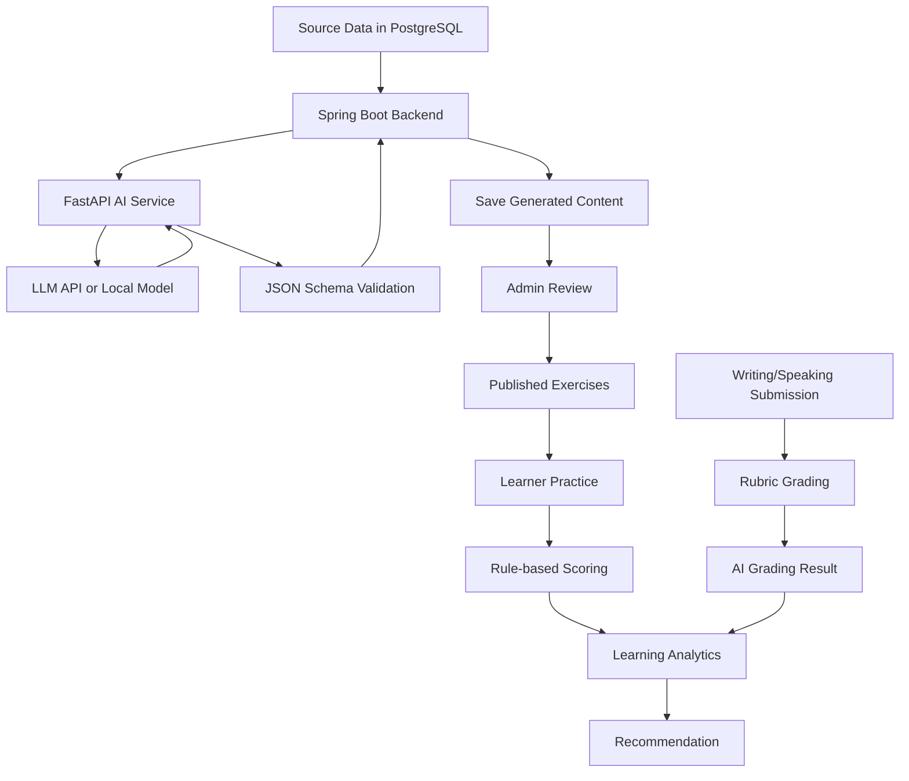
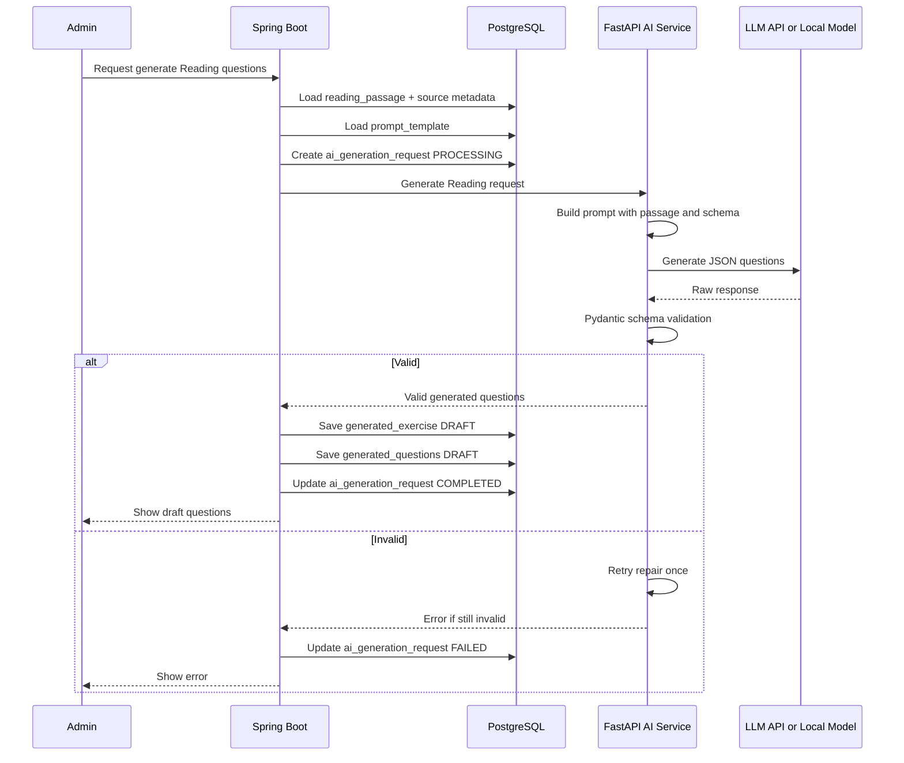
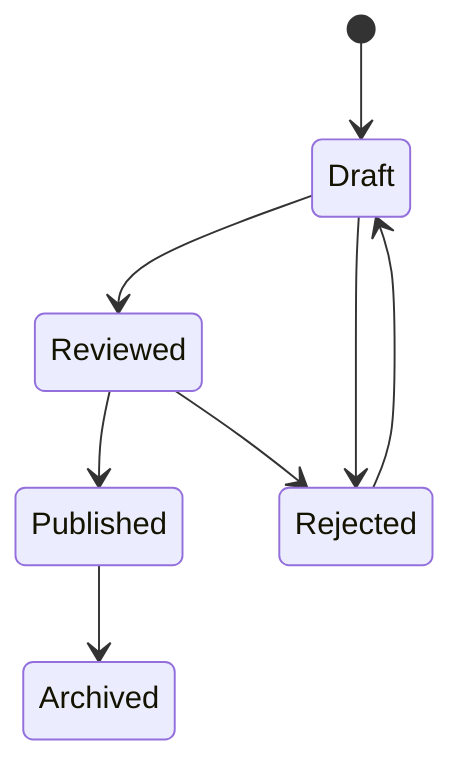
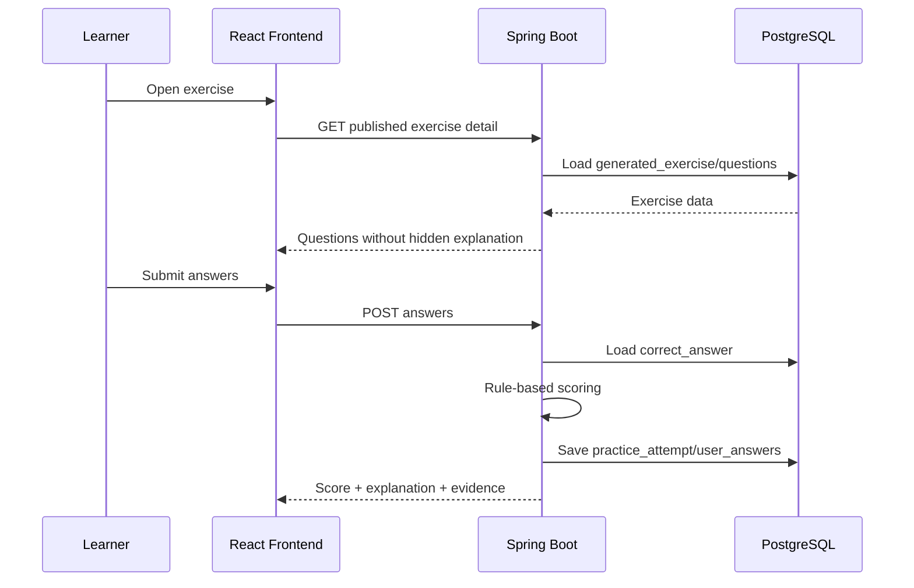
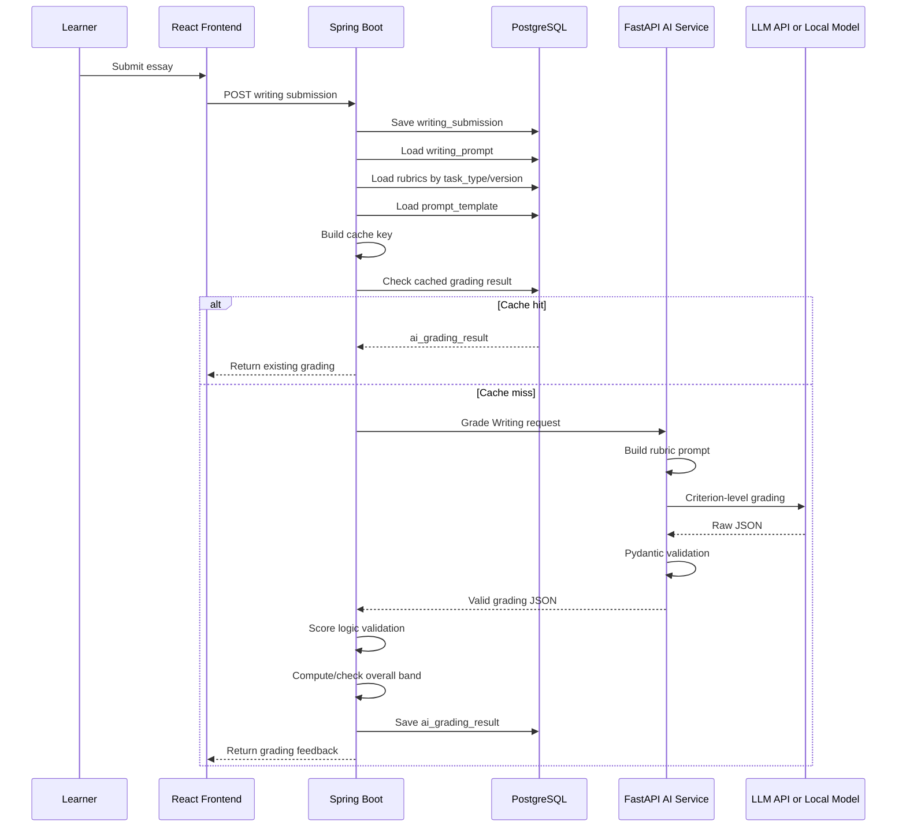
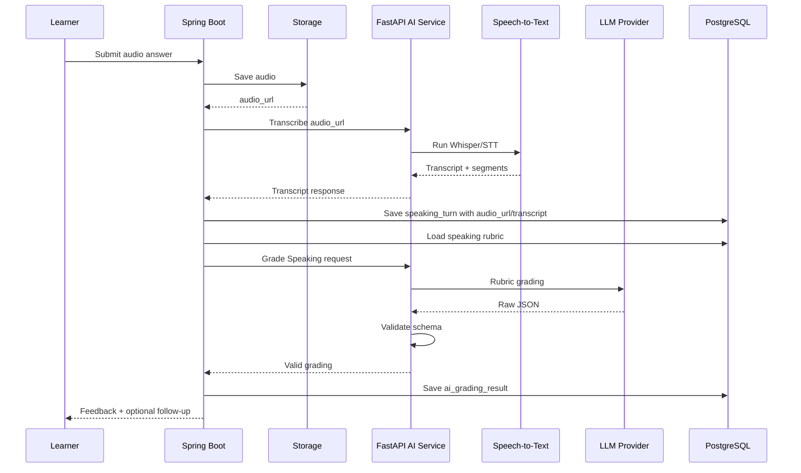
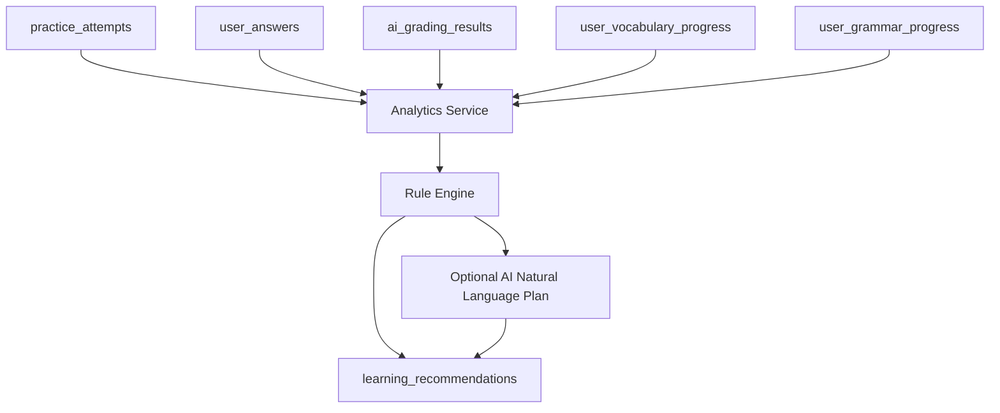

# Pipeline thiet ke - Generate cau hoi, lam bai, cham diem va recommendation

## 1. Muc tieu

Tai lieu nay tong hop cac pipeline xu ly chinh cua he thong IELTS AI Learning Platform.

Tap trung vao:

- Pipeline generate cau hoi.
- Pipeline admin review/publish.
- Pipeline learner lam bai Reading/Listening/Vocabulary/Grammar.
- Pipeline cham Writing theo rubric.
- Pipeline cham Speaking theo rubric.
- Pipeline speech-to-text.
- Pipeline recommendation dua tren lich su hoc.
- Pipeline cache, retry va error handling.

## 2. Nguyen tac thiet ke pipeline

## 2.1. Tach offline generation va online learning

Voi cac bai co dap an co dinh:

```text
Reading
Listening
Vocabulary quiz
Grammar exercise
```

Khong generate moi khi learner lam bai.

Dung pipeline:

```text
Source data -> AI generate -> validate -> save DB -> admin review -> publish -> learner uses DB
```

## 2.2. Writing/Speaking la online grading

Writing/Speaking phu thuoc vao cau tra loi rieng cua tung learner.

Dung pipeline:

```text
Learner submission -> rubric grading -> JSON validation -> score validation -> save result -> analytics
```

## 2.3. Spring Boot so huu database

FastAPI AI Service khong ghi truc tiep PostgreSQL trong MVP.

Spring Boot lam:

- Load data tu DB.
- Goi FastAPI.
- Validate response.
- Luu result.
- Cham rule-based.
- Tinh dashboard/recommendation.

FastAPI lam:

- Build prompt.
- Goi model/API/local provider.
- Validate output bang Pydantic.
- Retry neu output sai schema.
- Tra JSON ve Spring Boot.

## 2.4. Nguyen tac chon API AI, local model hay thu vien

Uu tien performance theo thu tu:

```text
1. Rule-based code neu bai toan co dap an/logic ro rang.
2. SQL aggregation neu chi la thong ke/analytics.
3. Thu vien local neu la NLP/audio/preprocessing.
4. Local model neu task don gian, chap nhan quality trung binh, can giam chi phi.
5. LLM API chi dung cho task can reasoning/ngon ngu chat luong cao.
```

Khong goi LLM API cho:

- Cham Reading/Listening da co correct_answer.
- Flashcard progress.
- Grammar/vocabulary quiz scoring.
- Dashboard analytics.
- Recommendation item selection.
- Validate JSON schema.
- Word count, duration, simple text stats.

Nen goi LLM API cho:

- Sinh cau hoi Reading/Listening chat luong cao.
- Cham Writing/Speaking theo rubric.
- Feedback language tu nhien.
- Speaking follow-up question.

Nen dung local libraries cho:

- JSON schema validation: Pydantic.
- Grammar helper: LanguageTool.
- Readability/text stats: textstat.
- Keyword/basic NLP: spaCy.
- Fuzzy evidence matching: rapidfuzz.
- Audio duration/basic metrics: pydub/librosa.
- Speech-to-text local: faster-whisper.

Nen dung local model cho:

- Draft vocabulary quiz.
- Draft grammar exercise.
- Draft Reading/Listening questions khi muon giam chi phi.
- Demo offline.

## 2.5. Bang chon cong nghe theo tung buoc pipeline

| Buoc | Nen dung | Ly do performance |
| --- | --- | --- |
| Load source data | Spring Boot + PostgreSQL | Nhanh, query theo index |
| Preprocess passage/transcript | Python libraries: textstat, spaCy optional | Nhe hon LLM, chay local |
| Create AI generation request | Spring Boot | Chi ghi DB, khong can AI |
| Build prompt | FastAPI string template | Nhanh, deterministic |
| Generate Reading questions | LLM API fast/standard model; local Qwen/Llama optional | Can reasoning va distractors tot |
| Generate Listening questions | LLM API fast/standard model; local Qwen/Llama optional | Can hieu transcript va tao question type |
| Generate vocabulary quiz | Rule/template first; local model optional; LLM API last | Task don gian, khong can model manh |
| Generate grammar exercise | Template/local model first; LLM API khi can da dang | Giam chi phi |
| Validate AI JSON | Pydantic | Local, nhanh, chinh xac |
| Evidence check | String match + rapidfuzz | Re hon LLM, deterministic |
| Save generated content | Spring Boot + JPA | Backend so huu DB |
| Admin review | UI + Spring Boot | Human quality gate |
| Learner answer scoring | Spring Boot rule-based | Khong can AI, latency thap |
| Writing word count | Java/Python basic code | Khong can AI |
| Writing grammar precheck | LanguageTool optional | Local/helper, giam tai cho LLM |
| Writing rubric grading | LLM API strong model; local model only fallback | Can judgement theo rubric |
| Speaking transcription | faster-whisper local or Whisper API | STT chuyen dung tot hon LLM text |
| Speaking fluency metrics | faster-whisper segments + pydub/librosa | Local, nhanh |
| Speaking rubric grading | LLM API strong model; local model only fallback | Can feedback/rubric reasoning |
| Pronunciation advanced | Azure Speech Assessment or equivalent | LLM khong du cham phat am that |
| Recommendation analytics | SQL + rule engine | Nhanh, re, explainable |
| Study plan natural text | Template first; cheap LLM optional | Khong can moi lan dashboard |
| Cache grading | Spring Boot + DB/Redis optional | Tranh goi AI lap lai |

## 2.6. Model/API profile khuyen nghi

Thay vi hard-code mot model, nen cau hinh theo profile:

```text
mock_provider:
  dev/test, khong ton chi phi

cheap_fast_llm:
  vocabulary quiz, grammar exercise, recommendation text

standard_llm:
  Reading/Listening question generation

strong_llm:
  Writing/Speaking rubric grading

local_llm:
  draft generation, offline demo, cost-saving mode

stt_model:
  faster-whisper local hoac speech-to-text API
```

Config goi y:

```text
AI_PROVIDER=api|local|mock
AI_GENERATION_MODEL=standard_llm
AI_GRADING_MODEL=strong_llm
AI_CHEAP_MODEL=cheap_fast_llm
AI_LOCAL_MODEL=qwen-or-llama-via-ollama
AI_STT_PROVIDER=faster_whisper|whisper_api
AI_TEMPERATURE_GENERATION=0.2-0.4
AI_TEMPERATURE_GRADING=0.0-0.2
```

MVP performance recommendation:

```text
Generation:
  single batch LLM call per source material, save DB, review once

Grading:
  single LLM call returns all criterion scores, backend computes/checks overall

Analytics:
  SQL + rule-based only

Dev/test:
  Mock AI provider
```

## 3. Pipeline tong quan



## 4. Pipeline generate cau hoi Reading

## 4.1. Muc tieu

Tao cau hoi Reading tu passage trong database, gom:

- Question text.
- Options neu co.
- Correct answer.
- Explanation.
- Evidence text.
- Evidence location.
- Difficulty.

## 4.2. Input

Bang lien quan:

- `source_materials`
- `reading_passages`
- `prompt_templates`
- `ai_generation_requests`

Input gui sang FastAPI:

```json
{
  "source_material_id": "uuid",
  "passage": "...",
  "topic": "Environment",
  "level": "B2",
  "target_band": 6.5,
  "question_type": "true_false_not_given",
  "number_of_questions": 8,
  "prompt_version": "reading-generate-v1"
}
```

## 4.3. Pipeline



## 4.4. Validation rules

FastAPI validate:

- Response dung JSON schema.
- Co du so cau hoi.
- Moi cau co `question_text`.
- Moi cau co `correct_answer`.
- Moi cau co `explanation`.

Spring Boot validate:

- Reading questions nen co `evidence_text`.
- `evidence_text` nen ton tai trong passage hoac gan dung passage.
- Question type khop voi request.
- Khong publish neu thieu answer/explanation.

## 4.5. Output luu DB

- `generated_exercises`
- `generated_questions`
- `ai_generation_requests`

Status ban dau:

```text
generated_exercises.status = draft
generated_questions.status = draft
```

## 4.6. Performance-first implementation cho Reading

| Step | Cong nghe nen dung | Ghi chu toi uu |
| --- | --- | --- |
| Load passage | Spring Boot + PostgreSQL index | Query theo `topic_id`, `level_id`, `status` |
| Preprocess passage | textstat/spaCy optional | Chi dung neu can estimate difficulty/keywords |
| Build prompt | FastAPI template | Deterministic, khong can AI |
| Generate questions | `standard_llm` API; local LLM optional | Batch generate nhieu cau trong 1 call |
| Validate JSON | Pydantic | Retry repair toi da 1 lan |
| Check evidence | String contains + rapidfuzz | Khong goi LLM de check evidence |
| Save questions | Spring Boot + JPA | Luu draft de admin review |
| Learner scoring | Spring Boot rule-based | Khong goi AI khi learner lam bai |

Khuyen nghi:

- Neu uu tien chat luong: dung LLM API standard/strong cho generation.
- Neu uu tien chi phi/demo: dung local model de generate draft, bat buoc admin review.
- Khong dung LLM de cham Reading.

## 5. Pipeline generate cau hoi Listening

## 5.1. Muc tieu

Tao cau hoi Listening tu transcript/audio metadata.

AI khong can nghe audio trong MVP. AI dung transcript va transcript segments.

## 5.2. Input

Bang lien quan:

- `listening_materials`
- `transcript_segments`
- `source_materials`
- `prompt_templates`

Input FastAPI:

```json
{
  "source_material_id": "uuid",
  "transcript": "...",
  "segments": [
    {
      "start_time": 10.5,
      "end_time": 14.2,
      "speaker": "A",
      "text": "..."
    }
  ],
  "topic": "Travel",
  "level": "B1",
  "question_type": "form_completion",
  "number_of_questions": 6
}
```

## 5.3. Pipeline

```text
Admin selects listening material
-> Spring Boot loads transcript and segments
-> Spring Boot creates ai_generation_request
-> FastAPI builds listening prompt
-> LLM generates questions/answers/explanations/timestamps
-> FastAPI validates schema
-> Spring Boot saves generated exercise/questions as draft
-> Admin reviews
-> Published for learner
```

## 5.4. Validation rules

- Cau hoi phai dua tren transcript.
- Dap an phai co trong transcript hoac suy ra truc tiep.
- Neu co segments, nen co `timestamp_start` va `timestamp_end`.
- Transcript chi hien sau khi learner nop bai.

## 5.5. Performance-first implementation cho Listening

| Step | Cong nghe nen dung | Ghi chu toi uu |
| --- | --- | --- |
| Store audio | File storage | PostgreSQL chi luu `audio_url` |
| Store transcript | PostgreSQL text + transcript_segments | Tao segment de timestamp nhanh |
| Preprocess transcript | Python basic/textstat optional | Khong can LLM |
| Generate questions | `standard_llm` API; local LLM optional | Batch generate theo transcript |
| Timestamp matching | transcript_segments + rapidfuzz | Match dap an voi segment local |
| Validate JSON | Pydantic | Local validation |
| Learner playback | React audio player | Audio stream tu storage |
| Learner scoring | Spring Boot rule-based | Khong goi AI khi nop bai |

Khuyen nghi:

- AI khong can nghe audio trong MVP; dung transcript de generate.
- Neu audio chua co transcript, dung STT truoc roi moi generate.
- Chon local faster-whisper neu muon giam chi phi STT; chon STT API neu muon on dinh/deploy nhanh.

## 6. Pipeline generate Vocabulary quiz

## 6.1. Muc tieu

Tao quiz tu vocabulary items da co trong DB.

Co the dung:

- Rule/template.
- Local model.
- LLM API.

## 6.2. Pipeline

```text
Admin selects topic/level
-> Spring Boot loads vocabulary_items
-> FastAPI/local rule generates quiz questions
-> Validate JSON
-> Save generated_exercise/questions
-> Admin review/publish
-> Learner answers quiz
-> Spring Boot scores rule-based
```

## 6.3. Vi du question types

- Meaning multiple choice.
- Fill in blank.
- Synonym/antonym.
- Collocation.
- Match word with definition.

## 6.4. Performance-first implementation cho Vocabulary

| Step | Cong nghe nen dung | Ghi chu toi uu |
| --- | --- | --- |
| Load words | Spring Boot + PostgreSQL | Filter topic/level/status |
| Flashcard | Rule-based | Khong can AI |
| Spaced repetition | Java service | Tinh `next_review_at` local |
| Quiz generation | Template first; local LLM optional | LLM API chi dung khi can da dang |
| Quiz scoring | Spring Boot rule-based | So sanh correct_answer |
| Progress analytics | SQL aggregation | Khong can AI |

Khuyen nghi:

- Vocabulary la noi nen tranh LLM API nhieu nhat.
- Bat dau bang template-based quiz vi nhanh va re.

## 7. Pipeline generate Grammar exercise

## 7.1. Muc tieu

Tao bai tap ngu phap tu grammar topic.

Input:

- Explanation.
- Formula.
- Examples.
- Common mistakes.
- Level.

## 7.2. Pipeline

```text
Admin selects grammar topic
-> Spring Boot loads grammar topic details
-> FastAPI/local model/template generates exercises
-> Validate JSON
-> Save grammar_exercises or generated_questions
-> Admin review/publish
-> Learner answers
-> Spring Boot scores rule-based
-> Update user_grammar_progress
```

## 7.3. Performance-first implementation cho Grammar

| Step | Cong nghe nen dung | Ghi chu toi uu |
| --- | --- | --- |
| Store lesson | PostgreSQL | Admin-authored content |
| Generate exercise | Template/local LLM first | API LLM chi khi can sinh bai da dang |
| Grammar helper | LanguageTool optional | Phat hien loi co ban local |
| Validate exercise | Pydantic/Java validation | Dap an va explanation bat buoc |
| Learner scoring | Spring Boot rule-based | Khong goi AI |
| Progress analytics | SQL + rules | Recommend grammar topic |

Khuyen nghi:

- Dung LanguageTool cho grammar error hints co ban.
- Dung LLM cho explanation tu nhien neu can, nhung sinh truoc va luu DB.

## 8. Pipeline admin review va publish

## 8.1. Muc tieu

Dam bao noi dung AI generate khong duoc learner su dung truoc khi duoc duyet.

## 8.2. Status workflow



## 8.3. Pipeline

```text
Generated content DRAFT
-> Admin opens review screen
-> Admin checks question, answer, explanation, evidence/timestamp
-> Admin edits if needed
-> Admin marks reviewed/published/rejected
-> Only published content appears to learner
```

## 8.4. Review checklist

Reading:

- Question clear.
- Correct answer correct.
- Explanation correct.
- Evidence exists in passage.

Listening:

- Answer appears in transcript.
- Timestamp/evidence correct.
- Question type suitable.

Vocabulary/Grammar:

- Correct answer accurate.
- Distractors not ambiguous.
- Explanation understandable.

## 9. Pipeline learner lam bai co dap an co dinh

Ap dung cho:

- Reading.
- Listening.
- Vocabulary quiz.
- Grammar exercise.

## 9.1. Pipeline



## 9.2. Scoring logic

Backend compare:

```text
user_answers.answer
vs
generated_questions.correct_answer
```

Normalization:

- Trim spaces.
- Lowercase.
- Remove unnecessary punctuation.
- Accept aliases if configured.

Example `correct_answer`:

```json
{
  "type": "text",
  "accepted_values": ["two nights", "2 nights", "two"]
}
```

## 10. Pipeline cham Writing theo rubric

## 10.1. Muc tieu

Cham Writing Task 1/Task 2 theo IELTS rubric, theo tung criterion.

## 10.2. Pipeline



## 10.3. Criterion scoring

Writing Task 1:

- Task Achievement.
- Coherence and Cohesion.
- Lexical Resource.
- Grammatical Range and Accuracy.

Writing Task 2:

- Task Response.
- Coherence and Cohesion.
- Lexical Resource.
- Grammatical Range and Accuracy.

MVP:

```text
One model call -> returns all criterion scores -> backend computes/checks overall
```

Advanced:

```text
Multi-pass scoring -> one focused call per criterion -> backend aggregates
```

## 10.4. Output

```json
{
  "overall_band": 6.0,
  "criterion_scores": {
    "task_response": 6.0,
    "coherence_cohesion": 6.0,
    "lexical_resource": 6.5,
    "grammatical_range_accuracy": 5.5
  },
  "criterion_feedback": {},
  "strengths": [],
  "weaknesses": [],
  "grammar_errors": [],
  "vocabulary_suggestions": [],
  "feedback_text": "...",
  "improved_answer_text": "..."
}
```

## 10.5. Backend validation

- Score between 0.0 and 9.0.
- Score step should be 0.5.
- Overall close to average of criterion scores.
- If essay too short, Task Response/Task Achievement should not be too high.
- If many grammar errors, grammar score should not be too high.

## 10.6. Performance-first implementation cho Writing grading

| Step | Cong nghe nen dung | Ghi chu toi uu |
| --- | --- | --- |
| Save essay | Spring Boot + PostgreSQL | Luu truoc khi goi AI de khong mat bai |
| Word count | Java basic code | Khong can AI |
| Grammar precheck | LanguageTool optional | Ho tro AI, khong thay grading |
| Readability/stats | textstat optional | Co the dung lam metadata |
| Load rubric | PostgreSQL | Rubric versioned |
| Build prompt | FastAPI template | Include rubric + schema |
| Grade criteria | `strong_llm` API | MVP: 1 call tra 4 criterion |
| Advanced criterion grading | Multi-pass LLM optional | Chat luong cao hon nhung cham/ton hon |
| Validate JSON | Pydantic | Bat buoc |
| Score logic validation | Spring Boot | Range/step/overall guardrails |
| Cache | DB cache key; Redis optional | Tranh cham lai input giong nhau |
| Save result | Spring Boot + PostgreSQL | Luu `writing_submission_id` |

Khuyen nghi performance:

- MVP dung single-pass grading: 1 LLM call tra tat ca criterion.
- Khong dung multi-pass mac dinh vi ton 4x request va latency cao.
- Dung LanguageTool/textstat nhu helper local de tang signal ma khong ton API.
- Backend tinh/kiem tra overall, khong de model tu quyet het.

## 11. Pipeline cham Speaking theo rubric

## 11.1. Muc tieu

Cham Speaking theo rubric, ho tro text answer truoc va audio/STT sau.

## 11.2. Text MVP pipeline

```text
Learner selects speaking prompt
-> Spring Boot creates speaking_session
-> Learner submits text answer
-> Spring Boot saves speaking_turn
-> Spring Boot loads speaking rubric
-> FastAPI grades answer by criterion
-> Spring Boot validates scores
-> Save ai_grading_result with speaking_turn_id
-> Optional AI follow-up question
```

## 11.3. Audio pipeline



## 11.4. Criterion scoring

- Fluency and Coherence.
- Lexical Resource.
- Grammatical Range and Accuracy.
- Pronunciation.

Pronunciation note:

- If only transcript exists, pronunciation is limited-confidence estimate.
- For a deeper local/research-grade pronunciation pipeline, use `docs/speaking-pronunciation-pipeline.md`.
- The recommended advanced approach is:

```text
Audio
-> preprocessing
-> WhisperX transcript + word timestamps
-> text normalization
-> G2P expected phonemes
-> forced alignment phoneme/syllable boundaries
-> phoneme recognizer actual probabilities
-> feature extraction
-> scoring engine
-> LLM feedback generator
```

## 11.5. Performance-first implementation cho Speaking grading

| Step | Cong nghe nen dung | Ghi chu toi uu |
| --- | --- | --- |
| Text answer MVP | Spring Boot + FastAPI grading | Nhanh, khong can STT |
| Audio upload | File storage | DB chi luu `audio_url` |
| Transcription | faster-whisper local or Whisper API | Local re hon, API de deploy hon |
| Audio duration | pydub/librosa | Local |
| Fluency metrics | faster-whisper segments + rules | Pause/duration/WPM local |
| Grammar helper | LanguageTool optional | Ho tro grading |
| Grade criteria | `strong_llm` API | Can reasoning/feedback |
| Pronunciation basic | WhisperX/faster-whisper + pydub/librosa | Limited confidence |
| Pronunciation advanced local | WhisperX + G2P + forced alignment + phoneme recognizer | Chinh xac hon, co chieu sau ky thuat |
| Pronunciation API option | Azure Speech Assessment or equivalent | De trien khai hon, ton chi phi API |
| Follow-up question | `cheap_fast_llm` or same grading response | Co the tao chung trong grading call |
| Cache | Hash question + transcript + rubric | Tranh cham lai |

Khuyen nghi performance:

- MVP lam text answer truoc.
- Neu dung audio, transcribe async neu file dai.
- Speaking follow-up co the generate trong cung grading call de giam request.
- Pronunciation advanced local nen chay async va cache theo audio hash.

## 12. Pipeline speech-to-text

## 12.1. MVP

Speaking can accept text answer first.

## 12.2. Audio STT pipeline

```text
React records audio
-> Spring Boot receives file
-> Storage saves file
-> Spring Boot sends audio_url to FastAPI
-> FastAPI uses Whisper/faster-whisper/API
-> FastAPI returns transcript/segments/duration
-> Spring Boot saves transcript in speaking_turns
```

## 12.3. Output

```json
{
  "transcript": "...",
  "duration_seconds": 83,
  "segments": [
    {
      "start_time": 0.0,
      "end_time": 4.2,
      "text": "..."
    }
  ]
}
```

## 13. Pipeline recommendation

## 13.1. Muc tieu

De xuat bai hoc tiep theo dua tren lich su hoc.

Core recommendation khong can AI API.

## 13.2. Pipeline



## 13.3. Analytics

Backend tinh:

- Average score by skill.
- Error rate by question type.
- Weak topic.
- Writing criterion weakness.
- Speaking criterion weakness.
- Grammar error frequency.
- Vocabulary review status.

## 13.4. Rules

Examples:

```text
If reading error_rate true_false_not_given > 40%
-> recommend Reading exercise with same question type

If writing grammar score < target_band - 1.0
-> recommend grammar topics from grammar_errors

If vocabulary topic progress < 70%
-> recommend flashcards for that topic

If speaking answer duration < threshold
-> recommend Speaking Part 2 expansion practice
```

## 13.5. AI optional

AI chi dung de viet recommendation thanh study plan tu nhien.

Khong goi AI moi lan learner mo dashboard.

## 13.6. Performance-first implementation cho Recommendation

| Step | Cong nghe nen dung | Ghi chu toi uu |
| --- | --- | --- |
| Aggregate scores | SQL queries/materialized view optional | Nhanh, explainable |
| Detect weak question type | Spring Boot rules | Khong can AI |
| Detect grammar weakness | Count `grammar_errors` JSONB | Co index GIN neu query nhieu |
| Detect vocabulary weakness | SQL on progress/quiz score | Khong can AI |
| Select recommended items | Rule engine | Deterministic |
| Generate natural text | Template first; `cheap_fast_llm` optional | Cache theo ngay/lan thay doi |
| Save recommendation | PostgreSQL | Khong tao moi moi lan open dashboard |

Khuyen nghi:

- Dashboard nen chi query cached/aggregated data.
- Chi tao recommendation moi khi co attempt/submission moi hoac user bam regenerate.
- Khong dung LLM de quyet dinh item can hoc; LLM chi dien dat neu can.

## 14. Cache pipeline

## 14.1. Dung cho AI grading

Cache key:

```text
hash(
  submission_type
  + prompt_text/question_text
  + answer_text/transcript
  + rubric_version
  + prompt_version
  + model_name
)
```

## 14.2. Pipeline

```text
Build cache key
-> Check existing ai_grading_results/cache table
-> If hit: return old result
-> If miss: call AI
-> Save result with cache key
```

## 15. Error handling pipeline

## 15.1. AI generate fail

```text
AI output invalid
-> FastAPI retry repair once
-> If still invalid, return error
-> Spring Boot marks ai_generation_request failed
-> Admin can retry/regenerate
```

## 15.2. AI grading fail

```text
Learner submission saved first
-> AI grading fails
-> Mark grading status failed/pending retry
-> Learner does not lose answer
-> Allow retry grading later
```

## 15.3. STT fail

```text
Audio saved
-> STT fails
-> Allow retry
-> Allow learner to enter transcript manually
```

## 16. Pipeline theo module tom tat

| Module | Pipeline chinh | AI dung luc nao | Cham diem |
| --- | --- | --- | --- |
| Reading | Source -> AI generate -> review -> publish -> learner practice | Admin generate only | Rule-based |
| Listening | Transcript -> AI generate -> review -> publish -> learner practice | Admin generate only | Rule-based |
| Writing | Learner essay -> rubric grading -> save feedback | On submission | AI criterion scoring + backend aggregate |
| Speaking | Learner answer -> STT optional -> rubric grading -> follow-up | On submission | AI criterion scoring + backend aggregate |
| Vocabulary | Items -> flashcard/quiz -> progress | Optional generate quiz | Rule-based |
| Grammar | Topic -> exercise -> progress | Optional generate exercise | Rule-based |
| Recommendation | Learning history -> analytics -> rules -> recommendation | Optional text generation | Not scoring |

## 17. Pipeline implementation order

1. Implement source data CRUD.
2. Implement AI generation request records.
3. Implement FastAPI Mock AI.
4. Implement generated_exercises/generated_questions save flow.
5. Implement admin review/publish.
6. Implement Reading practice scoring.
7. Implement Listening practice scoring.
8. Implement real LLM provider for generation.
9. Implement Writing grading pipeline.
10. Implement Speaking text grading pipeline.
11. Implement STT/audio pipeline.
12. Implement recommendation analytics.
13. Implement cache and retry.

## 18. Ket luan

He thong nen co 3 pipeline cot loi:

```text
1. Content generation pipeline:
   Source data -> AI -> schema validation -> DB -> admin review -> publish

2. Learning/scoring pipeline:
   Published exercise -> learner answers -> rule-based scoring -> attempts/history

3. Rubric grading pipeline:
   Writing/Speaking submission -> rubric -> AI criterion scoring -> backend validation -> ai_grading_results
```

Them pipeline recommendation:

```text
Learning history -> SQL analytics -> rule engine -> recommended items -> optional AI study plan text
```

Diem noi bat cua do an nam o viec cac pipeline nay duoc thiet ke co:

- Source traceability.
- Schema validation.
- Admin review.
- Rule-based scoring cho bai co dap an co dinh.
- Rubric-based criterion scoring cho Writing/Speaking.
- Cache va retry.
- Analytics va personalization.
