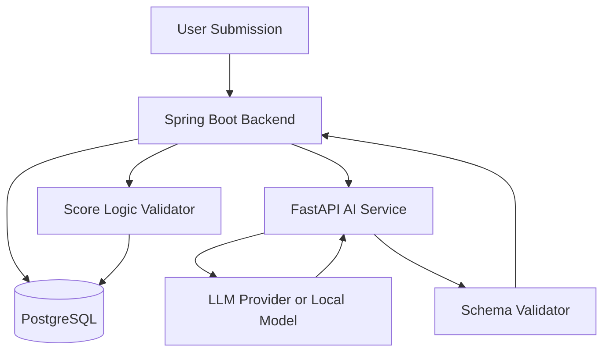
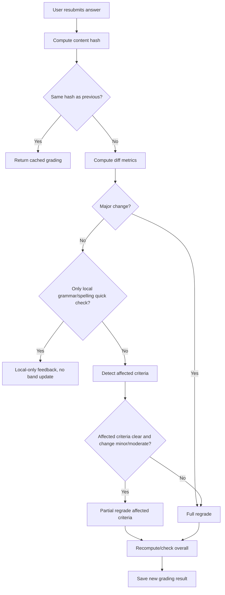
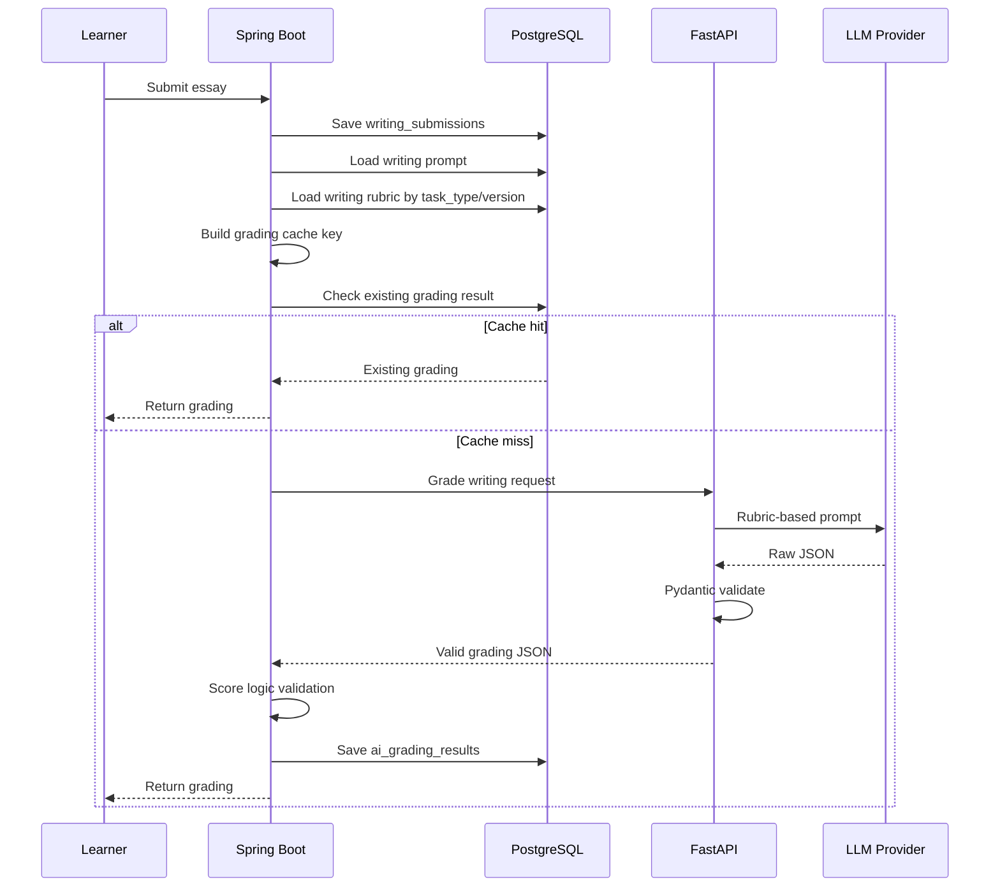
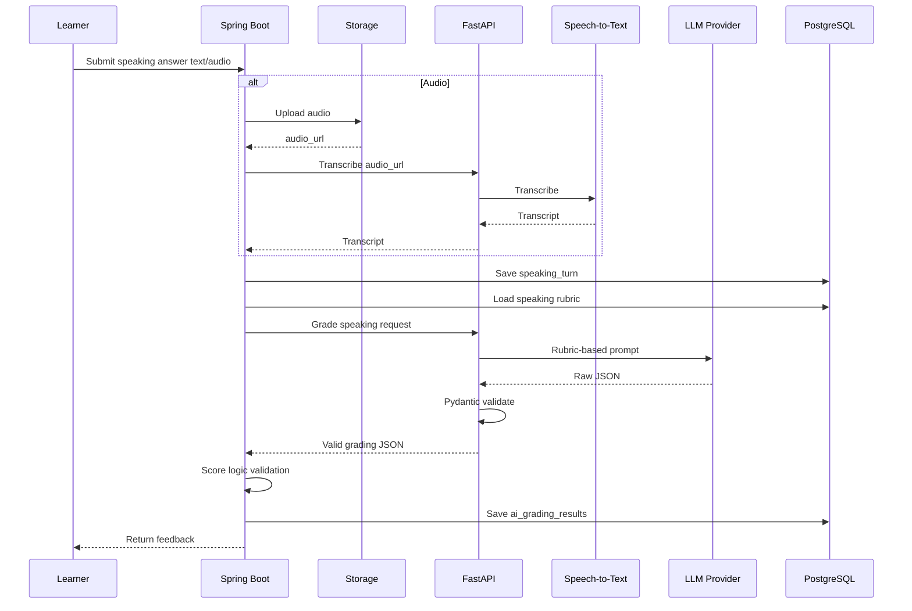

# Thiet ke cham diem theo IELTS Rubric - Writing va Speaking

## 1. Muc tieu

Tai lieu nay mo ta cach xay dung phan cham diem Writing/Speaking theo IELTS rubric.

Muc tieu:

- Cham theo tung tieu chi IELTS that.
- Tra ve estimated band score co cau truc.
- Giai thich ly do cho diem.
- Phat hien loi grammar/vocabulary.
- Tao feedback va goi y cai thien.
- Luu ket qua de dashboard va recommendation dung lai.
- Giam tinh bat on cua AI bang rubric, schema, cache va validation.

## 2. Nguyen tac quan trong

Khong nen lam:

```text
Essay/Speaking answer -> goi AI -> tra ve text feedback tu do
```

Nen lam:

```text
Submission
-> Load rubric tu database
-> Build prompt theo task type
-> AI cham tung criterion
-> Validate JSON schema
-> Backend kiem tra logic diem
-> Luu ai_grading_results
-> Cap nhat analytics/recommendation
```

Diem hien thi nen goi la:

```text
Estimated IELTS Band Score
```

Khong nen khang dinh la diem thi that tuyet doi.

## 3. Du lieu rubric can luu

Bang `rubrics`:

```text
id
skill: writing/speaking
task_type
criterion
band_score
descriptor_text
version
source_reference
```

## 3.1. Writing Task 1 criteria

- Task Achievement.
- Coherence and Cohesion.
- Lexical Resource.
- Grammatical Range and Accuracy.

## 3.2. Writing Task 2 criteria

- Task Response.
- Coherence and Cohesion.
- Lexical Resource.
- Grammatical Range and Accuracy.

## 3.3. Speaking criteria

- Fluency and Coherence.
- Lexical Resource.
- Grammatical Range and Accuracy.
- Pronunciation.

## 4. Kien truc cham diem



## 5. Vai tro cua tung thanh phan

## 5.1. Spring Boot

Spring Boot lam:

- Luu submission.
- Load prompt/rubric tu database.
- Tao cache key.
- Goi FastAPI AI Service.
- Validate nghiep vu sau khi AI tra ve.
- Luu `ai_grading_results`.
- Cap nhat dashboard/recommendation.

## 5.2. FastAPI AI Service

FastAPI lam:

- Nhan request co cau truc.
- Build prompt cuoi cung.
- Goi LLM API/local model.
- Validate response bang Pydantic.
- Retry neu output sai schema.
- Tra JSON chuan ve Spring Boot.

## 5.3. LLM Provider/Local Model

LLM lam:

- Doc bai lam.
- So sanh voi rubric.
- Cham tung criterion.
- Tao feedback.
- Trich loi grammar/vocabulary.
- Tao improved answer.

LLM khong duoc tu quyet format response.

## 5.4. Chon model/API/thu vien theo tung criterion

Khong phai moi criterion deu can "goi AI API rieng". Cach toi uu la:

```text
MVP:
  1 strong LLM call -> tra diem tat ca criteria -> backend validate/tinh overall

Advanced:
  criterion-specific evaluation -> moi criterion co prompt rieng
  chi tach call rieng khi can quality cao hon va chap nhan latency/chi phi tang
```

Ten model khong nen hard-code vao thiet ke. Nen dung model profile:

```text
strong_llm:
  Dung cho rubric grading can judgement chat luong cao.
  Vi du provider: OpenAI GPT-4-class, Claude Sonnet-class, Gemini Pro-class, hoac latest equivalent.

standard_llm:
  Dung cho generation chat luong kha.

cheap_fast_llm:
  Dung cho feedback text/recommendation text/task don gian.

local_llm:
  Dung cho draft/offline/demo, khong nen la grading source chinh neu can diem sat rubric.

speech_assessment_api:
  Dung cho pronunciation scoring that su.
```

## 5.5. Writing criterion -> nen dung gi?

| Criterion | Nen dung chinh | Thu vien/model phu | Co can AI API khong? | Ly do |
| --- | --- | --- | --- | --- |
| Task Response / Task Achievement | `strong_llm` | Rule guardrails: word count, prompt coverage checklist | Co | Can hieu de bai, muc do tra loi dung task, phat trien y, overview voi Task 1 |
| Coherence and Cohesion | `strong_llm` | Rule/text analysis: paragraph count, linking word count, sentence order heuristic | Co | Can danh gia mach lap luan, flow, cohesion tu nhien/khong may moc |
| Lexical Resource | `strong_llm` | spaCy, word frequency list, collocation list, textstat optional | Co, nhung co helper local | Can danh gia lexical range, word choice, collocation, paraphrase; helper local chi cung cap signal |
| Grammatical Range and Accuracy | `strong_llm` + LanguageTool | LanguageTool, spaCy POS/dependency optional | Co, ket hop local | LanguageTool bat loi co ban; LLM danh gia muc anh huong, range cau phuc, accuracy theo rubric |

### 5.5.1. Task Response / Task Achievement

Best choice:

```text
strong_llm API
```

Vi sao:

- Can doc de bai va bai lam.
- Can danh gia bai co tra loi dung task khong.
- Can xem y co du phat trien khong.
- Writing Task 1 can danh gia overview, key features, comparison.
- Writing Task 2 can danh gia position, arguments, examples.

Khong nen chi dung local library vi library khong hieu task-level meaning tot.

Optimization:

- Backend tinh word_count truoc.
- Backend truyen essay_type/task_type vao prompt.
- LLM chi cham criterion nay dua tren rubric va evidence tu essay.

### 5.5.2. Coherence and Cohesion

Best choice:

```text
strong_llm API
```

Helper optional:

```text
rule-based paragraph count
linking word count
sentence count
```

Vi sao:

- Can danh gia flow giua cac y.
- Can biet cohesive devices dung tu nhien hay may moc.
- Can xem paragraphing co hop ly khong.

Optimization:

- Backend/FastAPI co the tinh paragraph_count va sentence_count local.
- Dua stats vao prompt de LLM co them signal.
- Khong can goi model rieng neu MVP; trong single-pass grading van cham duoc.

### 5.5.3. Lexical Resource

Best choice:

```text
strong_llm API + NLP helper local
```

Helper nen dung:

```text
spaCy:
  tokenize, POS, lemma, keyword/topic word extraction

textstat or word frequency list:
  lexical variety/readability signal

custom collocation/topic vocabulary list:
  IELTS topic vocabulary usage
```

Vi sao:

- LLM tot trong danh gia word choice, paraphrase, collocation.
- spaCy/textstat tot cho thong ke nhanh nhung khong du cham rubric.

Optimization:

- Tinh local:
  - type-token ratio.
  - repeated words.
  - topic vocabulary count.
  - uncommon word ratio.
- Dua cac signal nay vao prompt.
- LLM dua ra final lexical score.

### 5.5.4. Grammatical Range and Accuracy

Best choice:

```text
LanguageTool + strong_llm API
```

Helper nen dung:

```text
LanguageTool:
  detect grammar/spelling/basic usage errors

spaCy:
  sentence structure hints, POS/dependency optional
```

Vi sao:

- LanguageTool bat loi grammar co ban nhanh va re.
- LLM danh gia grammar range, complex sentences, muc do loi anh huong meaning.
- Chi dung LanguageTool se khong cham dung IELTS rubric vi rubric khong chi dem loi.

Optimization:

- Chay LanguageTool truoc.
- Gom error summary:

```json
{
  "article_errors": 5,
  "subject_verb_agreement": 3,
  "tense_errors": 4
}
```

- Dua summary vao prompt.
- LLM cham criterion va giai thich.

## 5.6. Speaking criterion -> nen dung gi?

| Criterion | Nen dung chinh | Thu vien/model phu | Co can AI API khong? | Ly do |
| --- | --- | --- | --- | --- |
| Fluency and Coherence | STT segments + rules + `strong_llm` | faster-whisper, pydub/librosa | Co neu can feedback tot | Can pause/duration/WPM + coherence cua noi dung |
| Lexical Resource | `strong_llm` | spaCy/topic vocab list | Co | Can danh gia range, paraphrase, topic vocabulary |
| Grammatical Range and Accuracy | LanguageTool + `strong_llm` | LanguageTool, spaCy | Co | Can loi grammar + range cau trong speech transcript |
| Pronunciation | Speech assessment API | Azure Speech Assessment or equivalent; STT confidence/audio metrics fallback | Khong dung LLM text-only lam chinh | Pronunciation can audio-level model, LLM khong nghe/khong cham phat am that neu chi co transcript |

### 5.6.1. Fluency and Coherence

Best choice:

```text
faster-whisper/STT segments + rule metrics + strong_llm API
```

Local metrics:

```text
duration_seconds
words_per_minute
pause_count
average_pause_length
filler_word_count
answer_length
```

Vi sao:

- Fluency can audio timing metrics.
- Coherence can LLM danh gia transcript co mach lac khong.

Optimization:

- Tinh WPM/pause local.
- LLM chi nhan transcript + metrics + rubric.
- Neu text-only answer, fluency score phai co limited confidence.

### 5.6.2. Lexical Resource

Best choice:

```text
strong_llm API + spaCy/topic vocabulary helper
```

Vi sao:

- Speaking lexical resource can range, paraphrase, flexibility.
- Local NLP dem tu lap/topic words nhanh nhung khong du final judgement.

Optimization:

- Detect repeated words local.
- Extract topic vocabulary local.
- LLM cham lexical score va feedback.

### 5.6.3. Grammatical Range and Accuracy

Best choice:

```text
LanguageTool + strong_llm API
```

Vi sao:

- Transcript speech thuong co cau khong hoan chinh.
- LanguageTool bat loi co ban.
- LLM danh gia loi co anh huong communication khong va co range cau khong.

Optimization:

- Khong sua transcript qua muc truoc khi cham.
- Giu transcript gan voi loi noi that.
- Dua LanguageTool summary vao prompt nhu helper, khong phai final score.

### 5.6.4. Pronunciation

Best choice neu muon cham that:

```text
speech_assessment_api
```

Vi du:

```text
Azure Speech Assessment
```

Fallback MVP:

```text
faster-whisper confidence + audio metrics + limited-confidence estimate
```

Khong nen:

```text
LLM text-only -> pronunciation score chinh
```

Vi sao:

- Pronunciation can audio signal.
- Transcript khong du de biet stress, intonation, phoneme accuracy.

MVP recommendation:

- Neu chua tich hop speech assessment API, ghi ro:

```text
Pronunciation score is estimated with limited confidence based on transcript/audio metrics.
```

## 5.7. Bang chon nhanh cho MVP va Advanced

| Criterion group | MVP choice | Advanced choice |
| --- | --- | --- |
| Writing Task Response/Achievement | strong_llm single-pass | criterion-specific strong_llm call |
| Writing Coherence | strong_llm single-pass | strong_llm + paragraph/linking analysis |
| Writing Lexical | strong_llm single-pass | strong_llm + spaCy/textstat/collocation signals |
| Writing Grammar | strong_llm single-pass + LanguageTool optional | criterion-specific call + LanguageTool summary |
| Speaking Fluency | text/transcript + strong_llm | STT segments + WPM/pause metrics + strong_llm |
| Speaking Lexical | strong_llm single-pass | strong_llm + topic vocab analysis |
| Speaking Grammar | strong_llm + LanguageTool optional | LanguageTool summary + criterion-specific call |
| Speaking Pronunciation | limited estimate or no official-like score | Azure Speech Assessment or equivalent |

## 5.8. Recommendation cuoi cung

De toi uu performance va van sat tieu chi thuc te:

```text
Writing MVP:
  LanguageTool optional precheck
  + 1 strong LLM API call returning all 4 criterion scores
  + backend computes/checks overall

Speaking MVP:
  Text answer or transcript
  + 1 strong LLM API call for content criteria
  + pronunciation limited-confidence note

Speaking Advanced:
  faster-whisper for transcript and timing
  + pydub/librosa for audio metrics
  + Azure Speech Assessment for pronunciation
  + strong LLM API for fluency/coherence/lexical/grammar feedback
```

## 5.9. Grading co phu thuoc hoan toan vao AI API khong?

Khong. Phan cham rubric nen la **hybrid grading engine**, khong phai "AI API tu cham tat ca".

Chia vai tro:

| Thanh phan | Vai tro |
| --- | --- |
| Spring Boot | Luu submission, load rubric, tao cache key, validate score, tinh/check overall, luu result |
| PostgreSQL | Luu rubric version, prompt version, grading history, submission versions |
| FastAPI | Build prompt, goi provider, validate JSON bang Pydantic |
| Local libraries | Word count, diff, grammar precheck, readability, audio metrics |
| LLM API/local model | Criterion judgement cho cac diem can hieu ngu nghia/rubric |
| Speech assessment API | Pronunciation scoring neu can chuan hon |

Nhung phan **khong nen dung AI API**:

- Word count.
- Paragraph count.
- Sentence count.
- Text diff.
- Cache check.
- Overall band calculation.
- Score range/step validation.
- LanguageTool grammar precheck.
- Audio duration/WPM/pause metrics.

Nhung phan **nen dung LLM API hoac local model**:

- Task Response/Task Achievement judgement.
- Coherence/Cohesion judgement.
- Lexical quality judgement.
- Grammar range and error impact judgement.
- Speaking coherence/lexical/grammar feedback.

Nhung phan **khong nen dung LLM text-only lam chinh**:

- Pronunciation scoring. Neu can diem phat am that, dung speech assessment API.

## 5.10. Chien luoc cham lai khi user chi sua mot chut

Van de:

```text
Learner nhan feedback -> sua mot vai cau/tu -> submit lai
```

Neu moi lan deu full regrade bang strong LLM:

- Ton chi phi.
- Tang latency.
- Co the diem dao dong do model variance.

Neu chi dung ket qua cu:

- Khong phan anh dung loi da sua.
- Learner khong thay tien bo.

Vi vay nen dung **revision-aware grading strategy**.

### 5.10.1. Luu submission theo version

Nen bo sung metadata cho submission:

```text
writing_submissions:
  parent_submission_id
  revision_number
  content_hash
  diff_from_previous_json

speaking_turns:
  parent_turn_id optional
  revision_number optional
  content_hash

ai_grading_results:
  grading_mode: full / partial / cache_reuse / local_quick_check
  cache_key
  based_on_grading_result_id
  rubric_version
  prompt_version
```

MVP co the chua can them het vao database, nhung nen thiet ke service theo huong nay.

### 5.10.2. Buoc 1 - Exact cache hit

Neu user submit y het noi dung da cham:

```text
content_hash moi == content_hash cu
```

Thi:

```text
Khong goi AI
Tra lai ai_grading_result cu
grading_mode = cache_reuse
```

### 5.10.3. Buoc 2 - Tinh muc do thay doi

Dung local diff, khong dung AI.

Thu vien/cach lam:

- Java: java-diff-utils hoac custom diff.
- Python: difflib.
- Fuzzy similarity: rapidfuzz.

Metrics:

```text
changed_token_ratio
changed_sentence_ratio
word_count_delta_ratio
paragraph_structure_changed
grammar_error_delta
lexical_change_count
```

Phan loai:

```text
exact_same:
  0% changed

minor_revision:
  changed_token_ratio <= 10%
  word_count_delta_ratio <= 10%
  paragraph_structure_changed = false

moderate_revision:
  10% < changed_token_ratio <= 30%
  hoac co sua/chen mot so cau

major_revision:
  changed_token_ratio > 30%
  hoac thay doi paragraph structure
  hoac them/xoa y lon
```

### 5.10.4. Buoc 3 - Xac dinh criterion bi anh huong

Dung diff + local analysis de suy ra criterion can cham lai.

| Loai thay doi | Criterion co the bi anh huong | Cach xu ly |
| --- | --- | --- |
| Sua loi grammar nho | Grammatical Range and Accuracy | Chay LanguageTool lai, partial regrade grammar |
| Doi tu/collocation | Lexical Resource | Partial regrade lexical |
| Them example/supporting idea | Task Response/Achievement, Coherence | Regrade task + coherence |
| Sap xep lai paragraph | Coherence and Cohesion | Regrade coherence, co the task |
| Viet lai nhieu doan | Tat ca criteria | Full regrade |
| Speaking sua transcript nho | Grammar/Lexical/Coherence tuy noi dung | Partial hoac full theo changed ratio |

### 5.10.5. Chon grading mode

#### Mode A - Cache reuse

Dieu kien:

```text
No content change
```

Xu ly:

```text
Return old grading result
No AI call
```

#### Mode B - Local-only quick feedback

Dieu kien:

```text
User chi sua grammar/spelling rat nho
Va chi can quick feedback
```

Xu ly:

```text
Run LanguageTool/text stats
Show local improvement feedback
Do not update official estimated band
```

Dung cho:

- Giai thich nhanh rang loi grammar da giam.
- Khong ton AI.

#### Mode C - Partial regrade

Dieu kien:

```text
minor_revision hoac moderate_revision
Affected criteria ro rang
```

Xu ly:

```text
Keep old unaffected criterion scores
Regrade only affected criteria
Recompute/check overall
Cap score movement, usually max +/- 0.5 for minor revision
```

Vi du:

```text
User chi sua article errors va subject-verb agreement.
-> Re-run LanguageTool.
-> Send previous grammar feedback + changed sentences + full essay context to LLM.
-> Regrade Grammatical Range and Accuracy only.
-> Keep Task Response, Coherence, Lexical old scores.
-> Recompute overall.
```

Model:

```text
standard_llm or strong_llm depending on importance
```

Khuyen nghi:

- Dung `strong_llm` neu result hien thi nhu grading chinh.
- Dung `standard_llm` neu chi la revision suggestion.

#### Mode D - Full regrade

Dieu kien:

```text
major_revision
Hoac user bam "Regrade full"
Hoac prompt/task changed
Hoac paragraph structure changed nhieu
Hoac partial regrade confidence low
```

Xu ly:

```text
Run full rubric grading again
All criteria re-evaluated
New ai_grading_result
```

### 5.10.6. Decision tree



### 5.10.7. Guardrails cho partial regrade

Partial regrade de tiet kiem chi phi nhung can guardrails:

- Khong dung partial regrade neu bai thay doi qua nhieu.
- Khong de diem overall nhay qua lon voi minor revision.
- Neu affected criteria khong ro, full regrade.
- Neu user can diem final/mock test, full regrade.
- Neu AI confidence/validation fail, full regrade hoac retry.

Cap movement goi y:

```text
minor_revision:
  criterion score change max +/- 0.5

moderate_revision:
  criterion score change max +/- 1.0 unless full regrade
```

### 5.10.8. Chien luoc hien thi cho learner

Nen tach hai nut:

```text
Quick check changes:
  Re nhanh, local/partial, phu hop khi sua nho.

Full regrade:
  Goi AI cham lai toan bo theo rubric.
```

Hien thi ro:

```text
This is a partial re-evaluation based on your recent changes.
For a full estimated IELTS band score, run full regrade.
```

### 5.10.9. Recommendation cho MVP

MVP nen lam:

```text
1. Exact cache reuse.
2. Full regrade for changed submissions.
3. Store previous grading history.
4. Add diff display for learner.
```

Neu con pham vi, them:

```text
5. Minor edit detection.
6. Local-only quick feedback using LanguageTool.
7. Partial regrade affected criteria.
```

Ly do:

- MVP don gian va dang tin hon.
- Partial regrade can nhieu guardrail de khong sai lech diem.

## 6. Luong cham Writing chi tiet



## 7. Luong cham Speaking chi tiet



## 8. Input cho AI grading

## 8.1. Writing grading input

```json
{
  "submission_id": "uuid",
  "task_type": "task_2",
  "prompt": "Some people believe that...",
  "essay": "In recent years...",
  "word_count": 285,
  "target_band": 6.5,
  "rubric_version": "ielts-writing-v1",
  "rubric": [
    {
      "criterion": "Task Response",
      "band_score": 5.0,
      "descriptor": "..."
    },
    {
      "criterion": "Task Response",
      "band_score": 6.0,
      "descriptor": "..."
    }
  ],
  "prompt_version": "writing-task2-grade-v1"
}
```

## 8.2. Speaking grading input

```json
{
  "speaking_turn_id": "uuid",
  "part": "part_2",
  "question": "Describe a place you would like to visit.",
  "answer_text": "I would like to visit...",
  "transcript": "I would like to visit...",
  "duration_seconds": 85,
  "target_band": 6.5,
  "rubric_version": "ielts-speaking-v1",
  "rubric": [
    {
      "criterion": "Fluency and Coherence",
      "band_score": 5.0,
      "descriptor": "..."
    }
  ],
  "audio_metrics": {
    "words_per_minute": 105,
    "pause_count": 12
  }
}
```

## 9. Output schema

## 9.1. Writing grading output

```json
{
  "overall_band": 6.0,
  "criterion_scores": {
    "task_response": 6.0,
    "coherence_cohesion": 6.0,
    "lexical_resource": 6.5,
    "grammatical_range_accuracy": 5.5
  },
  "criterion_feedback": {
    "task_response": "The position is clear but some ideas need more development.",
    "coherence_cohesion": "Paragraphing is logical but cohesive devices are sometimes mechanical.",
    "lexical_resource": "Vocabulary is relevant with some good collocations.",
    "grammatical_range_accuracy": "There are frequent article and agreement errors."
  },
  "strengths": [
    "Clear position",
    "Relevant main ideas"
  ],
  "weaknesses": [
    "Some supporting ideas are underdeveloped",
    "Frequent article errors"
  ],
  "grammar_errors": [
    {
      "original": "People is more dependent on technology.",
      "corrected": "People are more dependent on technology.",
      "error_type": "subject_verb_agreement",
      "explanation": "People is plural, so the verb should be are."
    }
  ],
  "vocabulary_suggestions": [
    {
      "original": "bad effects",
      "suggestion": "adverse effects",
      "reason": "More academic collocation."
    }
  ],
  "feedback_text": "Your essay is around Band 6.0...",
  "improved_answer_text": "..."
}
```

## 9.2. Speaking grading output

```json
{
  "overall_band": 5.5,
  "criterion_scores": {
    "fluency_coherence": 5.5,
    "lexical_resource": 6.0,
    "grammatical_range_accuracy": 5.0,
    "pronunciation": 5.5
  },
  "criterion_feedback": {
    "fluency_coherence": "The answer is relevant but pauses are frequent.",
    "lexical_resource": "Some topic vocabulary is used but range is limited.",
    "grammatical_range_accuracy": "Several tense and agreement errors occur.",
    "pronunciation": "Pronunciation is estimated from transcript/audio metrics only."
  },
  "strengths": [
    "Answer is relevant to the question"
  ],
  "weaknesses": [
    "Answer needs more detail and examples",
    "Grammar errors affect clarity"
  ],
  "grammar_errors": [],
  "vocabulary_suggestions": [],
  "feedback_text": "...",
  "improved_answer_text": "...",
  "follow_up_question": "Why do you think this place is popular with tourists?"
}
```

## 10. Cach tinh overall band

## 10.1. Cach don gian cho MVP

Tinh trung binh 4 criterion:

```text
overall = average(criterion scores)
```

Sau do lam tron ve band gan nhat:

```text
0.0, 0.5, 1.0, 1.5, ..., 9.0
```

Vi du:

```text
Task Response: 6.0
Coherence and Cohesion: 6.0
Lexical Resource: 6.5
Grammar: 5.5

average = 6.0
overall = 6.0
```

## 10.2. Lam tron band

Pseudo-code:

```java
BigDecimal roundToNearestHalf(BigDecimal score) {
    return BigDecimal.valueOf(Math.round(score.doubleValue() * 2) / 2.0);
}
```

## 10.3. Rule kiem tra logic

Backend nen kiem tra:

- Diem phai nam trong 0.0 - 9.0.
- Diem phai la buoc 0.5.
- Overall khong duoc lech qua lon so voi average.
- Neu bai Writing qua ngan, Task Response/Task Achievement khong nen qua cao.
- Neu grammar_errors nhieu, Grammar score khong nen qua cao.
- Neu Speaking answer qua ngan, Fluency/Coherence khong nen qua cao.

Vi du rule:

```text
If word_count < 150 for Task 2:
  task_response should not exceed 5.0 unless manually reviewed

If speaking duration < 20 seconds:
  fluency_coherence should not exceed 5.0
```

Luu y: cac rule nay la guardrail, khong phai thay the rubric.

## 11. Prompt design

## 11.1. Cau truc prompt

Prompt nen gom:

```text
System role:
  You are an IELTS examiner...

Task:
  Grade this Writing Task 2 essay...

Rubric:
  Rubric descriptors loaded from database...

Input:
  Prompt, essay, word count, target band...

Instructions:
  Score each criterion independently.
  Justify each score using evidence from the answer.
  Return only valid JSON matching schema.
  Do not include markdown.

Output schema:
  JSON schema...
```

## 11.2. Vi du Writing prompt rut gon

```text
You are an IELTS Writing examiner.
Grade the essay using the provided IELTS Writing Task 2 rubric.

Rules:
- Score each criterion independently.
- Use only band scores in increments of 0.5.
- Explain each criterion score.
- Identify grammar and vocabulary issues from the essay.
- Return only valid JSON matching the schema.
- The score is an estimated IELTS band score, not an official score.

Question:
{{prompt}}

Essay:
{{essay}}

Rubric:
{{rubric}}

JSON schema:
{{schema}}
```

## 11.3. Vi du Speaking prompt rut gon

```text
You are an IELTS Speaking examiner.
Assess the answer using IELTS Speaking band descriptors.

Important:
- If only transcript is available, pronunciation must be estimated with limited confidence.
- Evaluate fluency/coherence, lexical resource, grammar range/accuracy, pronunciation.
- Generate one follow-up question if appropriate.
- Return only valid JSON.

Question:
{{question}}

Transcript:
{{transcript}}

Duration:
{{duration_seconds}}

Rubric:
{{rubric}}

Schema:
{{schema}}
```

## 12. Pydantic validation trong FastAPI

Vi du:

```python
from pydantic import BaseModel, Field

class CriterionScores(BaseModel):
    task_response: float | None = None
    task_achievement: float | None = None
    coherence_cohesion: float
    lexical_resource: float
    grammatical_range_accuracy: float

class WritingGradingResponse(BaseModel):
    overall_band: float = Field(ge=0, le=9)
    criterion_scores: CriterionScores
    criterion_feedback: dict[str, str]
    strengths: list[str]
    weaknesses: list[str]
    grammar_errors: list[dict]
    vocabulary_suggestions: list[dict]
    feedback_text: str
    improved_answer_text: str | None = None
```

Neu output sai schema:

```text
Retry 1 lan -> neu van sai -> tra error ve Spring Boot
```

## 13. Backend validation trong Spring Boot

FastAPI validate format. Spring Boot validate nghiep vu.

Spring Boot can kiem tra:

- Submission co ton tai khong.
- Rubric version co dung khong.
- Criterion scores co du khong.
- Score co nam trong range khong.
- Overall co khop average khong.
- Ket qua co dung `submission_type` khong.

Pseudo-code:

```java
public AiGradingResult gradeWriting(UUID submissionId) {
    WritingSubmission submission = loadSubmission(submissionId);
    WritingPrompt prompt = submission.getWritingPrompt();
    List<Rubric> rubrics = rubricService.findWritingRubric(prompt.getTaskType());

    String cacheKey = gradingCacheKey(submission, rubrics, promptVersion, modelName);
    Optional<AiGradingResult> cached = gradingRepository.findByCacheKey(cacheKey);
    if (cached.isPresent()) {
        return cached.get();
    }

    AiGradingResponse response = aiClient.gradeWriting(submission, prompt, rubrics);
    gradingValidator.validateWriting(response, submission);

    AiGradingResult result = mapper.toEntity(response);
    result.setWritingSubmission(submission);
    result.setSubmissionType(SubmissionType.WRITING);
    result.setCacheKey(cacheKey);

    return gradingRepository.save(result);
}
```

## 14. Cache de giam chi phi va tang nhat quan

Cache key:

```text
hash(
  submission_type
  + prompt_text
  + answer_text/transcript
  + rubric_version
  + prompt_template_version
  + model_name
)
```

Neu learner submit lai y het:

- Khong goi AI lan nua.
- Lay ket qua cu.

Can luu them trong `ai_grading_results`:

```text
cache_key
rubric_version
prompt_version
```

Neu chua co trong DB design, co the bo sung sau.

## 15. Calibration de diem sat hon

## 15.1. Tao tap bai mau

Can co tap bai/cau tra loi mau:

- Writing band 5.0.
- Writing band 6.0.
- Writing band 7.0.
- Speaking band 5.0.
- Speaking band 6.0.
- Speaking band 7.0.

Nguon:

- Tu bien soan.
- Bai mau public co license phu hop.
- Giao vien/nguoi hoc gop mau neu co dong y.

## 15.2. Dung de test prompt

Voi moi prompt version:

```text
Chay grading tren sample set
-> So sanh estimated score voi expected score
-> Ghi lai sai lech
-> Chinh prompt/rules neu can
```

## 15.3. Metrics don gian

- Mean absolute error giua AI score va expected score.
- Ty le lech qua 0.5 band.
- Ty le output dung schema.
- Ty le feedback co nhac dung loi chinh.

## 16. Speaking pronunciation

## 16.1. Neu chi co transcript

Khong the cham pronunciation that su chinh xac.

Chi co the:

- Uoc luong han che.
- Dua feedback ve fluency/coherence, grammar, vocabulary.
- Ghi ro trong feedback:

```text
Pronunciation is estimated with limited confidence because only transcript/audio metrics are available.
```

## 16.2. Neu co audio metrics co ban

Co the tinh:

- duration_seconds.
- words_per_minute.
- pause_count.
- filler words.
- average pause length.

Thu vien:

- pydub.
- librosa.
- faster-whisper segments.

## 16.3. Neu muon pronunciation scoring tot

Dung API chuyen dung:

- Azure Speech Assessment.
- Google/AWS speech services neu co pronunciation metrics.

Khuyen nghi MVP:

- Speaking text grading truoc.
- STT/audio sau.
- Pronunciation advanced de sau.

## 17. Luu ket qua vao database

Bang `ai_grading_results` nen luu:

```text
id
user_id
submission_type
writing_submission_id
speaking_turn_id
overall_band
criterion_scores
strengths
weaknesses
grammar_errors
vocabulary_suggestions
pronunciation_metrics
feedback_text
improved_answer_text
model_name
prompt_template_id
created_at
```

Nen bo sung sau neu can:

```text
cache_key
rubric_version
prompt_version
raw_response
validation_status
```

## 18. Lien ket voi personalization

Sau khi co `ai_grading_results`, backend dung du lieu nay de phan tich:

Writing:

- Criterion nao thap nhat.
- Grammar error type nao lap lai.
- Vocabulary issue nao hay gap.

Speaking:

- Fluency co thap khong.
- Answer co qua ngan khong.
- Grammar/vocabulary co yeu khong.

Sau do recommend:

- Grammar topic.
- Vocabulary topic.
- Writing prompt tuong tu.
- Speaking topic/part can luyen.

Phan recommend core nen dung rule-based analytics, khong can goi AI moi lan.

## 19. Rui ro va cach giam rui ro

| Rui ro | Cach giam |
| --- | --- |
| AI cham lech | Rubric fixed, temperature thap, calibration set |
| Output sai JSON | Pydantic schema + retry |
| Feedback chung chung | Prompt yeu cau evidence tu bai lam |
| Diem khong hop ly | Backend score logic validation |
| Ton chi phi | Cache + quota + model routing |
| Speaking pronunciation khong chuan | Ghi ro han che neu chi co transcript |
| Rubric thay doi | Luu rubric_version va prompt_version |

## 20. Ket luan

Cham diem theo rubric nen duoc xay nhu mot grading engine:

```text
Rubric in DB
-> Prompt template
-> AI criterion scoring
-> JSON schema validation
-> Backend score validation
-> Cache
-> Save grading result
-> Analytics/recommendation
```

Diem noi bat khong nam o viec goi API, ma nam o:

- Rubric duoc luu va version hoa.
- Cham tung criterion.
- Output co schema.
- Co validation/caching.
- Co calibration bang sample set.
- Ket qua cham duoc dung tiep cho ca nhan hoa hoc tap.
