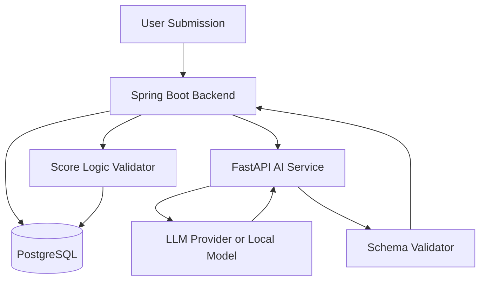
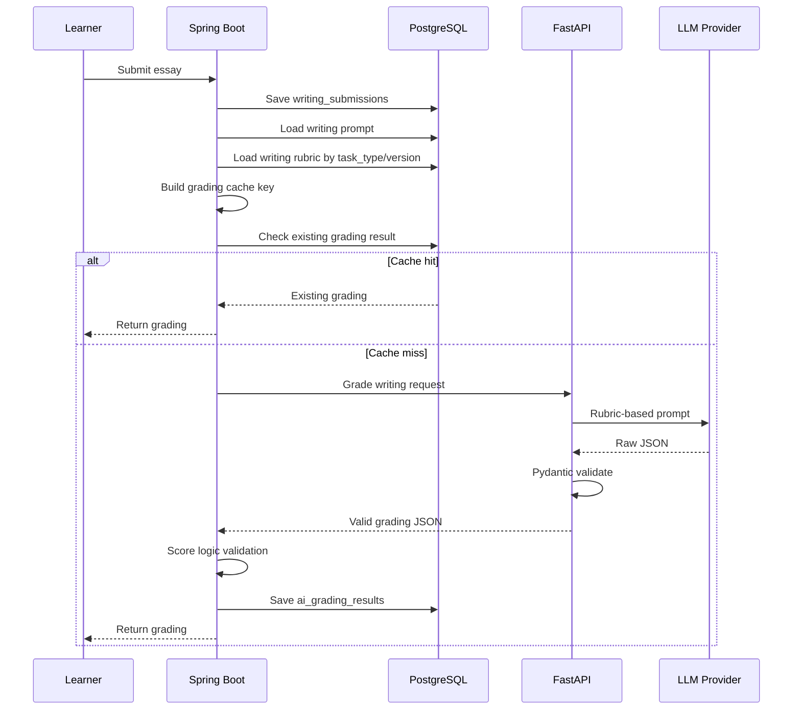
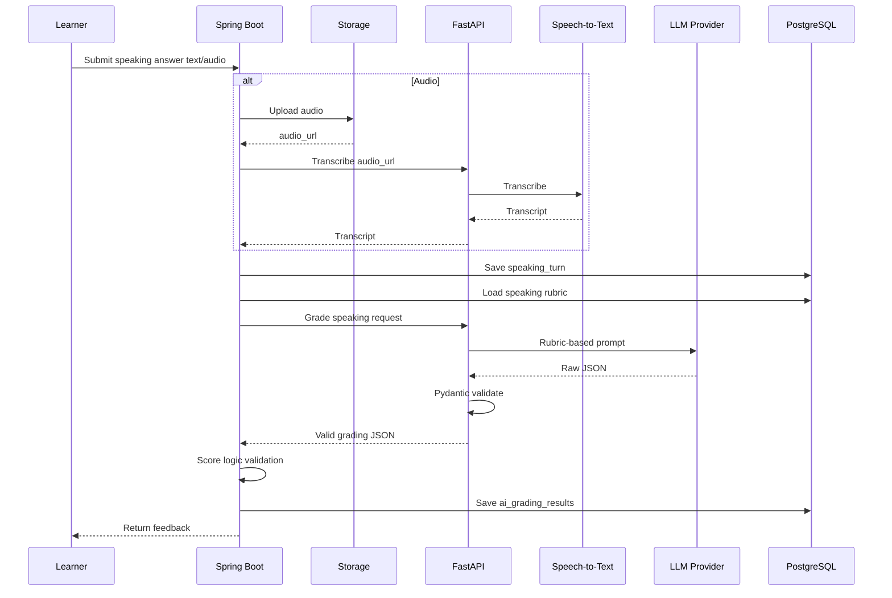

# Thiet ke cham diem theo IELTS Rubric - Writing va Speaking

## 1. Muc tieu

Tai lieu nay mo ta cach xay dung phan cham diem Writing/Speaking theo IELTS rubric.

Muc tieu:

- Cham theo tung tieu chi IELTS that.
- Tra ve estimated band score co cau truc.
- Giai thich ly do cho diem.
- Phat hien loi grammar/vocabulary.
- Tao feedback va goi y cai thien.
- Luu ket qua de dashboard va recommendation dung lai.
- Giam tinh bat on cua AI bang rubric, schema, cache va validation.

## 2. Nguyen tac quan trong

Khong nen lam:

```text
Essay/Speaking answer -> goi AI -> tra ve text feedback tu do
```

Nen lam:

```text
Submission
-> Load rubric tu database
-> Build prompt theo task type
-> AI cham tung criterion
-> Validate JSON schema
-> Backend kiem tra logic diem
-> Luu ai_grading_results
-> Cap nhat analytics/recommendation
```

Diem hien thi nen goi la:

```text
Estimated IELTS Band Score
```

Khong nen khang dinh la diem thi that tuyet doi.

## 3. Du lieu rubric can luu

Bang `rubrics`:

```text
id
skill: writing/speaking
task_type
criterion
band_score
descriptor_text
version
source_reference
```

## 3.1. Writing Task 1 criteria

- Task Achievement.
- Coherence and Cohesion.
- Lexical Resource.
- Grammatical Range and Accuracy.

## 3.2. Writing Task 2 criteria

- Task Response.
- Coherence and Cohesion.
- Lexical Resource.
- Grammatical Range and Accuracy.

## 3.3. Speaking criteria

- Fluency and Coherence.
- Lexical Resource.
- Grammatical Range and Accuracy.
- Pronunciation.

## 4. Kien truc cham diem



## 5. Vai tro cua tung thanh phan

## 5.1. Spring Boot

Spring Boot lam:

- Luu submission.
- Load prompt/rubric tu database.
- Tao cache key.
- Goi FastAPI AI Service.
- Validate nghiep vu sau khi AI tra ve.
- Luu `ai_grading_results`.
- Cap nhat dashboard/recommendation.

## 5.2. FastAPI AI Service

FastAPI lam:

- Nhan request co cau truc.
- Build prompt cuoi cung.
- Goi LLM API/local model.
- Validate response bang Pydantic.
- Retry neu output sai schema.
- Tra JSON chuan ve Spring Boot.

## 5.3. LLM Provider/Local Model

LLM lam:

- Doc bai lam.
- So sanh voi rubric.
- Cham tung criterion.
- Tao feedback.
- Trich loi grammar/vocabulary.
- Tao improved answer.

LLM khong duoc tu quyet format response.

## 6. Luong cham Writing chi tiet



## 7. Luong cham Speaking chi tiet



## 8. Input cho AI grading

## 8.1. Writing grading input

```json
{
  "submission_id": "uuid",
  "task_type": "task_2",
  "prompt": "Some people believe that...",
  "essay": "In recent years...",
  "word_count": 285,
  "target_band": 6.5,
  "rubric_version": "ielts-writing-v1",
  "rubric": [
    {
      "criterion": "Task Response",
      "band_score": 5.0,
      "descriptor": "..."
    },
    {
      "criterion": "Task Response",
      "band_score": 6.0,
      "descriptor": "..."
    }
  ],
  "prompt_version": "writing-task2-grade-v1"
}
```

## 8.2. Speaking grading input

```json
{
  "speaking_turn_id": "uuid",
  "part": "part_2",
  "question": "Describe a place you would like to visit.",
  "answer_text": "I would like to visit...",
  "transcript": "I would like to visit...",
  "duration_seconds": 85,
  "target_band": 6.5,
  "rubric_version": "ielts-speaking-v1",
  "rubric": [
    {
      "criterion": "Fluency and Coherence",
      "band_score": 5.0,
      "descriptor": "..."
    }
  ],
  "audio_metrics": {
    "words_per_minute": 105,
    "pause_count": 12
  }
}
```

## 9. Output schema

## 9.1. Writing grading output

```json
{
  "overall_band": 6.0,
  "criterion_scores": {
    "task_response": 6.0,
    "coherence_cohesion": 6.0,
    "lexical_resource": 6.5,
    "grammatical_range_accuracy": 5.5
  },
  "criterion_feedback": {
    "task_response": "The position is clear but some ideas need more development.",
    "coherence_cohesion": "Paragraphing is logical but cohesive devices are sometimes mechanical.",
    "lexical_resource": "Vocabulary is relevant with some good collocations.",
    "grammatical_range_accuracy": "There are frequent article and agreement errors."
  },
  "strengths": [
    "Clear position",
    "Relevant main ideas"
  ],
  "weaknesses": [
    "Some supporting ideas are underdeveloped",
    "Frequent article errors"
  ],
  "grammar_errors": [
    {
      "original": "People is more dependent on technology.",
      "corrected": "People are more dependent on technology.",
      "error_type": "subject_verb_agreement",
      "explanation": "People is plural, so the verb should be are."
    }
  ],
  "vocabulary_suggestions": [
    {
      "original": "bad effects",
      "suggestion": "adverse effects",
      "reason": "More academic collocation."
    }
  ],
  "feedback_text": "Your essay is around Band 6.0...",
  "improved_answer_text": "..."
}
```

## 9.2. Speaking grading output

```json
{
  "overall_band": 5.5,
  "criterion_scores": {
    "fluency_coherence": 5.5,
    "lexical_resource": 6.0,
    "grammatical_range_accuracy": 5.0,
    "pronunciation": 5.5
  },
  "criterion_feedback": {
    "fluency_coherence": "The answer is relevant but pauses are frequent.",
    "lexical_resource": "Some topic vocabulary is used but range is limited.",
    "grammatical_range_accuracy": "Several tense and agreement errors occur.",
    "pronunciation": "Pronunciation is estimated from transcript/audio metrics only."
  },
  "strengths": [
    "Answer is relevant to the question"
  ],
  "weaknesses": [
    "Answer needs more detail and examples",
    "Grammar errors affect clarity"
  ],
  "grammar_errors": [],
  "vocabulary_suggestions": [],
  "feedback_text": "...",
  "improved_answer_text": "...",
  "follow_up_question": "Why do you think this place is popular with tourists?"
}
```

## 10. Cach tinh overall band

## 10.1. Cach don gian cho MVP

Tinh trung binh 4 criterion:

```text
overall = average(criterion scores)
```

Sau do lam tron ve band gan nhat:

```text
0.0, 0.5, 1.0, 1.5, ..., 9.0
```

Vi du:

```text
Task Response: 6.0
Coherence and Cohesion: 6.0
Lexical Resource: 6.5
Grammar: 5.5

average = 6.0
overall = 6.0
```

## 10.2. Lam tron band

Pseudo-code:

```java
BigDecimal roundToNearestHalf(BigDecimal score) {
    return BigDecimal.valueOf(Math.round(score.doubleValue() * 2) / 2.0);
}
```

## 10.3. Rule kiem tra logic

Backend nen kiem tra:

- Diem phai nam trong 0.0 - 9.0.
- Diem phai la buoc 0.5.
- Overall khong duoc lech qua lon so voi average.
- Neu bai Writing qua ngan, Task Response/Task Achievement khong nen qua cao.
- Neu grammar_errors nhieu, Grammar score khong nen qua cao.
- Neu Speaking answer qua ngan, Fluency/Coherence khong nen qua cao.

Vi du rule:

```text
If word_count < 150 for Task 2:
  task_response should not exceed 5.0 unless manually reviewed

If speaking duration < 20 seconds:
  fluency_coherence should not exceed 5.0
```

Luu y: cac rule nay la guardrail, khong phai thay the rubric.

## 11. Prompt design

## 11.1. Cau truc prompt

Prompt nen gom:

```text
System role:
  You are an IELTS examiner...

Task:
  Grade this Writing Task 2 essay...

Rubric:
  Rubric descriptors loaded from database...

Input:
  Prompt, essay, word count, target band...

Instructions:
  Score each criterion independently.
  Justify each score using evidence from the answer.
  Return only valid JSON matching schema.
  Do not include markdown.

Output schema:
  JSON schema...
```

## 11.2. Vi du Writing prompt rut gon

```text
You are an IELTS Writing examiner.
Grade the essay using the provided IELTS Writing Task 2 rubric.

Rules:
- Score each criterion independently.
- Use only band scores in increments of 0.5.
- Explain each criterion score.
- Identify grammar and vocabulary issues from the essay.
- Return only valid JSON matching the schema.
- The score is an estimated IELTS band score, not an official score.

Question:
{{prompt}}

Essay:
{{essay}}

Rubric:
{{rubric}}

JSON schema:
{{schema}}
```

## 11.3. Vi du Speaking prompt rut gon

```text
You are an IELTS Speaking examiner.
Assess the answer using IELTS Speaking band descriptors.

Important:
- If only transcript is available, pronunciation must be estimated with limited confidence.
- Evaluate fluency/coherence, lexical resource, grammar range/accuracy, pronunciation.
- Generate one follow-up question if appropriate.
- Return only valid JSON.

Question:
{{question}}

Transcript:
{{transcript}}

Duration:
{{duration_seconds}}

Rubric:
{{rubric}}

Schema:
{{schema}}
```

## 12. Pydantic validation trong FastAPI

Vi du:

```python
from pydantic import BaseModel, Field

class CriterionScores(BaseModel):
    task_response: float | None = None
    task_achievement: float | None = None
    coherence_cohesion: float
    lexical_resource: float
    grammatical_range_accuracy: float

class WritingGradingResponse(BaseModel):
    overall_band: float = Field(ge=0, le=9)
    criterion_scores: CriterionScores
    criterion_feedback: dict[str, str]
    strengths: list[str]
    weaknesses: list[str]
    grammar_errors: list[dict]
    vocabulary_suggestions: list[dict]
    feedback_text: str
    improved_answer_text: str | None = None
```

Neu output sai schema:

```text
Retry 1 lan -> neu van sai -> tra error ve Spring Boot
```

## 13. Backend validation trong Spring Boot

FastAPI validate format. Spring Boot validate nghiep vu.

Spring Boot can kiem tra:

- Submission co ton tai khong.
- Rubric version co dung khong.
- Criterion scores co du khong.
- Score co nam trong range khong.
- Overall co khop average khong.
- Ket qua co dung `submission_type` khong.

Pseudo-code:

```java
public AiGradingResult gradeWriting(UUID submissionId) {
    WritingSubmission submission = loadSubmission(submissionId);
    WritingPrompt prompt = submission.getWritingPrompt();
    List<Rubric> rubrics = rubricService.findWritingRubric(prompt.getTaskType());

    String cacheKey = gradingCacheKey(submission, rubrics, promptVersion, modelName);
    Optional<AiGradingResult> cached = gradingRepository.findByCacheKey(cacheKey);
    if (cached.isPresent()) {
        return cached.get();
    }

    AiGradingResponse response = aiClient.gradeWriting(submission, prompt, rubrics);
    gradingValidator.validateWriting(response, submission);

    AiGradingResult result = mapper.toEntity(response);
    result.setWritingSubmission(submission);
    result.setSubmissionType(SubmissionType.WRITING);
    result.setCacheKey(cacheKey);

    return gradingRepository.save(result);
}
```

## 14. Cache de giam chi phi va tang nhat quan

Cache key:

```text
hash(
  submission_type
  + prompt_text
  + answer_text/transcript
  + rubric_version
  + prompt_template_version
  + model_name
)
```

Neu learner submit lai y het:

- Khong goi AI lan nua.
- Lay ket qua cu.

Can luu them trong `ai_grading_results`:

```text
cache_key
rubric_version
prompt_version
```

Neu chua co trong DB design, co the bo sung sau.

## 15. Calibration de diem sat hon

## 15.1. Tao tap bai mau

Can co tap bai/cau tra loi mau:

- Writing band 5.0.
- Writing band 6.0.
- Writing band 7.0.
- Speaking band 5.0.
- Speaking band 6.0.
- Speaking band 7.0.

Nguon:

- Tu bien soan.
- Bai mau public co license phu hop.
- Giao vien/nguoi hoc gop mau neu co dong y.

## 15.2. Dung de test prompt

Voi moi prompt version:

```text
Chay grading tren sample set
-> So sanh estimated score voi expected score
-> Ghi lai sai lech
-> Chinh prompt/rules neu can
```

## 15.3. Metrics don gian

- Mean absolute error giua AI score va expected score.
- Ty le lech qua 0.5 band.
- Ty le output dung schema.
- Ty le feedback co nhac dung loi chinh.

## 16. Speaking pronunciation

## 16.1. Neu chi co transcript

Khong the cham pronunciation that su chinh xac.

Chi co the:

- Uoc luong han che.
- Dua feedback ve fluency/coherence, grammar, vocabulary.
- Ghi ro trong feedback:

```text
Pronunciation is estimated with limited confidence because only transcript/audio metrics are available.
```

## 16.2. Neu co audio metrics co ban

Co the tinh:

- duration_seconds.
- words_per_minute.
- pause_count.
- filler words.
- average pause length.

Thu vien:

- pydub.
- librosa.
- faster-whisper segments.

## 16.3. Neu muon pronunciation scoring tot

Dung API chuyen dung:

- Azure Speech Assessment.
- Google/AWS speech services neu co pronunciation metrics.

Khuyen nghi MVP:

- Speaking text grading truoc.
- STT/audio sau.
- Pronunciation advanced de sau.

## 17. Luu ket qua vao database

Bang `ai_grading_results` nen luu:

```text
id
user_id
submission_type
writing_submission_id
speaking_turn_id
overall_band
criterion_scores
strengths
weaknesses
grammar_errors
vocabulary_suggestions
pronunciation_metrics
feedback_text
improved_answer_text
model_name
prompt_template_id
created_at
```

Nen bo sung sau neu can:

```text
cache_key
rubric_version
prompt_version
raw_response
validation_status
```

## 18. Lien ket voi personalization

Sau khi co `ai_grading_results`, backend dung du lieu nay de phan tich:

Writing:

- Criterion nao thap nhat.
- Grammar error type nao lap lai.
- Vocabulary issue nao hay gap.

Speaking:

- Fluency co thap khong.
- Answer co qua ngan khong.
- Grammar/vocabulary co yeu khong.

Sau do recommend:

- Grammar topic.
- Vocabulary topic.
- Writing prompt tuong tu.
- Speaking topic/part can luyen.

Phan recommend core nen dung rule-based analytics, khong can goi AI moi lan.

## 19. Rui ro va cach giam rui ro

| Rui ro | Cach giam |
| --- | --- |
| AI cham lech | Rubric fixed, temperature thap, calibration set |
| Output sai JSON | Pydantic schema + retry |
| Feedback chung chung | Prompt yeu cau evidence tu bai lam |
| Diem khong hop ly | Backend score logic validation |
| Ton chi phi | Cache + quota + model routing |
| Speaking pronunciation khong chuan | Ghi ro han che neu chi co transcript |
| Rubric thay doi | Luu rubric_version va prompt_version |

## 20. Ket luan

Cham diem theo rubric nen duoc xay nhu mot grading engine:

```text
Rubric in DB
-> Prompt template
-> AI criterion scoring
-> JSON schema validation
-> Backend score validation
-> Cache
-> Save grading result
-> Analytics/recommendation
```

Diem noi bat khong nam o viec goi API, ma nam o:

- Rubric duoc luu va version hoa.
- Cham tung criterion.
- Output co schema.
- Co validation/caching.
- Co calibration bang sample set.
- Ket qua cham duoc dung tiep cho ca nhan hoa hoc tap.
