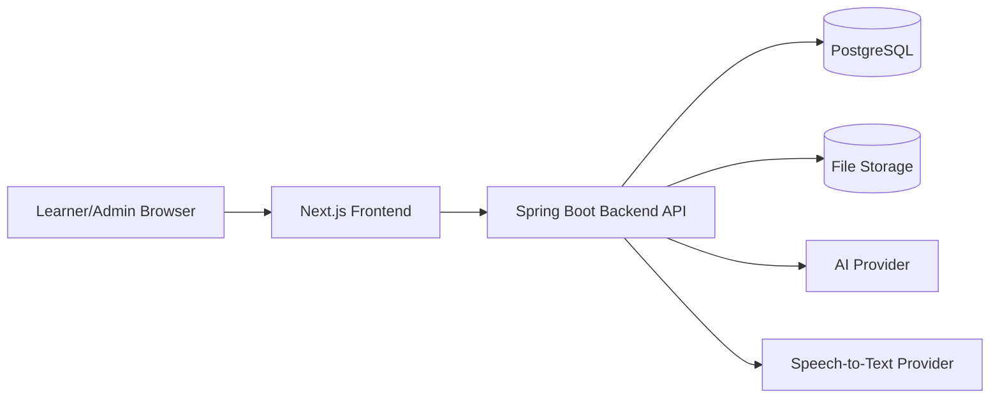
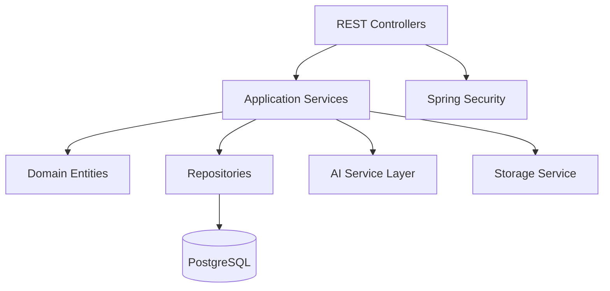

# Tech Stack va Lo trinh trien khai - IELTS AI Learning Platform

## 1. Muc tieu tai lieu

Tai lieu nay xac dinh:

- Tech stack de xay dung website hoc tieng Anh va luyen thi IELTS bang AI.
- Ly do chon tung cong nghe.
- Kien truc tong quan.
- Cac module can trien khai.
- Lo trinh trien khai theo phase/milestone ky thuat.
- Thu tu uu tien MVP.
- Rui ro ky thuat va cach giam rui ro.

Tai lieu nay tiep noi cac tai lieu:

- `docs/functional-requirements.md`
- `docs/use-case-analysis.md`
- `docs/database-design.md`
- `docs/dbdiagram-erd.dbml`
- `docs/springboot-entities.md`

## 2. Dinh huong chon cong nghe

He thong co cac dac diem:

- Can backend on dinh de quan ly user, noi dung, bai lam, tien do.
- Can database quan he ro rang vi du lieu co nhieu quan he.
- Can AI service de sinh cau hoi, cham Writing/Speaking, tao feedback.
- Can xu ly file audio/image.
- Can frontend de nguoi hoc thao tac voi bai luyen, dashboard, flashcard.
- Can admin panel de quan ly source data va kiem duyet noi dung AI tao.

Vi vay, tech stack nen uu tien:

- De trien khai trong do an.
- Co tai lieu phong phu.
- De demo.
- Phu hop voi PostgreSQL va Spring Boot entity da thiet ke.
- Co the mo rong ve sau.

## 3. Tech stack de xuat

## 3.1. Tong quan stack chinh

| Thanh phan | Cong nghe chon | Ly do |
| --- | --- | --- |
| Frontend | Next.js + React + TypeScript | Ho tro UI hien dai, routing tot, de chia component, phu hop dashboard/admin |
| UI library | Tailwind CSS + shadcn/ui | Tao giao dien nhanh, dep, de tuy bien |
| Backend | Spring Boot 3.x | Phu hop Java, JPA, validation, security, REST API |
| Database | PostgreSQL | Quan he chat, ho tro JSONB, phu hop ERD da thiet ke |
| ORM | Spring Data JPA/Hibernate | Map entity theo tai lieu Spring Boot entity |
| Migration | Flyway | Quan ly schema version, phu hop do an va production |
| Auth | Spring Security + JWT | Dang nhap stateless, de tich hop frontend |
| AI integration | AI Service layer trong backend | Tach logic goi model, de doi provider |
| AI provider | OpenAI/Gemini/Claude tuy dieu kien API | Sinh cau hoi, cham Writing/Speaking, tao feedback |
| Speech-to-text | Whisper API hoac local Whisper demo | Chuyen audio Speaking thanh transcript |
| File storage | Local storage cho demo, S3-compatible cho deploy | Luu audio/image, DB chi luu URL |
| Cache/queue | Khong bat buoc MVP; Redis neu can | Sinh AI async, cache ket qua |
| Deployment | Docker Compose | Chay frontend/backend/PostgreSQL de demo de dang |
| Testing | JUnit 5, Mockito, Testcontainers, Playwright | Test backend, DB integration, UI flow |
| API docs | OpenAPI/Swagger | De test endpoint va viet bao cao |

## 3.2. Frontend stack

### Cong nghe

- Next.js
- React
- TypeScript
- Tailwind CSS
- shadcn/ui
- React Hook Form
- Zod
- TanStack Query
- Axios hoac Fetch wrapper
- Recharts cho dashboard chart

### Ly do chon

- Next.js giup chia route ro rang:
  - `/login`
  - `/dashboard`
  - `/practice/reading`
  - `/practice/listening`
  - `/practice/writing`
  - `/practice/speaking`
  - `/vocabulary`
  - `/grammar`
  - `/admin`
- TypeScript giam loi khi lam viec voi API response.
- TanStack Query phu hop fetch/cache server data.
- React Hook Form + Zod phu hop validate form login, profile, writing submission, admin content.

### Cac man hinh frontend chinh

Learner:

- Login/Register.
- Dashboard.
- Profile/Band target.
- Reading practice.
- Listening practice.
- Writing editor + feedback.
- Speaking recorder/text answer + feedback.
- Vocabulary topic/flashcard.
- Grammar lesson/exercise.
- Recommendation page.

Admin:

- Source material management.
- Reading passage management.
- Listening material management.
- Writing prompt management.
- Speaking prompt management.
- Vocabulary management.
- Grammar management.
- AI generation request screen.
- Review generated questions.
- Rubric/prompt template management.

## 3.3. Backend stack

### Cong nghe

- Java 21 hoac Java 17.
- Spring Boot 3.x.
- Spring Web.
- Spring Data JPA.
- Spring Security.
- Bean Validation.
- Flyway.
- PostgreSQL Driver.
- OpenAPI/Swagger.
- Lombok.

### Ly do chon

- Spring Boot phu hop voi he thong co domain model ro rang.
- JPA map tot voi ERD da thiet ke.
- Spring Security + JWT phu hop user/admin.
- Flyway giup schema database co version.
- OpenAPI giup demo API va viet tai lieu.

### Module backend de xuat

```text
auth
user
profile
topic
level
source-material
ai-generation
generated-exercise
practice
reading
listening
writing
speaking
vocabulary
grammar
recommendation
admin
file-storage
ai-provider
```

## 3.4. Database stack

### Cong nghe

- PostgreSQL.
- Flyway migration.
- JSONB cho field linh hoat.
- UUID primary key.

### Ly do chon

- Quan he trong he thong ro rang va nhieu FK.
- JSONB phu hop options/correct answers/AI feedback.
- PostgreSQL manh cho query dashboard va analytics.

### Nguyen tac schema

- Khong de Hibernate auto create schema cho moi truong chinh.
- Viet migration bang Flyway.
- Seed data ban dau:
  - users admin demo.
  - topics.
  - levels.
  - rubrics.
  - prompt templates.
  - sample reading/listening/writing/speaking data.

## 3.5. AI stack

### Kien truc AI

Khong goi AI truc tiep tu frontend.

Frontend:

```text
Frontend -> Backend API -> AI Service Layer -> AI Provider
```

### Ly do

- Bao ve API key.
- Luu lich su request/response vao database.
- Validate output AI truoc khi luu.
- Co the doi provider ma khong sua frontend.

### AI provider

Co the chon mot trong cac huong:

1. OpenAI API
2. Gemini API
3. Claude API
4. Local model cho demo han che

Khuyen nghi cho MVP:

- Dung mot AI provider qua interface chung.
- Thiet ke `AiClient` interface:

```java
public interface AiClient {
    AiResponse generate(AiRequest request);
}
```

Sau nay co the co:

```text
OpenAiClient
GeminiClient
ClaudeClient
MockAiClient
```

### AI tasks can co

- Generate Reading Questions.
- Generate Listening Questions.
- Grade Writing Task 1.
- Grade Writing Task 2.
- Grade Speaking.
- Generate Speaking Follow-up Question.
- Generate Vocabulary Quiz.
- Generate Grammar Exercise.
- Generate Learning Recommendation.

## 3.6. Speech-to-text stack

### MVP

- Cho phep Speaking tra loi bang text.
- Audio la should-have.

### Khi lam audio

Lua chon:

- Whisper API.
- Local Whisper neu cau hinh may cho phep.
- Google Speech-to-Text.
- Azure Speech.

Khuyen nghi:

- MVP: text answer truoc.
- Sau do them audio recording + Whisper transcription.
- Pronunciation score nang cao de sau.

## 3.7. File storage stack

### MVP/demo

- Local file storage trong backend.
- PostgreSQL chi luu URL/path.

### Khi deploy

- S3-compatible storage.
- Cloudinary.
- Firebase Storage.

Loai file:

- Listening audio.
- Speaking answer audio.
- Writing Task 1 chart image.

## 3.8. Deployment stack

### Demo/local

Docker Compose:

```text
frontend
backend
postgres
```

Neu can:

```text
redis
minio
```

### Production-like demo

- Frontend: Vercel hoac Docker.
- Backend: Render/Railway/Fly.io/VPS.
- Database: managed PostgreSQL hoac Docker PostgreSQL.
- Storage: S3-compatible/Cloudinary.

## 4. Kien truc tong quan



## 5. Kien truc backend de xuat



## 6. Cau truc repository de xuat

Neu lam monorepo:

```text
/
  backend/
    src/main/java/...
    src/main/resources/db/migration/
    build.gradle hoac pom.xml
  frontend/
    app/
    components/
    lib/
    package.json
  docs/
  docker-compose.yml
```

Neu muon tach repo:

- `ielts-ai-backend`
- `ielts-ai-frontend`
- `ielts-ai-docs`

Khuyen nghi cho do an:

- Dung monorepo de de quan ly va demo.

## 7. Lo trinh trien khai tong quan

Lo trinh chia theo phase ky thuat. Moi phase co dau ra ro rang va co the demo.

## Phase 0 - Chuan hoa tai lieu va setup nen tang

### Muc tieu

Tao nen tang project de cac module sau phat trien dong nhat.

### Cong viec

- Tao monorepo.
- Tao backend Spring Boot.
- Tao frontend Next.js.
- Tao Docker Compose voi PostgreSQL.
- Cau hinh Flyway.
- Cau hinh OpenAPI/Swagger.
- Cau hinh lint/format.
- Tao README huong dan chay local.

### Dau ra

- Backend chay duoc.
- Frontend chay duoc.
- PostgreSQL chay duoc.
- Migration dau tien tao schema core.
- Swagger truy cap duoc.

## Phase 1 - Core system: Auth, User, Profile, Metadata

### Muc tieu

Xay dung nen tang user va du lieu danh muc.

### Cong viec backend

- Auth:
  - Register.
  - Login.
  - JWT.
  - Role learner/admin.
- User profile:
  - View profile.
  - Update current band.
  - Update target band.
  - Update weak skills.
- Metadata:
  - Topics.
  - Levels.
  - Rubrics seed.
  - Prompt templates seed.

### Cong viec frontend

- Login/Register page.
- Profile setup page.
- Layout learner/admin.
- Route protection.

### Dau ra

- Learner dang ky/dang nhap duoc.
- Learner cap nhat muc tieu IELTS.
- Admin/learner phan quyen duoc.
- Database co topics, levels, rubrics, prompt templates.

## Phase 2 - Admin source content va AI generation foundation

### Muc tieu

Xay dung workflow admin nhap source data va goi AI tao noi dung.

### Cong viec backend

- CRUD source materials.
- CRUD reading passages.
- CRUD listening materials.
- CRUD writing prompts.
- CRUD speaking prompts.
- CRUD vocabulary items.
- CRUD grammar topics.
- AI generation request service.
- Prompt template resolver.
- AI client interface.
- Mock AI client de test khong ton chi phi.
- Validate AI output JSON.
- Luu generated exercises/questions.

### Cong viec frontend

- Admin source material list/detail.
- Admin form tao passage/transcript/prompt.
- Admin nut "Generate with AI".
- Admin man hinh review generated questions.

### Dau ra

- Admin nhap passage/transcript.
- Admin goi AI tao cau hoi.
- Cau hoi/dap an/giai thich duoc luu database.
- Admin review/publish noi dung.

## Phase 3 - Reading module

### Muc tieu

Hoan thanh module Reading co the demo end-to-end.

### Cong viec backend

- API list published Reading exercises theo level/topic/question type.
- API get exercise detail.
- API submit answers.
- Cham dung/sai.
- Luu practice attempts/user answers.
- Tra ket qua, explanation, evidence.

### Cong viec frontend

- Reading exercise list.
- Reading practice screen.
- Answer form theo question type.
- Submit result screen.
- Explanation/evidence display.

### Dau ra

- Learner chon bai Reading.
- Learner lam bai va nop.
- He thong cham va hien thi giai thich.
- Dashboard co thong ke Reading co ban.

## Phase 4 - Listening module

### Muc tieu

Hoan thanh module Listening voi audio + transcript + cau hoi AI tao.

### Cong viec backend

- File upload/listening audio URL.
- Transcript segments.
- API list Listening exercises.
- API get audio + questions.
- API submit answers.
- Hien transcript sau khi nop.
- Tra timestamp/evidence neu co.

### Cong viec frontend

- Audio player.
- Listening question UI.
- Submit result.
- Transcript/explanation view.

### Dau ra

- Learner nghe audio.
- Learner lam bai Listening.
- He thong cham va hien transcript/giai thich.

## Phase 5 - Writing module

### Muc tieu

Hoan thanh AI grading cho Writing theo IELTS rubric.

### Cong viec backend

- API list Writing prompts.
- API get prompt detail.
- API submit essay.
- Word count.
- Load rubric theo task type.
- Build grading prompt.
- Goi AI cham.
- Validate grading JSON.
- Luu writing submission.
- Luu AI grading result voi `writing_submission_id`.
- API get feedback.

### Cong viec frontend

- Writing prompt list.
- Writing editor.
- Submit essay.
- Loading grading state.
- Feedback screen:
  - overall band.
  - criterion scores.
  - strengths.
  - weaknesses.
  - grammar errors.
  - vocabulary suggestions.
  - improved version.

### Dau ra

- Learner viet bai Task 2.
- AI cham theo 4 tieu chi.
- Learner xem estimated band va feedback.

## Phase 6 - Speaking module

### Muc tieu

Hoan thanh Speaking MVP, uu tien text answer truoc, audio sau.

### Cong viec backend

- API list Speaking prompts.
- API create speaking session.
- API submit speaking turn text.
- Goi AI cham theo Speaking rubric.
- Luu speaking turn.
- Luu AI grading result voi `speaking_turn_id`.
- AI generate follow-up question.
- Neu lam audio:
  - Upload audio.
  - Goi STT.
  - Luu transcript.

### Cong viec frontend

- Speaking part/topic selection.
- Speaking session screen.
- Text answer input.
- Audio recorder neu lam should-have.
- Feedback screen.
- Follow-up question display.

### Dau ra

- Learner luyen Speaking Part 1/2.
- AI cham theo rubric.
- AI co the hoi follow-up question.

## Phase 7 - Vocabulary va flashcard

### Muc tieu

Hoan thanh hoc tu vung theo topic va flashcard.

### Cong viec backend

- API list vocabulary by topic/level.
- API get flashcard deck.
- API update memory status.
- SRS calculation don gian.
- API due review list.
- Vocabulary quiz API neu lam should-have.

### Cong viec frontend

- Vocabulary topic page.
- Flashcard UI.
- Buttons:
  - Da nho.
  - Chua nho.
  - Can on lai.
- Due review page.
- Vocabulary quiz UI neu lam.

### Dau ra

- Learner hoc flashcard theo topic.
- He thong luu tien do tu vung.
- Tu kho xuat hien lai de on tap.

## Phase 8 - Grammar module

### Muc tieu

Hoan thanh bai hoc ngu phap va bai tap.

### Cong viec backend

- API list grammar topics.
- API get grammar lesson.
- API list exercises.
- API submit grammar answers.
- Luu progress.
- AI generate grammar exercises neu lam should-have.

### Cong viec frontend

- Grammar topic list.
- Lesson page.
- Exercise page.
- Result/explanation display.

### Dau ra

- Learner hoc ngu phap theo level.
- Learner lam bai tap va xem giai thich.
- He thong luu grammar progress.

## Phase 9 - Dashboard va personalization

### Muc tieu

Tong hop du lieu hoc tap va de xuat bai hoc tiep theo.

### Cong viec backend

- Dashboard API:
  - scores by skill.
  - recent attempts.
  - weak question types.
  - writing/speaking criterion weaknesses.
  - vocabulary progress.
  - grammar progress.
- Recommendation service.
- AI recommendation prompt.
- Luu learning recommendations.

### Cong viec frontend

- Dashboard charts.
- Skill summary cards.
- Weakness list.
- Recommended next actions.

### Dau ra

- Learner xem tien do hoc.
- He thong goi y bai hoc tiep theo theo loi sai va muc tieu.

## Phase 10 - Hoan thien admin, quality, demo

### Muc tieu

Hoan thien de bao ve do an va demo on dinh.

### Cong viec

- Admin review workflow day du.
- Error handling.
- Loading states.
- Empty states.
- Seed data demo.
- Test case chinh.
- API docs day du.
- Docker compose demo.
- Bao cao ky thuat.

### Dau ra

- He thong demo duoc end-to-end.
- Co du lieu mau cho 4 ky nang, vocabulary, grammar.
- Co tai lieu API va tai lieu cai dat.

## 8. Thu tu uu tien MVP

## 8.1. MVP bat buoc

1. Auth + profile.
2. Admin source content.
3. AI generation foundation.
4. Reading end-to-end.
5. Listening end-to-end.
6. Writing Task 2 AI grading.
7. Speaking text answer AI grading.
8. Vocabulary flashcard.
9. Grammar lesson/exercise.
10. Dashboard co ban.

## 8.2. Nen lam sau MVP

1. Placement test.
2. Speaking audio + STT.
3. Writing Task 1 chart image.
4. Speaking follow-up question.
5. Vocabulary quiz.
6. AI-generated grammar exercise.
7. Recommendation AI.
8. Mini mock test.

## 8.3. Nang cao

1. Pronunciation scoring nang cao.
2. Study plan chi tiet.
3. Admin prompt version comparison.
4. Redis queue cho AI generation.
5. Analytics nang cao.
6. Multi-provider AI fallback.

## 9. API nhom theo module

## 9.1. Auth

```text
POST /api/auth/register
POST /api/auth/login
POST /api/auth/logout
GET  /api/auth/me
```

## 9.2. Profile

```text
GET  /api/profile
PUT  /api/profile
```

## 9.3. Reading

```text
GET  /api/reading/exercises
GET  /api/reading/exercises/{id}
POST /api/reading/exercises/{id}/submit
```

## 9.4. Listening

```text
GET  /api/listening/exercises
GET  /api/listening/exercises/{id}
POST /api/listening/exercises/{id}/submit
```

## 9.5. Writing

```text
GET  /api/writing/prompts
GET  /api/writing/prompts/{id}
POST /api/writing/submissions
GET  /api/writing/submissions/{id}/grading
```

## 9.6. Speaking

```text
GET  /api/speaking/prompts
POST /api/speaking/sessions
POST /api/speaking/sessions/{id}/turns
GET  /api/speaking/sessions/{id}
```

## 9.7. Vocabulary

```text
GET  /api/vocabulary
GET  /api/vocabulary/review
POST /api/vocabulary/{id}/progress
```

## 9.8. Grammar

```text
GET  /api/grammar/topics
GET  /api/grammar/topics/{id}
POST /api/grammar/exercises/{id}/submit
```

## 9.9. Admin

```text
GET    /api/admin/source-materials
POST   /api/admin/source-materials
PUT    /api/admin/source-materials/{id}
DELETE /api/admin/source-materials/{id}

POST   /api/admin/ai-generation
GET    /api/admin/generated-exercises
PUT    /api/admin/generated-exercises/{id}/status
```

## 10. Testing strategy

## 10.1. Backend tests

- Unit test service:
  - scoring Reading/Listening.
  - SRS vocabulary.
  - AI output validation.
  - recommendation logic.
- Integration test:
  - repository + PostgreSQL.
  - auth flow.
  - submit exercise.
  - submit Writing/Speaking.
- Mock AI provider:
  - dung output JSON co dinh de test.

## 10.2. Frontend tests

- Component tests cho:
  - flashcard.
  - exercise question.
  - writing feedback.
  - dashboard cards.
- E2E smoke test:
  - login.
  - lam Reading.
  - nop Writing.
  - hoc flashcard.

## 10.3. Manual demo checklist

- Dang ky/dang nhap.
- Cap nhat target band.
- Admin tao Reading passage.
- AI tao cau hoi Reading.
- Admin publish.
- Learner lam Reading.
- Learner nop Writing va nhan feedback.
- Learner luyen Speaking.
- Learner hoc flashcard.
- Learner xem dashboard.

## 11. Rui ro va cach giam rui ro

## 11.1. AI output sai format

Rui ro:

- AI tra ve JSON sai schema.
- Cau hoi thieu dap an/giai thich.

Giam rui ro:

- Bat buoc output JSON schema.
- Validate backend truoc khi luu.
- Luu raw response de debug.
- Admin review truoc khi publish.

## 11.2. AI cham diem khong on dinh

Rui ro:

- Cung mot bai co the cham lech.

Giam rui ro:

- Dung rubric co dinh.
- Cham tung criterion.
- Luu prompt version/model name.
- Hien thi la Estimated IELTS Band Score.

## 11.3. Speaking audio phuc tap

Rui ro:

- Ghi am, upload, STT, pronunciation scoring co nhieu loi.

Giam rui ro:

- MVP lam text answer truoc.
- Audio/STT lam sau.
- Pronunciation scoring nang cao de sau.

## 11.4. Qua nhieu module

Rui ro:

- Lam rong nhung khong sau.

Giam rui ro:

- Uu tien Reading/Writing truoc de co demo AI ro.
- Listening/Speaking lam MVP.
- Vocabulary/Grammar lam co ban nhung hoan thien flow.

## 11.5. Du lieu co ban quyen

Rui ro:

- Su dung passage/audio/de thi co ban quyen.

Giam rui ro:

- Tu bien soan.
- AI sinh va admin duyet.
- Dung public domain/open dataset co license ro.
- Khong copy de IELTS Cambridge.

## 12. Definition of Done theo module

## 12.1. Backend module done

- Co migration.
- Co entity/repository/service/controller.
- Co validation.
- Co Swagger docs.
- Co unit/integration test co ban.
- Co error handling.

## 12.2. Frontend module done

- Co page/component.
- Co loading/error/empty state.
- Co form validation.
- Co API integration.
- Responsive co ban.

## 12.3. AI feature done

- Co prompt template.
- Co request/response logging.
- Co JSON schema validation.
- Co fallback khi AI fail.
- Co admin review neu la generated content.

## 13. Thu tu implement chi tiet de bat dau code

Neu bat dau code ngay, nen di theo thu tu:

1. Tao monorepo va Docker Compose.
2. Tao Spring Boot backend.
3. Tao Next.js frontend.
4. Tao PostgreSQL migration core:
   - users
   - learner_profiles
   - topics
   - levels
5. Implement auth JWT.
6. Implement profile.
7. Seed topics/levels.
8. Tao admin layout.
9. Implement source materials.
10. Implement generated exercises/questions.
11. Implement mock AI generation.
12. Implement Reading end-to-end.
13. Implement real AI provider.
14. Implement Listening.
15. Implement Writing grading.
16. Implement Speaking text grading.
17. Implement Vocabulary flashcard.
18. Implement Grammar lesson/exercise.
19. Implement Dashboard.
20. Them STT/audio neu con pham vi.
21. Hoan thien seed data, docs, tests, demo.

## 14. Ket luan

Tech stack khuyen nghi:

```text
Frontend: Next.js + React + TypeScript + Tailwind CSS + shadcn/ui
Backend: Spring Boot 3.x + Spring Data JPA + Spring Security + JWT
Database: PostgreSQL + Flyway + JSONB
AI: AI Service Layer + OpenAI/Gemini/Claude provider
Speech-to-text: Whisper API hoac local Whisper
Storage: Local demo, S3-compatible khi deploy
Deployment: Docker Compose
Testing: JUnit, Mockito, Testcontainers, Playwright
```

Huong trien khai tot nhat la lam theo MVP end-to-end:

1. Nen tang auth/profile/admin/source data.
2. AI generation workflow.
3. Reading va Listening co cau hoi AI tao.
4. Writing va Speaking co AI grading theo rubric.
5. Vocabulary/Grammar ho tro ca nhan hoa.
6. Dashboard tong hop tien do.

Cach lam nay giup he thong co gia tri demo som, dong thoi van giu dung kien truc de mo rong.
