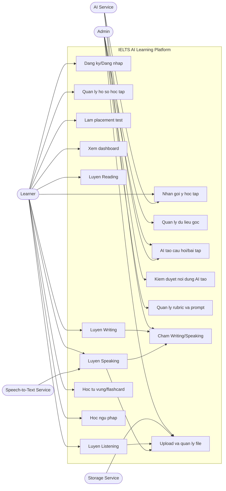
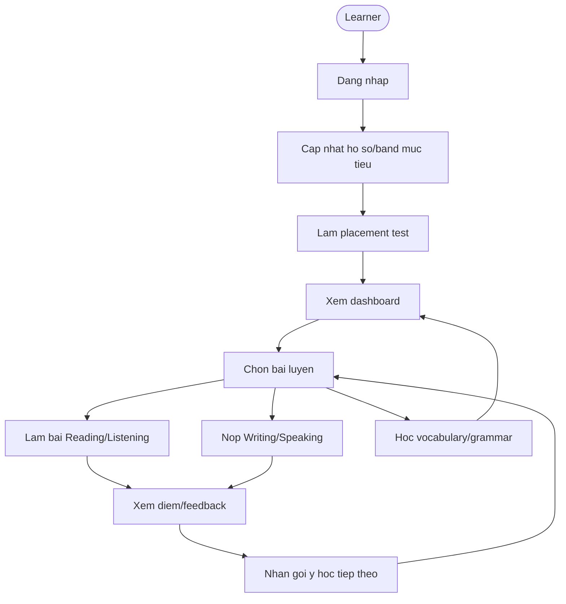
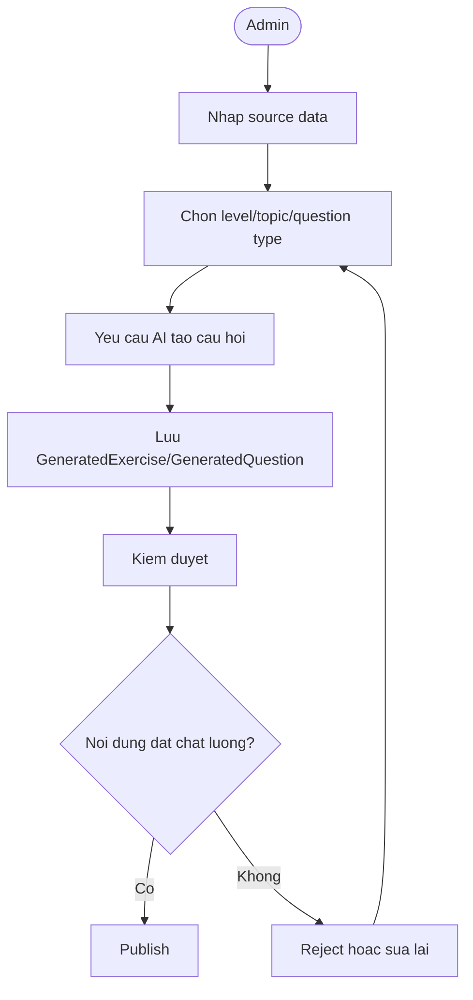

# Tai lieu phan tich Use Case - IELTS AI Learning Platform

## 1. Vi tri trong quy trinh phan tich thiet ke

Sau khi da co:

1. Tai lieu yeu cau chuc nang: `docs/functional-requirements.md`
2. Tai lieu thiet ke database: `docs/database-design.md`
3. Bieu do database dbdiagram.io: `docs/dbdiagram-erd.dbml`
4. Tai lieu entity Spring Boot: `docs/springboot-entities.md`

Buoc tiep theo trong pha phan tich la **mo hinh hoa Use Case**.

Muc tieu cua buoc nay:

- Xac dinh cac actor tuong tac voi he thong.
- Nhom cac chuc nang thanh use case ro rang.
- Mo ta luong nghiep vu chinh cua tung use case quan trong.
- Lam co so cho cac buoc tiep theo:
  - Thiet ke UI/UX flow.
  - Thiet ke REST API.
  - Thiet ke sequence diagram.
  - Lap ke hoach implementation theo module.
  - Viet test case.

## 2. Pham vi use case

Tai lieu nay tap trung vao phien ban MVP cua website:

- Quan ly tai khoan va ho so hoc tap.
- Placement test.
- Dashboard ca nhan hoa.
- Luyen Reading.
- Luyen Listening.
- Luyen Writing.
- Luyen Speaking.
- Hoc tu vung va flashcard.
- Hoc ngu phap va bai tap.
- AI tao noi dung/cham diem/goi y.
- Admin quan ly va kiem duyet noi dung.

## 3. Actor cua he thong

## 3.1. Learner

Nguoi hoc su dung he thong de hoc tieng Anh va luyen thi IELTS.

Trach nhiem/nhu cau:

- Dang ky/dang nhap.
- Cap nhat muc tieu IELTS.
- Lam placement test.
- Luyen 4 ky nang IELTS.
- Hoc tu vung/ngu phap.
- Xem diem, feedback va tien do.
- Nhan goi y hoc tap ca nhan hoa.

## 3.2. Admin

Nguoi quan tri noi dung va van hanh he thong.

Trach nhiem/nhu cau:

- Quan ly du lieu goc.
- Quan ly topic, level, rubric, prompt template.
- Yeu cau AI tao cau hoi/bai tap.
- Kiem duyet cau hoi, dap an, giai thich do AI tao.
- Quan ly noi dung da publish.
- Xem thong ke he thong.

## 3.3. AI Service

Thanh phan AI tich hop vao backend.

Trach nhiem:

- Tao cau hoi, dap an va giai thich tu source data trong database.
- Cham Writing/Speaking theo IELTS rubric.
- Tao feedback va goi y hoc tap.
- Tao follow-up question cho Speaking.
- Tao vocabulary quiz va grammar exercise.

## 3.4. Speech-to-Text Service

Dich vu chuyen audio thanh transcript.

Trach nhiem:

- Nhan audio Speaking cua learner.
- Tra ve transcript.
- Neu co, tra ve pronunciation metrics co ban.

## 3.5. Storage Service

Dich vu luu file.

Trach nhiem:

- Luu audio Listening.
- Luu audio Speaking cua learner.
- Luu anh chart Writing Task 1.
- Tra ve URL file de luu vao PostgreSQL.

## 4. Use Case diagram tong quan

## 5. Danh sach use case theo module

## 5.1. Account va learner profile

| Ma UC | Ten use case | Actor chinh | Muc do uu tien |
| --- | --- | --- | --- |
| UC-001 | Dang ky tai khoan | Learner | Must have |
| UC-002 | Dang nhap | Learner/Admin | Must have |
| UC-003 | Dang xuat | Learner/Admin | Must have |
| UC-004 | Cap nhat ho so hoc tap | Learner | Must have |
| UC-005 | Chon band muc tieu | Learner | Must have |
| UC-006 | Lam placement test | Learner | Should have |

## 5.2. Dashboard va ca nhan hoa

| Ma UC | Ten use case | Actor chinh | Muc do uu tien |
| --- | --- | --- | --- |
| UC-007 | Xem dashboard tien do | Learner | Must have |
| UC-008 | Xem phan tich diem yeu | Learner | Should have |
| UC-009 | Nhan goi y bai hoc tiep theo | Learner/AI Service | Should have |
| UC-010 | Tao study plan ca nhan hoa | Learner/AI Service | Could have |

## 5.3. Reading

| Ma UC | Ten use case | Actor chinh | Muc do uu tien |
| --- | --- | --- | --- |
| UC-011 | Chon bai Reading theo level/topic | Learner | Must have |
| UC-012 | Lam bai Reading | Learner | Must have |
| UC-013 | Nop bai va xem ket qua Reading | Learner | Must have |
| UC-014 | Xem giai thich va evidence Reading | Learner | Must have |
| UC-015 | AI tao cau hoi Reading tu passage | Admin/AI Service | Must have |

## 5.4. Listening

| Ma UC | Ten use case | Actor chinh | Muc do uu tien |
| --- | --- | --- | --- |
| UC-016 | Chon bai Listening theo level/topic | Learner | Must have |
| UC-017 | Nghe audio va lam bai Listening | Learner | Must have |
| UC-018 | Nop bai va xem transcript/giai thich | Learner | Must have |
| UC-019 | AI tao cau hoi Listening tu transcript | Admin/AI Service | Must have |
| UC-020 | Upload audio/transcript Listening | Admin | Must have |

## 5.5. Writing

| Ma UC | Ten use case | Actor chinh | Muc do uu tien |
| --- | --- | --- | --- |
| UC-021 | Chon de Writing Task 1/Task 2 | Learner | Must have |
| UC-022 | Nop bai Writing | Learner | Must have |
| UC-023 | AI cham Writing theo rubric IELTS | AI Service | Must have |
| UC-024 | Xem diem va feedback Writing | Learner | Must have |
| UC-025 | Xem improved version | Learner | Should have |
| UC-026 | Quan ly de Writing | Admin | Must have |

## 5.6. Speaking

| Ma UC | Ten use case | Actor chinh | Muc do uu tien |
| --- | --- | --- | --- |
| UC-027 | Chon Speaking part/topic | Learner | Must have |
| UC-028 | Tra loi Speaking bang text/audio | Learner | Must have |
| UC-029 | Chuyen audio thanh transcript | Speech-to-Text Service | Should have |
| UC-030 | AI cham Speaking theo rubric IELTS | AI Service | Must have |
| UC-031 | AI tao follow-up question | AI Service | Should have |
| UC-032 | Xem diem va feedback Speaking | Learner | Must have |
| UC-033 | Quan ly cau hoi Speaking | Admin | Must have |

## 5.7. Vocabulary va flashcard

| Ma UC | Ten use case | Actor chinh | Muc do uu tien |
| --- | --- | --- | --- |
| UC-034 | Xem tu vung theo topic/level | Learner | Must have |
| UC-035 | Hoc flashcard | Learner | Must have |
| UC-036 | Danh dau trang thai ghi nho | Learner | Must have |
| UC-037 | On tap theo spaced repetition | Learner | Should have |
| UC-038 | Lam vocabulary quiz | Learner | Should have |
| UC-039 | Quan ly vocabulary items | Admin | Must have |

## 5.8. Grammar

| Ma UC | Ten use case | Actor chinh | Muc do uu tien |
| --- | --- | --- | --- |
| UC-040 | Xem bai hoc ngu phap | Learner | Must have |
| UC-041 | Lam bai tap ngu phap | Learner | Must have |
| UC-042 | Xem dap an va giai thich ngu phap | Learner | Must have |
| UC-043 | AI tao bai tap ngu phap | Admin/AI Service | Should have |
| UC-044 | Quan ly grammar topics | Admin | Must have |

## 5.9. Admin va AI content workflow

| Ma UC | Ten use case | Actor chinh | Muc do uu tien |
| --- | --- | --- | --- |
| UC-045 | Quan ly source materials | Admin | Must have |
| UC-046 | Yeu cau AI tao noi dung | Admin | Must have |
| UC-047 | Kiem duyet cau hoi/dap an/giai thich | Admin | Must have |
| UC-048 | Publish noi dung luyen tap | Admin | Must have |
| UC-049 | Quan ly prompt templates | Admin | Should have |
| UC-050 | Quan ly IELTS rubrics | Admin | Should have |

## 6. Use Case diagram theo nhom chuc nang

## 6.1. Learner learning flow

## 6.2. Admin content workflow

## 7. Dac ta use case chi tiet

## 7.1. UC-015 - AI tao cau hoi Reading tu passage

| Muc | Noi dung |
| --- | --- |
| Actor chinh | Admin |
| Actor phu | AI Service |
| Muc tieu | Tao cau hoi, dap an va giai thich tu passage Reading trong database |
| Tien dieu kien | Admin da dang nhap; passage co trang thai draft/reviewed; topic va level da duoc gan |
| Hau dieu kien | Generated exercise va generated questions duoc luu voi status draft |
| Du lieu lien quan | `reading_passages`, `source_materials`, `ai_generation_requests`, `generated_exercises`, `generated_questions` |

### Luong chinh

1. Admin chon mot Reading passage.
2. Admin chon dang cau hoi, level muc tieu va so luong cau hoi.
3. He thong tao `ai_generation_requests`.
4. He thong gui passage, metadata va prompt template sang AI Service.
5. AI Service tra ve cau hoi, options, dap an, giai thich va evidence.
6. He thong validate output theo JSON schema.
7. He thong luu `generated_exercises` va `generated_questions`.
8. He thong hien thi noi dung AI tao cho admin kiem duyet.

### Luong ngoai le

- AI tra output sai schema: request status = failed, luu error message.
- AI khong tao evidence: cau hoi van luu nhung status = draft/rejected de admin xu ly.
- Passage chua duoc gan level/topic: he thong yeu cau cap nhat metadata truoc.

### Quy tac nghiep vu

- Cau hoi Reading nen co `evidence_text`.
- Noi dung AI tao chua duoc hien thi cho learner neu chua published.
- Moi generated question phai co `correct_answer` va `explanation`.

## 7.2. UC-019 - AI tao cau hoi Listening tu transcript

| Muc | Noi dung |
| --- | --- |
| Actor chinh | Admin |
| Actor phu | AI Service |
| Muc tieu | Tao cau hoi Listening tu transcript/audio metadata |
| Tien dieu kien | Listening material co audio_url va transcript |
| Hau dieu kien | Bai Listening duoc tao va cho admin kiem duyet |
| Du lieu lien quan | `listening_materials`, `transcript_segments`, `generated_exercises`, `generated_questions` |

### Luong chinh

1. Admin chon listening material.
2. Admin chon dang cau hoi: form completion, multiple choice, matching,...
3. He thong lay transcript full va transcript segments neu co.
4. AI Service tao cau hoi, dap an, giai thich va timestamp/evidence.
5. He thong luu generated exercise/questions.
6. Admin kiem duyet va publish.

### Quy tac nghiep vu

- File audio khong luu trong PostgreSQL, chi luu `audio_url`.
- Cau hoi Listening nen co timestamp hoac evidence_text trong transcript.
- Transcript nen duoc an voi learner cho den khi learner nop bai.

## 7.3. UC-023 - AI cham Writing theo rubric IELTS

| Muc | Noi dung |
| --- | --- |
| Actor chinh | Learner |
| Actor phu | AI Service |
| Muc tieu | Cham bai Writing theo tieu chi IELTS va tra feedback |
| Tien dieu kien | Learner da dang nhap; writing prompt ton tai; rubric da duoc cau hinh |
| Hau dieu kien | Ket qua cham duoc luu vao `ai_grading_results` |
| Du lieu lien quan | `writing_prompts`, `writing_submissions`, `rubrics`, `ai_grading_results` |

### Luong chinh

1. Learner chon Writing prompt.
2. Learner viet bai va nop.
3. He thong luu `writing_submissions`.
4. He thong lay rubric phu hop theo task type.
5. AI Service cham tung tieu chi.
6. AI Service tra ve overall band, criterion scores, feedback, loi sai va improved version.
7. He thong validate output.
8. He thong luu `ai_grading_results` voi `writing_submission_id`.
9. Learner xem diem va feedback.

### Luong ngoai le

- Bai viet qua ngan: he thong canh bao hoac van cham nhung feedback neu ro han che.
- AI cham that bai: hien thi trang thai dang xu ly/thu lai.
- Rubric chua cau hinh: khong cho cham va bao admin.

### Quy tac nghiep vu

- Diem hien thi la `Estimated IELTS Band Score`.
- Cham theo tung tieu chi truoc, sau do moi tinh overall.
- Ket qua cham phai co ly do cho diem.

## 7.4. UC-030 - AI cham Speaking theo rubric IELTS

| Muc | Noi dung |
| --- | --- |
| Actor chinh | Learner |
| Actor phu | AI Service, Speech-to-Text Service |
| Muc tieu | Cham cau tra loi Speaking theo rubric IELTS |
| Tien dieu kien | Learner da dang nhap; speaking session da duoc tao |
| Hau dieu kien | Transcript, answer va grading result duoc luu |
| Du lieu lien quan | `speaking_sessions`, `speaking_turns`, `rubrics`, `ai_grading_results` |

### Luong chinh

1. Learner chon speaking part/topic.
2. He thong tao `speaking_sessions`.
3. He thong hien thi cau hoi/cue card.
4. Learner tra loi bang text hoac audio.
5. Neu la audio, he thong upload file va goi Speech-to-Text Service.
6. He thong luu `speaking_turns`.
7. AI Service cham theo rubric Speaking.
8. He thong luu `ai_grading_results` voi `speaking_turn_id`.
9. Neu can, AI Service tao follow-up question.
10. Learner xem feedback va cau hoi tiep theo.

### Quy tac nghiep vu

- Neu chi co transcript, pronunciation score chi duoc cham co ban hoac gan nhan han che.
- Speaking Part 3 co the dung cau tra loi truoc de tao follow-up question.
- Moi speaking session co nhieu speaking turns.

## 7.5. UC-035 - Hoc flashcard

| Muc | Noi dung |
| --- | --- |
| Actor chinh | Learner |
| Muc tieu | Hoc tu vung theo flashcard va cap nhat trang thai ghi nho |
| Tien dieu kien | Learner da dang nhap; vocabulary items da published |
| Hau dieu kien | Tien do tu vung duoc cap nhat |
| Du lieu lien quan | `vocabulary_items`, `user_vocabulary_progress` |

### Luong chinh

1. Learner chon topic/level tu vung.
2. He thong hien thi danh sach flashcard.
3. Learner xem mat truoc/mat sau.
4. Learner danh dau: da nho, chua nho, can on lai.
5. He thong cap nhat memory status, review count va next review time.

### Quy tac nghiep vu

- Moi user chi co mot progress record cho mot vocabulary item.
- Tu chua nho phai duoc uu tien on lai som hon.
- Tu da mastered van co the xuat hien lai sau mot khoang thoi gian dai.

## 7.6. UC-041 - Lam bai tap ngu phap

| Muc | Noi dung |
| --- | --- |
| Actor chinh | Learner |
| Muc tieu | Luyen grammar topic va xem giai thich |
| Tien dieu kien | Grammar topic/exercise da published |
| Hau dieu kien | Grammar progress duoc cap nhat |
| Du lieu lien quan | `grammar_topics`, `grammar_exercises`, `user_grammar_progress`, `practice_attempts`, `user_answers` |

### Luong chinh

1. Learner chon grammar topic.
2. He thong hien thi lesson va exercises.
3. Learner tra loi cau hoi.
4. He thong cham dap an.
5. He thong hien thi correct answer va explanation.
6. He thong cap nhat progress.

### Quy tac nghiep vu

- Bai tap ngu phap co dap an dung/sai ro rang.
- Loi grammar lap lai tu Writing/Speaking co the duoc dung de de xuat topic can hoc.

## 7.7. UC-047 - Kiem duyet cau hoi/dap an/giai thich

| Muc | Noi dung |
| --- | --- |
| Actor chinh | Admin |
| Muc tieu | Kiem tra chat luong noi dung AI tao truoc khi publish |
| Tien dieu kien | Generated exercise/questions dang o status draft |
| Hau dieu kien | Noi dung duoc reviewed/published/rejected |
| Du lieu lien quan | `generated_exercises`, `generated_questions`, `ai_generation_requests` |

### Luong chinh

1. Admin mo danh sach noi dung AI tao.
2. Admin xem cau hoi, dap an, giai thich, evidence/timestamp.
3. Admin sua noi dung neu can.
4. Admin chon reviewed/published/rejected.
5. He thong cap nhat status.

### Quy tac nghiep vu

- Chi noi dung `published` moi duoc learner lam.
- Noi dung rejected khong bi xoa ngay de giu lich su AI generation.
- Moi cau hoi nen co explanation truoc khi publish.

## 8. Quan he include/extend giua use case

| Use case goc | Quan he | Use case lien quan | Ghi chu |
| --- | --- | --- | --- |
| Lam bai Reading | include | Nop bai va xem ket qua Reading | Sau khi lam bai phai co buoc nop |
| Lam bai Reading | include | Xem giai thich va evidence Reading | Sau khi nop bai |
| Lam bai Listening | include | Xem transcript/giai thich | Sau khi nop bai |
| Nop Writing | include | AI cham Writing | Cham bang rubric |
| Tra loi Speaking | include | AI cham Speaking | Cham bang rubric |
| Tra loi Speaking bang audio | include | Speech-to-text | Chi khi co audio |
| AI cham Speaking | extend | AI tao follow-up question | Tuy part/topic |
| Hoc flashcard | include | Danh dau trang thai ghi nho | Cap nhat SRS |
| Yeu cau AI tao noi dung | include | Kiem duyet noi dung AI tao | Truoc khi publish |
| Kiem duyet noi dung AI tao | extend | Publish noi dung | Neu dat chat luong |

## 9. Ma tran traceability FR - Use Case

| Functional requirement | Use case lien quan |
| --- | --- |
| FR-001 Dang ky tai khoan | UC-001 |
| FR-002 Dang nhap/dang xuat | UC-002, UC-003 |
| FR-003 Cap nhat ho so hoc tap | UC-004, UC-005 |
| FR-004 Placement test | UC-006 |
| FR-005 Dashboard | UC-007 |
| FR-006 Phan tich diem yeu | UC-008, UC-009 |
| FR-007 Chon bai Reading | UC-011 |
| FR-008 AI tao cau hoi Reading | UC-015 |
| FR-009 Lam bai/cham Reading | UC-012, UC-013, UC-014 |
| FR-010 Chon bai Listening | UC-016 |
| FR-011 AI tao cau hoi Listening | UC-019 |
| FR-012 Lam bai/cham Listening | UC-017, UC-018 |
| FR-013 Luyen Writing Task 1 | UC-021, UC-022 |
| FR-014 Luyen Writing Task 2 | UC-021, UC-022 |
| FR-015 AI cham Writing | UC-023, UC-024, UC-025 |
| FR-016 Speaking Part 1 | UC-027, UC-028 |
| FR-017 Speaking Part 2 | UC-027, UC-028 |
| FR-018 Speaking Part 3 | UC-031 |
| FR-019 Speech-to-text | UC-029 |
| FR-020 AI cham Speaking | UC-030, UC-032 |
| FR-021 Tu vung theo topic | UC-034 |
| FR-022 Flashcard | UC-035, UC-036 |
| FR-023 Spaced repetition | UC-037 |
| FR-024 Vocabulary quiz | UC-038 |
| FR-025 Chu diem ngu phap | UC-040 |
| FR-026 Bai hoc ngu phap | UC-040 |
| FR-027 AI tao bai tap ngu phap | UC-041, UC-042, UC-043 |
| FR-028 Goi y bai hoc tiep theo | UC-009 |
| FR-029 Tao study plan | UC-010 |
| FR-030 Goi y tu vung/ngu phap tu loi | UC-009, UC-010 |
| FR-031 Quan ly du lieu goc | UC-045 |
| FR-032 Tao noi dung bang AI | UC-046 |
| FR-033 Duyet noi dung AI tao | UC-047, UC-048 |

## 10. Quy tac nghiep vu tong hop

## 10.1. Noi dung AI tao

- Cau hoi, dap an, giai thich phai duoc luu vao database.
- Noi dung AI tao nen co status: draft, reviewed, published, rejected.
- Learner chi thay noi dung published.
- AI generation request phai luu model, prompt template va raw response de debug.

## 10.2. Reading va Listening

- Cau hoi Reading nen co evidence trong passage.
- Cau hoi Listening nen co evidence trong transcript hoac timestamp.
- Transcript Listening chi hien thi sau khi learner nop bai.
- Cau tra loi cua learner phai duoc luu de phan tich loi.

## 10.3. Writing va Speaking

- Diem la estimated IELTS band, khong khang dinh diem thi that tuyet doi.
- Cham theo tung tieu chi IELTS rubric.
- Feedback phai chi ra diem manh, diem yeu va goi y cai thien.
- Ket qua cham Writing lien ket voi `writing_submission_id`.
- Ket qua cham Speaking lien ket voi `speaking_turn_id`.

## 10.4. Vocabulary va Grammar

- Vocabulary progress la duy nhat theo cap `(user_id, vocabulary_item_id)`.
- Grammar progress la duy nhat theo cap `(user_id, grammar_topic_id)`.
- Loi grammar/vocabulary trong Writing/Speaking duoc dung de de xuat bai hoc lien quan.

## 10.5. Admin workflow

- Admin co the tao source data.
- Admin co the yeu cau AI tao noi dung tu source data.
- Admin co the sua/duyet/publish/reject noi dung AI tao.
- Rubric va prompt template nen duoc quan ly theo version.

## 11. Uu tien MVP theo use case

## 11.1. Must have

- UC-001 Dang ky tai khoan.
- UC-002 Dang nhap.
- UC-004 Cap nhat ho so hoc tap.
- UC-005 Chon band muc tieu.
- UC-007 Xem dashboard tien do.
- UC-011 den UC-015 cho Reading.
- UC-016 den UC-020 cho Listening.
- UC-021 den UC-024 cho Writing.
- UC-027, UC-028, UC-030, UC-032 cho Speaking.
- UC-034 den UC-036 cho Vocabulary/Flashcard.
- UC-040 den UC-042 cho Grammar.
- UC-045 den UC-048 cho Admin/AI content workflow.

## 11.2. Should have

- UC-006 Placement test.
- UC-008 Phan tich diem yeu.
- UC-009 Goi y bai hoc tiep theo.
- UC-025 Improved Writing version.
- UC-029 Speech-to-text.
- UC-031 Speaking follow-up question.
- UC-037 Spaced repetition.
- UC-038 Vocabulary quiz.
- UC-043 AI tao bai tap ngu phap.
- UC-049 Quan ly prompt templates.
- UC-050 Quan ly IELTS rubrics.

## 11.3. Could have

- UC-010 Study plan ca nhan hoa.
- Mini mock test IELTS.
- Pronunciation scoring nang cao.
- Learning streak/reminder.

## 12. Dau ra cua buoc phan tich use case

Sau buoc nay, he thong da co:

- Danh sach actor.
- Use case diagram tong quan.
- Use case diagram theo nhom.
- Danh sach use case theo module.
- Dac ta chi tiet cac use case quan trong.
- Traceability giua functional requirements va use cases.
- Quy tac nghiep vu can tuan thu.

## 13. Buoc tiep theo sau use case analysis

Buoc tiep theo trong quy trinh phan tich thiet ke nen la:

1. **Activity diagram / business flow**
   - Mo ta luong xu ly chi tiet cho Reading, Listening, Writing, Speaking, AI generation, AI grading.

2. **Sequence diagram**
   - Mo ta tuong tac giua Frontend, Backend, Database, AI Service, Storage, Speech-to-Text.

3. **API specification**
   - Thiet ke REST API endpoint, request/response, status code.

4. **UI/UX wireframe**
   - Phac thao man hinh learner/admin theo use case.

5. **Architecture design**
   - Thiet ke kien truc backend/frontend/AI service/storage.

Trong cac buoc nay, nen lam tiep **Activity Diagram va Sequence Diagram** vi chung bien use case thanh luong xu ly cu the truoc khi viet API va code.
